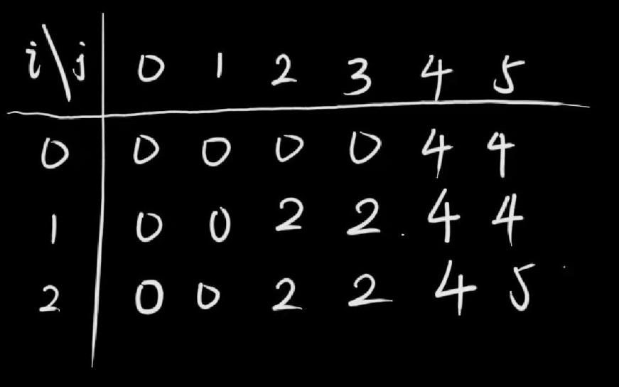
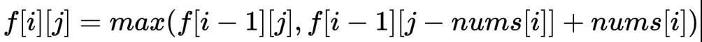
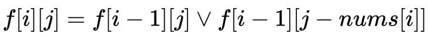

> !!持续更新中。

由于算法笔记已经太长了我就不在里面写了，独立开出来一个系列写比较清晰一点，也是为了记录我自己学习背包问题的一个过程吧。

对于背包问题，这里引用*宫水三叶*的一些介绍：

> 背包问题是「动态规划」中十分经典的一类问题，背包问题本质上属于组合优化的「 完全问题」。
>
> 如果你不了解什么是「 完全问题」，没有关系，丝毫不影响你求解背包问题。
>
> 你可以将「 完全问题」简单理解为「无法直接求解」的问题。
>
> 例如「分解质因数」问题，我们无法像四则运算（加减乘除）那样，按照特定的逻辑进行求解。
>
> 只能通过「穷举」+「验证」的方式进行求解。
>
> 既然本质上是一个无法避免「穷举」的问题，自然会联想到「动态规划」，事实上背包问题也同时满足「无后效性」的要求。
>
> 这就是为什么「背包问题」会使用「动态规划」来求解的根本原因。
>
> 如果按照常见的「背包问题」的题型来抽象模型的话，「背包问题」大概是对应这样的一类问题：
>
> 泛指一类「给定价值与成本」，同时「限定决策规则」，在这样的条件下，如何实现价值最大化的问题。

## 经典 01 背包问题

有`N`件物品和一个容量是`C` 的背包。每件物品有且只有一件。

第 `i` 件物品的体积是`v[i]` ，价值是`w[i]` 。

求解将哪些物品装入背包，可使这些物品的总体积不超过背包容量，且总价值最大。

实例一：

```
输入: N = 3, C = 4, v = [4,2,3], w = [4,2,3]
输出: 4
解释: 只选第一件物品，可使价值最大。
```

实例二：

```
输入: N = 3, C = 5, v = [4,2,3], w = [4,2,3]
输出: 5
解释: 不选第一件物品，选择第二件和第三件物品，可使价值最大。
```

---

**dp[N][c+1]**

《算法图解》第九章告诉我们，背包问题可以通过填满一个网格来解答。因此我们可以通过一个图来说明过程：



因此我们只需要一个二维数组`dp[i][j]`,i 表示目前考虑到的物品，j 表示目前剩余背包容量，dp 则表示在这两种情况下所能获得的最大价值。

最大价值要怎么求呢？我们只需要考虑当遍历到第 i 个物品的时候，我们只有买与不买两种情况。若不买，则`dp[i][j]=dp[i-1][j]`，若买，则`dp[i][j]=dp[i-1][j-v[i]]+w[i]`

当然，只有当前背包容量 j > v[i] 的时候才能选第 i 个。

```js
function maxValue(N, C, v, w) {
  let dp = new Array(N);
  for (let i = 0; i < N; i++) {
    dp[i] = new Array(C + 1).fill(0);
  }
  // 初始化
  for (let i = 0; i <= C; i++) {
    dp[0][i] = i >= v[0] ? w[0] : 0;
  }
  for (let i = 1; i < N; i++) {
    for (let j = 0; j <= C; j++) {
      dp[i][j] = Math.max(
        dp[i - 1][j],
        j >= v[i] ? dp[i - 1][j - v[i]] + w[i] : 0
      );
    }
  }
  return dp[N - 1][C];
}
```

**dp[2][c+1]**

我们发现上述代码 dp 中的第 i 行只依赖前一行，因此我们其实只需要使用 2 行的数组来记录数据即可。这种空间优化方法叫做**滚动数组**

除此之外，我们可以把`i%2`改成`i&1`，由二进制与运算我们可以知道，只有奇数与 1 才会等于 1，位运算可以优化计算速度。

```js
function maxValue(N, C, v, w) {
  let dp = new Array(N);
  for (let i = 0; i < 2; i++) {
    dp[i] = new Array(C + 1).fill(0);
  }
  // 初始化
  for (let i = 0; i <= C; i++) {
    dp[0][i] = i >= v[0] ? w[0] : 0;
  }
  for (let i = 1; i < N; i++) {
    for (let j = 0; j <= C; j++) {
      dp[i & 1][j] = Math.max(
        dp[(i - 1) & 1][j],
        j >= v[i] ? dp[(i - 1) & 1][j - v[i]] + w[i] : 0
      );
    }
  }
  return dp[(N - 1) & 1][C];
}
```

**\*dp[C+1]解法**

我们注意到除了需要上一行，还需要上一行的 C 以及 C 左边的位置 C-v[i]。

那么我们只需要从 C 开始遍历到 0，这样的话只需要一行维度的数组就 OK 啦。

> 这样做的空间复杂度和「滚动数组」优化的空间复杂度是一样的。但仍然具有意义，而且这样的「一维空间」优化，是求解其他背包问题的基础，需要重点掌握。

```js
function maxValue(N, C, v, w) {
  let dp = new Array(C + 1).fill(0);
  for (let i = 0; i < N; i++) {
    for (let j = C; j > -1; j--) {
      dp[j] = Math.max(dp[j], j >= v[i] ? dp[j - v[i]] + w[i] : 0);
    }
  }
  return dp[C];
}
```

## leetcode 416.分割等和子集

给你一个 `只包含正整数` 的 `非空` 数组 `nums` 。请你判断是否可以将这个数组分割成两个子集，使得两个子集的**元素和**相等。

---

### 间接求解

> 通常「背包问题」相关的题，都是在考察我们的「建模」能力，也就是将问题转换为「背包问题」的能力。

针对这道题，我们要想的是，要是两个子集和相同，也就是一个子集和为总和的一半，也就是需要我们判断能否将`Sum/2`的背包装满！

数组的每一格元素的*价值*和*成本*都是其数值大小

因此我们可以使用 01 背包问题的模型来做。



```js
var canPartition = function (nums) {
  let n = nums.length;
  let cost = Math.floor(nums.reduce((i, j) => i + j) / 2);
  if (cost !== nums.reduce((i, j) => i + j) / 2) return false;
  let dp = new Array(n);
  for (let i = 0; i < n; i++) {
    dp[i] = new Array(cost + 1);
  }
  for (let i = 0; i <= cost; i++) {
    dp[0][i] = i >= nums[0] ? nums[0] : 0;
  }
  // 初始化完毕
  for (let i = 1; i < n; i++) {
    for (let j = 0; j <= cost; j++) {
      dp[i][j] = Math.max(
        dp[i - 1][j],
        j >= nums[i] ? dp[i - 1][j - nums[i]] + nums[i] : 0
      );
    }
  }
  return dp[n - 1][cost] === cost;
};
```

**滚动数组优化方法一**

将 n 行变成 2 行：

```js
var canPartition = function (nums) {
  let n = nums.length;
  let cost = Math.floor(nums.reduce((i, j) => i + j) / 2);
  if (cost !== nums.reduce((i, j) => i + j) / 2) return false;
  dp = new Array(cost + 1);
  for (let i = 0; i <= cost; i++) {
    dp[i] = i >= nums[0] ? nums[0] : 0;
  }
  // 初始化完毕
  for (let i = 1; i < n; i++) {
    for (let j = 0; j <= cost; j++) {
      dp[i & 1][j] = Math.max(
        dp[(i - 1) & 1][j],
        j >= nums[i] ? dp[(i - 1) & 1][j - nums[i]] + nums[i] : 0
      );
    }
  }
  return dp[(n - 1) & 1][cost] === cost;
};
```

**滚动数组优化方法二**

变成一维数组

```js
var canPartition = function (nums) {
  let n = nums.length;
  let cost = Math.floor(nums.reduce((i, j) => i + j) / 2);
  if (cost !== nums.reduce((i, j) => i + j) / 2) return false;
  dp = new Array(cost + 1).fill(0);

  // 初始化完毕
  for (let i = 0; i < n; i++) {
    for (let j = cost; j >= 0; j--) {
      dp[j] = Math.max(dp[j], j >= nums[i] ? dp[j - nums[i]] + nums[i] : 0);
    }
  }
  return dp[cost] === cost;
};
```

### 直接求解

上述做法我们在定义 dp[i][j]的时候，代表考虑前`i`个数值，其选择数字总和不超过`j`的最大价值。

但是题目要求是：能否凑出最大价值。

因此我们可以把定义改一改，变成：代表考虑前`i`个数值，其选择数字总和能否凑出`j`的最大价值。

此时 dp 数组存储的就是 Boolean。

相应的状态转移方程变成如下：即最大变成了求交集



其次，在初始化的过程中也有变化。

我们要是初始化`dp[0][i] = false`的话，那么怎么也不会有 true 的状态出现。

因此我们需要考虑一种情况，就是不考虑任何物品的情况下，即将 dp[0][i]定义为不考虑任何物品的情况。即哨兵！

```js
/**
 * @param {number[]} nums
 * @return {boolean}
 */
var canPartition = function (nums) {
  let n = nums.length;
  let cost = Math.floor(nums.reduce((i, j) => i + j) / 2);
  if (cost !== nums.reduce((i, j) => i + j) / 2) return false;
  let dp = new Array(n + 1);
  for (let i = 0; i <= n; i++) {
    dp[i] = new Array(cost + 1).fill(false);
  }
  dp[0][0] = true;
  // 初始化完毕
  for (let i = 1; i <= n; i++) {
    for (let j = 0; j <= cost; j++) {
      dp[i][j] =
        dp[i - 1][j] || (j >= nums[i - 1] ? dp[i - 1][j - nums[i - 1]] : false);
    }
  }
  return dp[n][cost];
};
```

**滚动数组优化**

```js
var canPartition = function (nums) {
  let n = nums.length;
  let cost = Math.floor(nums.reduce((i, j) => i + j) / 2);
  if (cost !== nums.reduce((i, j) => i + j) / 2) return false;
  let dp = new Array(2);
  for (let i = 0; i < 2; i++) {
    dp[i] = new Array(cost + 1).fill(false);
  }
  dp[0][0] = true;
  // 初始化完毕
  for (let i = 1; i <= n; i++) {
    for (let j = 0; j <= cost; j++) {
      dp[i & 1][j] =
        dp[(i - 1) & 1][j] ||
        (j >= nums[i - 1] ? dp[(i - 1) & 1][j - nums[i - 1]] : false);
    }
  }
  return dp[n & 1][cost];
};
```

一维数组：

```js
var canPartition = function (nums) {
  let n = nums.length;
  let cost = Math.floor(nums.reduce((i, j) => i + j) / 2);
  if (cost !== nums.reduce((i, j) => i + j) / 2) return false;
  let dp = new Array(cost + 1).fill(false);
  dp[0] = true;
  // 初始化完毕
  for (let i = 1; i <= n; i++) {
    for (let j = cost; j >= 0; j--) {
      dp[j] = dp[j] || (j >= nums[i - 1] ? dp[j - nums[i - 1]] : false);
    }
  }
  return dp[cost];
};
```
