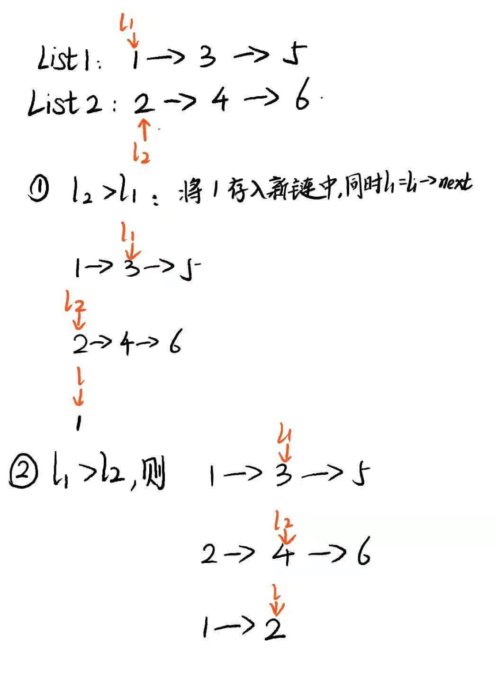
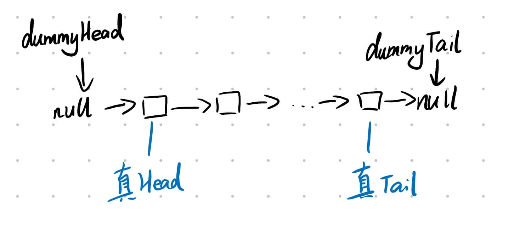
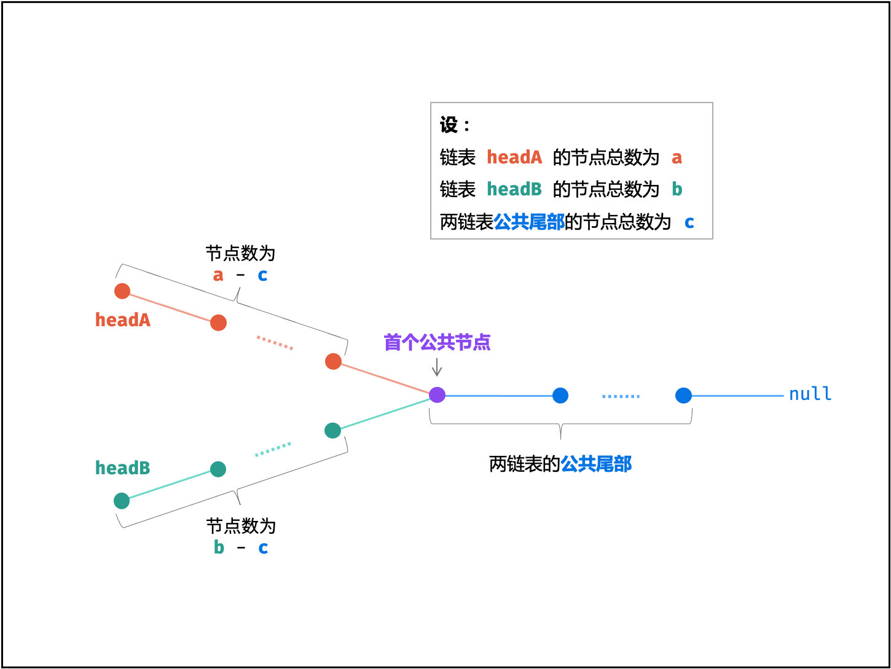

# leetcode----算法日记

---

现在是 2021 的 7 月份初，我刚好大二结束了。为了想在大三可以通过自己的努力去大厂实习，除了学习前端知识外，还得补补一些计算机基础知识：数据结构以及算法。因此我决定开始每日至少刷一道 leetcode 题。以前的我是非常讨厌做算法题的，因为我很菜 但是希望能通过努力来弥补这一点。奥里给~~

## 数学

### 29. 两数相除

要求不用乘除法、余数来实现一个向下取整的除法。

**法一：数学逻辑** `2021.10.12`

> 逻辑建议看代码吧。

```js
function divide(dividend, divisor) {
  if (dividend == 0) return 0;
  if (divisor == 1) return dividend;
  if (divisor == -1) {
    if (dividend > -2147483648) return -dividend; // 只要不是最小的那个整数，都是直接返回相反数就好啦
    return 2147483648 - 1; // 是最小的那个，那就返回最大的整数啦
  }
  let a = dividend;
  let b = divisor;
  let sign = 1;
  if ((a > 0 && b < 0) || (a < 0 && b > 0)) {
    sign = -1;
  }
  a = a > 0 ? a : -a;
  b = b > 0 ? b : -b;
  let res = div(a, b);
  if (sign > 0) return res > Infinity ? Infinity : res;
  return -res;
}
function div(a, b) {
  // 似乎精髓和难点就在于下面这几句
  if (a < b) return 0;
  let count = 1;
  let tb = b; // 在后面的代码中不更新b
  while (tb + tb <= a) {
    count = count + count; // 最小解翻倍
    tb = tb + tb; // 当前测试的值也翻倍
  }
  return count + div(a - tb, b);
}
```

**法二：位运算** `2021.10.13`

> 思路：首先，`x>>i`等于`x/2^i`，比如 100/3，i 从 31 开始，一直到 i=5 的时候，`100>>5>3`，那么即有`2**5个3`，然后我们再用`100-3*2**5`为 4，`4>>0>3`,即有`2**0个3`. 总的个数为`2**5+2**0=33`

```js
const divide = (a, b) => {
  if (dividend == 0) return 0;
  if (divisor == 1) return dividend;
  if (divisor == -1) {
    if (dividend > -2147483648) return -dividend; // 只要不是最小的那个整数，都是直接返回相反数就好啦
    return 2147483648 - 1; // 是最小的那个，那就返回最大的整数啦
  }

  // 是否为负数
  const isNeg = (a ^ b) < 0;
  // 取绝对值
  [a, b] = [Math.abs(a), Math.abs(b)];

  let res = 0;
  for (let i = 31; i >= 0; i--) {
    // 找出满足条件的最大的倍数
    if (a >>> i >= b) {
      // 累加上这个倍数
      res += 1 << i;
      // 被除数减去这个倍数*b
      a -= b << i;
    }
  }

  return isNeg ? -res : res;
};
```

### 412. Fizz Buzz

给你一个整数 n ，找出从 1 到 n 各个整数的 Fizz Buzz 表示，并用字符串数组 answer（下标从 1 开始）返回结果，其中：

- answer[i] == "FizzBuzz" 如果 i 同时是 3 和 5 的倍数。
- answer[i] == "Fizz" 如果 i 是 3 的倍数。
- answer[i] == "Buzz" 如果 i 是 5 的倍数。
- answer[i] == i 如果上述条件全不满足。

**2021.10.13**

> 思路：没什么好说的，一个 for 循环的事情。

```js
/**
 * @param {number} n
 * @return {string[]}
 */
var fizzBuzz = function(n) {
  let res = [];
  for (let i = 1; i <= n; i++) {
    if (i % 3 === 0 && i % 5 !== 0) {
      res.push("Fizz");
    } else if (i % 3 !== 0 && i % 5 === 0) {
      res.push("Buzz");
    } else if (i % 3 === 0 && i % 5 === 0) {
      res.push("FizzBuzz");
    } else {
      res.push(String(i));
    }
  }
  return res;
};
```

### leetcode 476. 数字的补数

对整数的二进制表示取反`（0 变 1 ，1 变 0）`后，再转换为十进制表示，可以得到这个整数的补数。

例如，整数 `5` 的二进制表示是 `"101"` ，取反后得到 `"010"` ，再转回十进制表示得到补数 `2` 。
给你一个整数 `num` ，输出它的补数。

**位运算** `2021.10.18`

> 思路：将`num`和二进制全为 1 的数进行一个异或操作，即可得到补码

```js
var findComplement = function(num) {
  let temp = num;
  let c = 0;
  while (temp > 0) {
    temp = temp >> 1;
    c = (c << 1) + 1;
  }
  return c ^ num;
};
```

## 数组

### leetcode 217.存在重复元素

给定一个整数数组，判断是否存在重复元素。如果存在一值在数组中出现至少两次，函数返回 true 。如果数组中每个元素都不相同，则返回 false 。

**法一：Set 类** `2021.7.12`
::: tip
思路：这种去重问题，可以用 ES6 新类 Set 来解决，因为 Set 本身就是不会将重复的元素添加进去，所以我们可以遍历数组将所以数据添加到 Set 中，再比较两者的长度
:::

```js
var containsDuplicate = function(nums) {
  let list = new Set();
  for (let i = 0; i < nums.length; i++) {
    list.add(nums[i]);
  }
  return list.size !== nums.length;
};
```

### leetcode 53.最大子序和

给定一个整数数组 nums ，找到一个具有最大和的连续子数组（子数组最少包含一个元素），返回其最大和。

**法一：贪心算法** `2021.7.12`

> 思路：遍历数组，在每一步的时候，比较当前数以及当前和，若当前和小于当前数，则可以无情的抛弃之前的和啦。然后再比较记录的最大和以及刚刚比较出来的最大值，若大于最大和则更新。最后返回最大和。

```js
var maxSubArray = function(nums) {
  if (nums.length === 1) return nums[0];
  let cur_sum = (max_sum = nums[0]);
  for (let i = 1; i < nums.length; i++) {
    cur_sum = Math.max(nums[i], nums[i] + cur_sum);
    max_sum = Math.max(cur_sum, max_sum);
  }
  return max_sum;
};
```

**法二：分治** `2021.7.12`

```js
function Status(l, r, m, i) {
  this.lSum = l;
  this.rSum = r;
  this.mSum = m;
  this.iSum = i;
}

const pushUp = (l, r) => {
  const iSum = l.iSum + r.iSum;
  const lSum = Math.max(l.lSum, l.iSum + r.lSum);
  const rSum = Math.max(r.rSum, r.iSum + l.rSum);
  const mSum = Math.max(Math.max(l.mSum, r.mSum), l.rSum + r.lSum);
  return new Status(lSum, rSum, mSum, iSum);
};

const getInfo = (a, l, r) => {
  if (l === r) {
    return new Status(a[l], a[l], a[l], a[l]);
  }
  const m = (l + r) >> 1; //除以2
  const lSub = getInfo(a, l, m);
  const rSub = getInfo(a, m + 1, r);
  return pushUp(lSub, rSub);
};

var maxSubArray = function(nums) {
  return getInfo(nums, 0, nums.length - 1).mSum;
};
```

这里直接上代码，因为分治在这道题中并不是最好的解法，而且难以理解。对于大规模查询的情况下，这种方法的优势便体现了出来。这棵树就是上文提及的一种神奇的数据结构——线段树。

> 思路： 分治的思想就是将[l,r]的区间分成左右两部分[l,m],[m+1,r]，这里的 m 就是 `l+r/2`。然后再对子区间进行同样的操作，递归。那么在这里，我们需要维护 4 个变量：

- `lSum` 表示 [l,r] 内以 l 为左端点的最大子段和。那么[l,r]的 lSum 可能是左区间的 iSum 或者左区间的 iSum + 右区间的 lSum。
- `rSum` 表示 [l,r] 内以 r 为右端点的最大子段和。同理
- `mSum` 表示 [l,r] 内的最大子段和。这个就有 3 种情况了：可能是左、右区间的 mSum，或者跨越了中间，即左区间的 rSum + 右区间的 lSum。
- `iSum` 表示 [l,r] 的区间和。那么[l,r]的 iSum 就是左右两区间的 iSum 之和。

### leetcode 1.两数之和

给定一个整数数组 nums  和一个整数目标值 target，请你在该数组中找出 和为目标值 target  的那   两个   整数，并返回它们的数组下标。

你可以假设每种输入只会对应一个答案。但是，数组中同一个元素在答案里不能重复出现。

你可以按任意顺序返回答案。

**法一：暴力解法** `2021.7.13`

> 思路：没啥好说的，两个 for 遍历完事了。时间复杂度 O(n^2)

```js
var twoSum = function(nums, target) {
  for (let i = 0; i < nums.length; i++) {
    for (let j = i + 1; j < nums.length; j++) {
      if (nums[i] + nums[j] === target) return [i, j];
    }
  }
  return [];
};
```

**法二：哈希表** `2021.7.13`

> 思路：我们可以换一种想法，每次遍历用 target-nums[i]来求出另一个值，这样的话只要寻找到另一个值，则 OK；找不到则继续遍历。时间复杂度 O(n^2)

```js
var twoSum = function(nums, target) {
  let hashMap = {};
  for (let i = 0; i < nums.length; i++) {
    let another = target - nums[i];
    if (another in hashMap) return [i, hashMap[another]];
    hashMap[nums[i]] = i;
  }
  return [];
};
```

### leetcode 56. 合并区间

以数组 `intervals` 表示若干个区间的集合，其中单个区间为 `intervals[i] = [starti, endi]` 。请你合并所有重叠的区间，并返回一个不重叠的区间数组，该数组需恰好覆盖输入中的所有区间。

**法一：排序** `2021.10.10`

> 思路：明天再写吧~~(代码很冗余)

```js
/**
 * @param {number[][]} intervals
 * @return {number[][]}
 */
var merge = function(intervals) {
  intervals.sort((a, b) => a[0] - b[0]);
  let start = intervals[0][0];
  let end = intervals[0][1];
  let res = [];
  for (let i = 0; i < intervals.length; i++) {
    if (i === intervals.length - 1) {
      let arr = [];
      arr.push(start);
      arr.push(end);
      res.push(arr);
      break;
    }
    if (intervals[i + 1][0] <= end) {
      end = Math.max(intervals[i][1], intervals[i + 1][1], end);
      continue;
    } else {
      let arr = [];
      arr.push(start);
      arr.push(end);
      res.push(arr);
      start = intervals[i + 1][0];
      end = intervals[i + 1][1];
    }
  }
  return res;
};
```

### leetcode 88.合并 2 个有序数组

**法一：JS 的 API** `2021.7.13`

它这道题不可以改变 num1 的指向，即 num1=。。。。。就很离谱。

```js
var merge = function(nums1, m, nums2, n) {
  nums1.splice(m, nums1.length - m, ...nums2);
  nums1.sort((a, b) => a - b);
};
```

**法二：双指针** `2021.7.13`

> 思路：链表的归并排序，我就不说了，可以看下面的题。 这题可以从头往前用双指针，代码如下：

```js
var merge = function(nums1, m, nums2, n) {
    int last=m+n-1;
    while(n){
        if(m==0||nums1[m-1]<=nums2[n-1]){
            nums1[last--]=nums2[--n];
        }else{
            nums1[last--]=nums1[--m];
        }
    }
}
```

### leetcode 350. 两个数组的交集 II

给定两个数组，编写一个函数来计算它们的交集。输出结果中每个元素出现的次数，应与元素在两个数组中出现次数的最小值一致。我们可以不考虑输出结果的顺序。

**进阶：**

- 如果给定的数组已经排好序呢？你将如何优化你的算法？
- 如果  nums1  的大小比  nums2  小很多，哪种方法更优？
- 如果  nums2  的元素存储在磁盘上，内存是有限的，并且你不能一次加载所有的元素到内存中，你该怎么办？

**法一：哈希表** `2021.7.14`

> 思路：首先遍历数组一，将元素出现的个数存在哈希表中，然后遍历数组二，如果存在于哈希表中的元素出现的次数大于 0，则 push 到结果中，并且次数减小。这样就可以保证输出元素在两个数组中出现次数的最小值啦。这个方法的时间、空间复杂度都为 O(n)

```js
var intersect = function(nums1, nums2) {
  let res = [];
  let hashMap = {};
  for (let i = 0; i < nums1.length; i++) {
    if (nums1[i] in hashMap) {
      hashMap[nums1[i]]++;
    } else {
      hashMap[nums1[i]] = 1;
    }
  }
  for (let i = 0; i < nums2.length; i++) {
    if (hashMap[nums2[i]] > 0) {
      res.push(nums2[i]);
      hashMap[nums2[i]]--;
    }
  }
  return res;
};
```

**法二：双指针** `2021.7.14`

> 思路：先给两个数组排好序，这样的话每个数组里相同的元素就会挨在一起了。然后通过两个指针分别遍历 2 个数组即可。这个方法时间复杂度为 O(nlogn) ，空间复杂度是 1

```js
var intersect = function(nums1, nums2) {
  nums1.sort((a, b) => a - b);
  nums2.sort((a, b) => a - b);
  let res = [];
  let p1 = 0;
  let p2 = 0;
  while (p1 < nums1.length && p2 < nums2.length) {
    if (nums1[p1] > nums2[p2]) {
      p2++;
    } else if (nums1[p1] < nums2[p2]) {
      p1++;
    } else {
      res.push(nums1[p1]);
      p1++;
      p2++;
    }
  }
  return res;
};
```

### leetcode 121. 买卖股票的最佳时机

给定一个数组 prices ，它的第  i 个元素  prices[i] 表示一支给定股票第 i 天的价格。
你只能选择 某一天 买入这只股票，并选择在 未来的某一个不同的日子 卖出该股票。设计一个算法来计算你所能获取的最大利润。
返回你可以从这笔交易中获取的最大利润。如果你不能获取任何利润，返回 0 。

_示例:_

```js
输入：[7,1,5,3,6,4]
输出：5
解释：在第 2 天（股票价格 = 1）的时候买入，在第 5 天（股票价格 = 6）的时候卖出，最大利润 = 6-1 = 5 。
     注意利润不能是 7-1 = 6, 因为卖出价格需要大于买入价格；同时，你不能在买入前卖出股票。
```

**法一：** `2021.7.14`

> 思路：记录下最小值以及每天理论上可获取的最大利润。

```js
var maxProfit = function(prices) {
  if (prices.length < 1) return 0;
  let max = 0;
  let min = prices[0];
  for (let i = 1; i < prices.length; i++) {
    max = Math.max(max, prices[i] - min);
    min = Math.min(prices[i], min);
  }
  return max;
};
```

### leetcode 414. 第三大的数

给你一个非空数组，返回此数组中 第三大的数 。如果不存在，则返回数组中最大的数。

**法一：一次遍历** `2021.10.6`

> 思路：维护 3 个变量分别是第一大、第二大和第三大，初始化的时候设置为`-Infinity`。在遍历过程中不断更新 3 个变量的值，如果遇到相同的数则直接`contiune`，最后返回的时候则只需要判断这 3 个变量是否都有了值，即不为`-Infinity`，如果都有了值则证明存在第三大的数，若有一个没有值则直接返回第一大的数。

```js
var thirdMax = function(nums) {
  let max = -Infinity;
  let secondmax = -Infinity;
  let thirdmax = -Infinity;
  for (let i = 0; i < nums.length; i++) {
    if (nums[i] === max || nums[i] === secondmax || nums[i] === thirdMax)
      continue;
    if (nums[i] > thirdmax) {
      thirdmax = nums[i];
    }
    if (thirdmax > secondmax) {
      let temp = secondmax;
      secondmax = thirdmax;
      thirdmax = temp;
    }
    if (secondmax > max) {
      let temp = max;
      max = secondmax;
      secondmax = temp;
    }
  }
  return thirdmax === -Infinity || secondmax === -Infinity || max === -Infinity
    ? max
    : thirdmax;
};
```

### leetcode 566. 重塑矩阵

给出一个由二维数组表示的矩阵，以及两个正整数 r 和 c，分别表示想要的重构的矩阵的行数和列数。
重构后的矩阵需要将原始矩阵的所有元素以相同的行遍历顺序填充。
如果具有给定参数的 reshape 操作是可行且合理的，则输出新的重塑矩阵；否则，输出原始矩阵。

**法一：暴力解法** `2021.7.15`

> 思路：首先先判断输入的 r、c 是否合理。然后将原数组转化成一维数组，再根据 r、c 进行循坏嵌套重排二维数组。时间复杂度为 O(n^2)

```js
/**
 * @param {number[][]} mat
 * @param {number} r
 * @param {number} c
 * @return {number[][]}
 */
var matrixReshape = function(mat, r, c) {
  let row = mat.length;
  let col = mat[0].length;
  if (row * col !== r * c) return mat;
  let store = [];
  mat.forEach((arr) => {
    arr.forEach((num) => {
      store.push(num);
    });
  });
  let res = [];
  for (let i = 0; i < r; i++) {
    let temp = [];
    for (let j = 0; j < c; j++) {
      temp.push(store[i * c + j]);
    }
    res.push(temp);
  }
  return res;
};
```

### leetcode 118.杨辉三角

**废话不多说:数学暴力解** `2021.7.15`

```js
/**
 * @param {number} numRows
 * @return {number[][]}
 */
var generate = function(numRows) {
  let res = [];
  for (let i = 0; i < numRows; i++) {
    let row = Array(i + 1).fill(1);
    for (let j = 1; j < i; j++) {
      row[j] = res[i - 1][j - 1] + res[i - 1][j];
    }
    res.push(row);
  }
  return res;
};
```

### leetcode 36.有效的数独

请你判断一个  9x9 的数独是否有效。只需要 根据以下规则 ，验证已经填入的数字是否有效即可。

- 数字  1-9  在每一行只能出现一次。
- 数字  1-9  在每一列只能出现一次。
- 数字  1-9  在每一个以粗实线分隔的  3x3  宫内只能出现一次。
- 数独部分空格内已填入了数字，空白格用  '.'  表示。

**暴力法** `2021.7.16`

> 思路：遍历该二维数组，建立 3 个哈希表来记录 3 条规则(行、列、块)，依次进行判断即可。

```js
/**
 * @param {character[][]} board
 * @return {boolean}
 */
var isValidSudoku = function(board) {
  let row = {};
  let col = {};
  let box = {};
  for (let i = 0; i < 9; i++) {
    for (let j = 0; j < 9; j++) {
      const num = board[i][j];
      if (num !== ".") {
        if (`${num},row${i}` in row) return false;
        if (`${num},col${j}` in col) return false;
        if (`${num}, ${Math.floor(i / 3)}, ${Math.floor(j / 3)}` in box)
          return false;
        row[`${num},row${i}`] = true;
        col[`${num},col${j}`] = true;
        box[`${num}, ${Math.floor(i / 3)}, ${Math.floor(j / 3)}`] = true;
      }
    }
  }
  return true;
};
```

### leetcode 73.矩阵置零

给定一个  m x n 的矩阵，如果一个元素为 0 ，则将其所在行和列的所有元素都设为 0 。请使用 **原地** 算法。

进阶：

一个直观的解决方案是使用  O(mn)  的额外空间，但这并不是一个好的解决方案。
一个简单的改进方案是使用 O(m + n) 的额外空间，但这仍然不是最好的解决方案。
你能想出一个仅使用常量空间的解决方案吗？

**法一：暴力哈希表** `2021.7.16`

> 思路：这里先讲一下什么叫原地算法：即在函数的输入矩阵上直接修改，而不是 return 一个矩阵。所以，力扣判定程序正确性的时候，仍然根据同一个 matrix 变量来判定。首先先遍历依次矩阵，分别用 2 个哈希表记录下需要置零的行和列。然后第二次遍历的时候，将需要置零的元素置零。时间复杂度：O(2m\*n)，空间复杂度：O(m+n)。

```js
var setZeroes = function(matrix) {
  let r = matrix.length;
  let c = matrix[0].length;
  let row = {};
  let col = {};
  for (let i = 0; i < r; i++) {
    for (let j = 0; j < c; j++) {
      if (matrix[i][j] === 0) {
        row[i] = 1;
        col[j] = 1;
      }
    }
  }
  /* 开始置零 */
  for (let i = 0; i < r; i++) {
    for (let j = 0; j < c; j++) {
      if (row[i] || col[j]) {
        matrix[i][j] = 0;
      }
    }
  }
  return matrix;
};
```

**法二** `2021.7.16`

> 思路：1.首先把首行首列都遍历一次，记录下 2 个 Boolean 值表示是否需要置零。2.然后遍历非首行首列，遇到 0 的时候，把对应的首行首列的元素设为 0。3.根据首行首列的信息，将对应的行与列置零。4.根据一开始的 Boolean 值，置零需要的首行首列。空间复杂度：O(1)

```js
var setZeroes = function(matrix) {
  let r = matrix.length;
  let c = matrix[0].length;
  let isR0 = false;
  let isC0 = false;
  /* 第一步 */
  for (let i = 0; i < r; i++) {
    if (matrix[i][0] === 0) {
      isC0 = true;
      break;
    }
  }
  for (let j = 0; j < c; j++) {
    if (matrix[0][j] === 0) {
      isR0 = true;
      break;
    }
  }
  /* 第二步 */
  for (let i = 1; i < r; i++) {
    for (let j = 1; j < c; j++) {
      if (matrix[i][j] === 0) {
        matrix[i][0] = 0;
        matrix[0][j] = 0;
      }
    }
  }
  /* 第三步 */
  for (let i = 1; i < r; i++) {
    for (let j = 1; j < c; j++) {
      if (matrix[i][0] === 0 || matrix[0][j] === 0) {
        matrix[i][j] = 0;
      }
    }
  }
  /* 第四步 */
  if (isC0) {
    for (let i = 0; i < r; i++) {
      matrix[i][0] = 0;
    }
  }
  if (isR0) {
    matrix[0].fill(0);
  }
};
```

::: danger
注意：这里我第一次写的时候，第三步写成了以下代码，这样的话会导致 `matrix[0][0]` 重复判断，会出错。应该把 i、j 都用 1 开始遍历
:::

```js
/* 第三步 */
for (let i = 0; i < r; i++) {
  if (matrix[i][0] === 0) {
    matrix[i].fill(0);
  }
}
for (let j = 0; j < c; j++) {
  if (matrix[0][j] === 0) {
    for (let i = 1; i < r; i++) {
      matrix[i][j] = 0;
    }
  }
}
```

### leetcode 351.将数据流变为多个不相交区间

给你一个由非负整数  `a1, a2, ..., an` 组成的数据流输入，请你将到目前为止看到的数字总结为不相交的区间列表。

实现 `SummaryRanges` 类：

- `SummaryRanges()` 使用一个空数据流初始化对象。
- `void addNum(int val)` 向数据流中加入整数 `val` 。
- `int[][] getIntervals()` 以不相交区间  `[starti, endi]` 的列表形式返回对数据流中整数的总结。

**法一：Set+循环找连续的数** `2021.10.9`

> 思路：首先先去重，然后遍历这个 set，遍历的时候用一个循环，如果存在比目前的数大 1 的，则 i++，直至找不到为止，然后 push 到 res 中。

```js
class SummaryRanges {
  constructor() {
    this.items = new Set();
  }
  addNum(val) {
    this.items.add(val);
  }
  getIntervals() {
    let res = [];
    let items = [...this.items];
    items = items.sort((a, b) => a - b);
    for (let i = 0; i < items.length; i++) {
      let arr = [];
      arr.push(items[i]);
      while (1) {
        if (items.indexOf(items[i] + 1) > 0) {
          i++;
          continue;
        } else {
          break;
        }
      }
      arr.push(items[i]);
      res.push(arr);
    }
    return res;
  }
}
```

### leetcode 387. 字符串中的第一个唯一字符

给定一个字符串，找到它的第一个不重复的字符，并返回它的索引。如果不存在，则返回 -1

**法一：哈希表** `2021.7.17`

> 思路：两次遍历。第一次将字符存储在哈希表中，第二次遍历哈希表，返回出现次数为 1 的第一个字符

::: danger
注意：这里我判断出现次数为 1 的时候，一开始用的 Foreach 方法，然后发现原来 Foreach 不能用**break**，**return**来打断，这里记录一下。
:::

```js
var firstUniqChar = function(s) {
  let hashMap = {};
  for (let i = 0; i < s.length; i++) {
    if (s[i] in hashMap) {
      hashMap[s[i]]++;
    } else {
      hashMap[s[i]] = 1;
    }
  }
  let keys = Object.keys(hashMap);
  for (let i = 0; i < keys.length; i++) {
    if (hashMap[keys[i]] === 1) {
      return s.indexOf(keys[i]);
    }
  }
  return -1;
};
```

**法二：数组** `2021.7.17`

> 思路：因为字符串一共只有 26 个字母，我们可以创建一个长度为 26 的数组来存储字母出现次数，第一次遍历字符串并把对应的 arr[index]++，第二次再遍历的时候判断 arr[index]为 1 即可。

```js
var firstUniqChar = function(s) {
  let arr = Array(26).fill(0);
  for (let i = 0; i < s.length; i++) {
    arr[s.charCodeAt(i) - "a".charCodeAt()]++;
  }

  for (let i = 0; i < s.length; i++) {
    if (arr[s.charCodeAt(i) - "a".charCodeAt()] === 1) {
      return i;
    }
  }
  return -1;
};
```

### leetcode 383.赎金信

给定一个赎金信 (ransom) 字符串和一个杂志(magazine)字符串，判断第一个字符串 ransom 能不能由第二个字符串 magazines 里面的字符构成。如果可以构成，返回 _true_ ；否则返回 _false_

- (题目说明：为了不暴露赎金信字迹，要从杂志上搜索各个需要的字母，组成单词来表达意思。杂志字符串中的每个字符只能在赎金信字符串中使用一次。)

**法一：哈希表记录出现次数** `2021.7.17`

> 思路：遍历一次杂志，把字母出现次数记录在哈希表中，然后遍历一次赎金信，每一次出现字母都将对应的哈希表中次数减一，当次数小于 0 则为 false，当字母在哈希表中没出现的时候也为 false。

```js
var canConstruct = function(ransomNote, magazine) {
  let hashMap = {};
  for (let i = 0; i < magazine.length; i++) {
    if (magazine[i] in hashMap) {
      hashMap[magazine[i]]++;
    } else {
      hashMap[magazine[i]] = 1;
    }
  }
  for (let i = 0; i < ransomNote.length; i++) {
    if (ransomNote[i] in hashMap) {
      hashMap[ransomNote[i]]--;
      if (hashMap[ransomNote[i]] < 0) return false;
    } else {
      return false;
    }
  }
  return true;
};
```

### leetcode 242. 有效的字母异位词

给定两个字符串 s 和 t ，编写一个函数来判断 t 是否是 s 的字母异位词。

- 注意：若  s 和 t  中每个字符出现的次数都相同，则称  s 和 t  互为字母异位词。

**法一：排序** `2021.7.17`

> 思路：首先先判断两个字符串的长度，若长度不一样则直接返回 false；然后将两字符串转化为数组进行排序，js 的`sort`方法在没有参数情况下按照 ascii 来排序，排序后再转化回字符串进行比较。时间复杂度：O(nlog n)其中 n 为 s 的长度。排序的时间复杂度为 O(nlogn)，比较两个字符串是否相等时间复杂度为 O(n)，因此总体时间复杂度为 O(nlogn)。

```js
var isAnagram = function(s, t) {
  return s.length === t.length
    ? [...s].sort().join("") === [...t].sort().join("")
    : false;
};
```

**法二：哈希表** `2021.7.17`

> 思路：思路同上题(leecode.383)，时间复杂度只需要 O(n)。代码略，直接把上题代码搬过来加一个长度判断即可。

### leetcode 581. 最短无序连续子数组

给你一个整数数组 nums ，你需要找出一个**连续子数组** ，如果对这个子数组进行升序排序，那么整个数组都会变为升序排序。

请你找出符合题意的**最短**子数组，并输出它的长度。

**法一：暴力法** `2021.8.3`

> 思路：先 copy 一份数组，然后把它进行排序，然后将两个数组进行对比，将变化的连续子数组的长度返回即可。时间复杂度：O(nlogn+n)

```js
var findUnsortedSubarray = function(nums) {
  let copy = [...nums];
  copy.sort((i, j) => i - j);
  let low = nums.length - 1;
  let high = 0;
  for (let i = 0; i < nums.length; i++) {
    if (nums[i] !== copy[i]) {
      low = Math.min(low, i);
    }
    if (nums[nums.length - 1 - i] !== copy[nums.length - 1 - i]) {
      high = Math.max(high, nums.length - 1 - i);
    }
  }
  return high > low ? high - low + 1 : 0;
};
```

**法二：一次遍历** `2021.8.3`

> 思路：从左到右遍历数组，记录下需要被调整位置的最大值 high；从右到左遍历数组，记录下需要被调整位置的最小值 low。

```js
var findUnsortedSubarray = function(nums) {
  let start = 0;
  let end = nums.length - 1;
  let max = nums[0];
  let min = nums[end];
  for (let i = 1; i < nums.length; i++) {
    if (nums[i] > max) max = nums[i];
    else if (nums[i] < max) {
      start = i;
    }
  }
  for (let i = nums.length - 2; i >= 0; i--) {
    if (nums[i] < min) min = nums[i];
    else if (nums[i] > min) {
      end = i;
    }
  }
  return start > end ? start - end + 1 : 0;
};
```

### leetcode 273. 整数转换英文表示

将非负整数 num 转换为其对应的英文表示。

**法一：递归** `2021.10.11`

> 思路：此题没什么意思。首先要知道 num 最多是 10 位数，则可以按照英语的分法，按照 3 个一位的方式分成 4 组，依次递归判断并转成相应的英文。

```js
/**
 * @param {number} num
 * @return {string}
 */
var numberToWords = function(num) {
  // 最大就10位数
  const singles = [
    "",
    "One",
    "Two",
    "Three",
    "Four",
    "Five",
    "Six",
    "Seven",
    "Eight",
    "Nine",
  ];
  const teens = [
    "Ten",
    "Eleven",
    "Twelve",
    "Thirteen",
    "Fourteen",
    "Fifteen",
    "Sixteen",
    "Seventeen",
    "Eighteen",
    "Nineteen",
  ];
  const tens = [
    "",
    "Ten",
    "Twenty",
    "Thirty",
    "Forty",
    "Fifty",
    "Sixty",
    "Seventy",
    "Eighty",
    "Ninety",
  ];
  const thousands = ["", "Thousand", "Million", "Billion"];
  const recursion = function(curArr, num) {
    if (num === 0) return;
    else if (num < 10) {
      curArr.push(singles[num] + " ");
    } else if (num < 20) {
      curArr.push(teens[num - 10] + " ");
    } else if (num < 100) {
      curArr.push(tens[Math.floor(num / 10)] + " ");
      recursion(curArr, num % 10);
    } else {
      curArr.push(singles[Math.floor(num / 100)] + " Hundred ");
      recursion(curArr, num % 100);
    }
  };
  let res = [];
  if (num === 0) return "Zero";
  for (
    let i = 3, unit = 1000000000;
    i >= 0;
    i--, unit = Math.floor(unit / 1000)
  ) {
    const curNum = Math.floor(num / unit);
    if (curNum !== 0) {
      num -= curNum * unit;
      let crrArr = [];
      recursion(crrArr, curNum);
      crrArr.push(thousands[i] + " ");
      res.push(crrArr.join(""));
    }
  }
  return res.join("").trim();
};
```

## 链表

### leetcode234.回文链表

**问题**：请判断一个链表是否为回文链表。

> 思路：利用快慢指针，慢指针一次走一步，快指针一次走两步。对于奇数链表，当快指针走到尾节点的时候，慢指针走到中间节点；对于偶数链表，当快指针走到倒数第二个节点的时候，慢指针走到前半段的尾节点处。同时，在慢指针走的时候讲前半段链表反转。（如果是奇数链表，慢指针再走一步，因为中间节点不需要比较）然后比较前半段反转的链表和后半段链表即可。

**代码实现**

```js
/**
 * Definition for singly-linked list.
 * function ListNode(val, next) {
 *     this.val = (val===undefined ? 0 : val)
 *     this.next = (next===undefined ? null : next)
 * }
 */
/**
 * @param {ListNode} head
 * @return {boolean}
 */
var isPalindrome = function(head) {
  let slow = head;
  let pre = null;
  let reverse = null;
  while (head && head.next) {
    pre = slow;
    slow = slow.next;
    head = head.next.next;
    /* 反转前半链表 */
    pre.next = reverse;
    reverse = pre;
  }
  if (head) slow = slow.next;
  while (slow) {
    if (slow.val === pre.val) {
      slow = slow.next;
      pre = pre.next;
    } else return false;
  }
  return true;
};
```

### 剑指 24.反转链表

> 思路：利用前中后 3 个指针，边遍历边反转。

**代码实现:**

```js
/**
 * Definition for singly-linked list.
 * function ListNode(val) {
 *     this.val = val;
 *     this.next = null;
 * }
 */
/**
 * @param {ListNode} head
 * @return {ListNode}
 */
var reverseList = function(head) {
  let pre = null;
  let current = head;
  if (!head) return head;
  let ahead = head.next;
  while (current) {
    current.next = pre;
    pre = current;
    current = ahead;
    if (ahead) {
      ahead = ahead.next;
    }
  }
  return pre;
};
```

### leetcode21.合并两顺序表

> 思路：主要思路如下图。这里我第一次出错的原因是循坏条件判断错误，我用的是`l1||l2`，企图想一次性把所有条件都写在一起，这样的话`l1.val`可能为空，则出错。第 2 次的话，是遍历的错误，我写成了`l=l1` / `l=l2` ，这样的话 l 根本就没有 next，整个链表就支零破碎了。



**代码实现：**

```js
/**
 * Definition for singly-linked list.
 * function ListNode(val, next) {
 *     this.val = (val===undefined ? 0 : val)
 *     this.next = (next===undefined ? null : next)
 * }
 */
/**
 * @param {ListNode} l1
 * @param {ListNode} l2
 * @return {ListNode}
 */
var mergeTwoLists = function(l1, l2) {
  if (l1 === null) return l2;
  if (l2 === null) return l1;
  let head = new ListNode(-1);
  let l = head;
  while (l1 != null && l2 != null) {
    if (l1.val > l2.val) {
      l.next = l2;
      l2 = l2.next;
    } else {
      l.next = l1;
      l1 = l1.next;
    }
    l = l.next;
  }
  if (l1 === null) l.next = l2;
  if (l2 === null) l.next = l1;
  return head.next;
};
```

### 剑指 offer 22. 链表第 n 个节点 `2021.7.5`

- 输入一个链表，输出该链表中倒数第 k 个节点。为了符合大多数人的习惯，本题从 1 开始计数，即链表的尾节点是倒数第 1 个节点。

实例：

```
给定一个链表: 1->2->3->4->5, 和 k = 2.

返回链表 4->5.
```

> 思路：首先遍历一遍链表，获取链表长度 n，然后重新遍历 n-k 次得到倒数第 k 个节点

```js
/**
 * Definition for singly-linked list.
 * function ListNode(val) {
 *     this.val = val;
 *     this.next = null;
 * }
 */
/**
 * @param {ListNode} head
 * @param {number} k
 * @return {ListNode}
 */
var getKthFromEnd = function(head, k) {
  if (!head.next) return head;
  let traverse = head;
  let length = 1;
  while (traverse.next) {
    traverse = traverse.next;
    length++;
  }
  if (k === 1) return traverse;
  if (k > length) return null;
  for (let i = 0; i < length - k; i++) {
    head = head.next;
  }
  return head;
};
```

---

**二刷**

> 思路：上述的做法实际上遍历了 2 次链表，感觉还可以再优化一下。看了一下各路大佬的题解，发现一种快慢指针法只需要遍历一次链表即可。关键是让快指针先移动 k-1 步，这样的话快慢指针就分别指向所求链表的尾、头节点了。

```js
var getKthFromEnd = function(head, k) {
  if (!head) return null;
  let fast = head;
  let slow = head;
  for (let i = 0; i < k - 1; i++) {
    if (!fast) return null; /* 即 k 大于链表的长度 */
    fast = fast.next;
  }
  while (fast.next) {
    slow = slow.next;
    fast = fast.next;
  }
  return slow;
};
```

### leetcode 876. 求链表的中间节点 `2021.7.6`

给定一个头结点为 head 的非空单链表，返回链表的中间结点。如果有两个中间结点，则返回第二个中间结点。

> 思路：因为之前刷过快慢指针的题，所以我一看到要获取中间节点，我一下子就想到了快慢指针。

**代码如下：**

```js
/**
 * @param {ListNode} head
 * @return {ListNode}
 */
var middleNode = function(head) {
  if (!head.next) return head;
  let slow = head;
  let fast = head;
  /* 兼容奇数和偶数长度的链表 */
  while (fast && fast.next) {
    slow = slow.next;
    fast = fast.next.next;
  }
  return slow;
};
```

### leetcode 146. LRU 缓存机制 `2021.7.7`

> 思路：这道题我们首先要想到，新的在前，旧的在后，若超出存贮极限，则把最旧的给抛弃掉。除此之外，当每次插入、更新或者获取节点的时候，都得把节点放在最前面也就是从旧变新了。因此我们可以定义几个方法：`_moveToHead`,`_remove`,`_isFull`。**`get方法`**：若 key 不存在 return -1；若存在则获取 value 并且 moveToHead。**`put`**：key 存在，则更新 value 并且 moveToHead；key 不存在，判断是否满了，若满了则删除尾节点；然后插入新节点。

> 这道题最难的地方，我认为在于时间复杂度需要 O(1)。存储节点我们首先想到的就是数组或者链表，但是当我们插入删除以及获取的时候，它们都不可避免的需要 0(n)。因此，我选择使用链表来执行插入删除，使用哈希表来获取，这样的话时间复杂度就都满足 0(1)了。hashMap 存储的是 key->node，链表存储的是 node。

```js
//第一次：
class Node {
  constructor(key, value) {
    this.key = key;
    this.data = value;
    this.next = null;
    this.prev = null;
  }
}
class LRUCache {
  constructor(capacity) {
    this.capacity = capacity;
    this.usedSpace = 0;
    this.head = new Node(null, null);
    this.tail = new Node(null, null);
    this.head.next = this.tail;
    this.tail.prev = this.head;
    this.hashmap = {};
  }
  _isFull() {
    return this.usedSpace == this.capacity ? true : false;
  }
  _remove(node) {
    node.prev.next = node.next;
    node.next.prev = node.prev;
    node.next = null;
    node.prev = null;
    return node;
  }
  _moveToHead(node) {
    let current = this.head;
    this.head = node;
    node.next = current;
    current.prev = node;
  }
  get(key) {
    if (key in this.hashmap) {
      let node = this._remove(this.hashmap[key]);
      this._moveToHead(node);
      return node.value;
    } else {
      return -1;
    }
  }
  put(key, value) {
    //
    if (!this.hashmap[key]) {
      let newNode = new Node(key, value);
      if (!this._isFull()) {
        this._moveToHead(newNode);
        this.hashmap[key] = newNode;
        this.usedSpace++;
      } else {
        delete this.hashmap[this.tail.key];
        this.hashmap[key] = newNode;
        this.tail = this.tail.prev;
        this.tail.next = null;
        this._moveToHead(newNode);
      }
    } else {
      this.hashmap[key].value = value;
      let node = this._remove(this.hashmap[key]);
      this._moveToHead(node);
    }
  }
}
```

**那么众所周知第一次往往都会失败，原因有 2 个：**

- 首先节点类的 value 写错成了 data (这个写错的地方花了我好久才发现)
- remove 方法中，如果删除的是尾节点的话则没有 node.next.prev，会报错

因此我采用两个固定的 dummyHead 以及 dummyTail 来记录下虚拟头尾节点


代码如下：

```js
class DoubleLinkedListNode {
  constructor(key, value) {
    this.key = key;
    this.value = value;
    this.prev = null;
    this.next = null;
  }
}
class LRUCache {
  constructor(capacity) {
    this.capacity = capacity;
    this.usedSpace = 0;
    this.hashmap = {};
    this.dummyHead = new DoubleLinkedListNode(null, null);
    this.dummyTail = new DoubleLinkedListNode(null, null);
    this.dummyHead.next = this.dummyTail;
    this.dummyTail.prev = this.dummyHead;
  }
  _isFull() {
    return this.usedSpace === this.capacity;
  }
  _remove(node) {
    node.prev.next = node.next;
    node.next.prev = node.prev;
    node.prev = null;
    node.next = null;
    return node;
  }
  _moveToHead(node) {
    const head = this.dummyHead.next;
    node.next = head;
    head.prev = node;
    node.prev = this.dummyHead;
    this.dummyHead.next = node;
  }
  get(key) {
    if (key in this.hashmap) {
      const node = this.hashmap[key];
      this._moveToHead(this._remove(node));
      return node.value;
      /* let node = this._remove(this.hashmap[key])
            this._moveToHead(node)
            return node.value */
    } else {
      return -1;
    }
  }

  put(key, value) {
    if (key in this.hashmap) {
      const node = this.hashmap[key];
      node.value = value;
      this._moveToHead(this._remove(node));
      /* this.hashmap[key].value = value
            let node = this._remove(this.hashmap[key])
            this._moveToHead(node) */
    } else {
      if (this._isFull()) {
        const node = this.dummyTail.prev;
        delete this.hashmap[node.key];
        this._remove(node);
        this.usedSpace--;
      }
      const newNode = new DoubleLinkedListNode(key, value);
      this.hashmap[key] = newNode;
      this._moveToHead(newNode);
      this.usedSpace++;
    }
  }
}
```

### leetcode 141. 判断链表是否有环 `2021.7.7`

如果链表中有某个节点，可以通过连续跟踪 next 指针再次到达，则链表中存在环。 为了表示给定链表中的环，我们使用整数 pos 来表示链表尾连接到链表中的位置（索引从 0 开始）。 如果 pos 是 -1，则在该链表中没有环。注意：pos 不作为参数进行传递，仅仅是为了标识链表的实际情况。

如果链表中存在环，则返回 true 。 否则，返回 false 。

**进阶：使用 O(1)内存解决该问题**

> 思路：第一次做的时候，我首先想到的是遍历链表，遍历的过程中用哈希表来存储链表，并且判断目前节点是否在哈希表中存在，若存在则代表有环，不存在则没有环，返回 false

**代码实现**

```js
/**
 * @param {ListNode} head
 * @return {boolean}
 */
var hasCycle = function(head) {
  let pos = -1;
  let index = 0;
  let current = head;
  let hashMap = {};
  while (current) {
    for (let key in hashMap) {
      if (hashMap[key] === current) {
        pos = key;
        return true;
      }
    }
    hashMap[index] = current;
    current = current.next;
    index++;
  }
  return false;
};
```

这种方法，**时间复杂度**以及**空间复杂度**都为 **O(n)**,要完成进阶的要求的话，我在题解看到一种很有趣的方法：**快慢指针**
即快指针要是能追上慢指针，就可以知道链表中存在环，是不是特别神奇呢。

**代码实现**

```js
/**
 * @param {ListNode} head
 * @return {boolean}
 */
var hasCycle = function(head) {
  let pos = -1;
  let index = 0;
  let slow = head;
  /* 当传入空链表的时候 */
  if (!slow) return false;
  let fast = head.next;
  /* 当只有一个节点的时候 */
  if (!fast) return false;
  while (slow != fast) {
    if (!fast || !fast.next) {
      return false;
    }
    fast = fast.next.next;
    slow = slow.next;
    index++;
  }
  pos = index;
  return true;
};
```

### leetcode 19. 删除倒数第 n 个节点 `2021.7.8`

> 解题思路:看到这道题的第一反应我想到的就是快慢指针，可是我一开始写的代码发现当传入的节点只有 1 个的时候，无法删除 head。
> 第一次的代码是这样的：

```js
var removeNthFromEnd = function(head, n) {
  if (!head) return head;
  let slower = null;
  let slow = head;
  let fast = head;
  for (let i = 0; i < n - 1; i++) {
    fast = fast.next;
  }
  while (fast.next !== null) {
    slower = slow;
    slow = slow.next;
    fast = fast.next;
  }
  //这里的slower.next在只有一个节点的时候会报错
  slower.next = slow.next;
  slow.next = null;
  return head;
};
```

后来我想起了之前做的一道 LRU 缓存的题，也是巧妙的利用了**虚拟节点**来规避了临界情况的错误，我就试着写一写。而且还可以通过调整快指针一开始走的步数，来让**slow 指针可以到达该删除节点的前驱**，这样的话就可以少创建一个指针了。代码如下。

```js
 * @param {ListNode} head
 * @param {number} n
 * @return {ListNode}
 */
var removeNthFromEnd = function(head, n) {
if (!head) return head
  let dummy=new ListNode(0,head)
  let slow = dummy
  let fast = dummy
  for (let i = 0; i < n; i++) {
    fast = fast.next
  }
  while (fast.next !== null) {
    slow = slow.next
    fast = fast.next
  }
  //此时slow是该删除节点的前驱
  slow.next = slow.next.next
  return dummy.next
};
```

### leetcode 2.两数相加 `2021.7.9`

给你两个   非空 的链表，表示两个非负的整数。它们每位数字都是按照   逆序   的方式存储的，并且每个节点只能存储   一位   数字.请你将两个数相加，并以相同形式返回一个表示和的链表。
你可以假设除了数字 0 之外，这两个数都不会以 0  开头。

> 第一次：第一次见到这个题目，我首先想到的就是遍历两链表，然后几下其表示的两个数，然后相加，再把其转成数组再一个一个遍历转成新链表。

```js
/**
 * @param {ListNode} l1
 * @param {ListNode} l2
 * @return {ListNode}
 */
var TenPowers = function(n) {
  let res = 1;
  for (let i = 0; i < n; i++) {
    res *= 10;
  }
  return res;
};
var addTwoNumbers = function(l1, l2) {
  let n = 0;
  let r1 = 0;
  let r2 = 0;
  while (l1 || l2) {
    if (l1) {
      r1 += l1.val * TenPowers(n);
      l1 = l1.next;
    }
    if (l2) {
      r2 += l2.val * TenPowers(n);
      l2 = l2.next;
    }
    n++;
  }
  r = r1 + r2;
  let arr = String(r).split("");
  let dummy = new ListNode(-1);
  let current = dummy;
  for (let i = arr.length - 1; i >= 0; i--) {
    current.next = new ListNode(arr[i]);
    current = current.next;
  }
  return dummy.next;
};
```

> 果不其然，这种方法被[1,0,0,0,0,0,0,0,0,0,0,0,0,0,0,0,0,0,0,0,0,0,0,0,0,0,0,0,0,0,1]教做人了。js 表示这个数字是 1e+30，所以在变成数组的时候，字母也进去了。最后看了一下评论，别人用小学数学的方式，一位位的相加，引入进位 carry 来表示进位。同时创建新链表，这样就可以避免超出精度的问题了。

```js
var addTwoNumbers = function(l1, l2) {
  let carry = 0;
  let dummy = new ListNode(0);
  let current = dummy;
  while (l1 || l2) {
    let v1 = l1 ? l1.val : 0;
    let v2 = l2 ? l2.val : 0;
    let sum = v1 + v2 + carry;
    carry = Math.floor(sum / 10);
    let newNode = new ListNode(sum % 10);
    current.next = newNode;
    current = current.next;
    if (l1) l1 = l1.next;
    if (l2) l2 = l2.next;
  }
  /* 注意，这里最后的时候也要判断有没有进位 */
  if (carry) {
    current.next = new ListNode(carry);
  }
  return dummy.next;
};
```

### leetcode 83.删除排序链表中重复元素

`2021.7.10`

> 思路：遍历链表，通过哈希表来存储每个节点的值，判断如果重复的话，则删除。

**代码思路**:

```js
/**
 * @param {ListNode} head
 * @return {ListNode}
 */
var deleteDuplicates = function(head) {
  let pre = null;
  let current = head;
  let hashMap = {};
  while (current) {
    if (current.val in hashMap) {
      pre.next = current.next;
      current = current.next;
    } else {
      hashMap[current.val] = current;
      pre = current;
      current = current.next;
    }
  }
  return head;
};
```

> 其实上面的代码有点复杂了。因为题目规定是有序链表，所以可以直接一个节点遍历到底就完事了~

```js
var deleteDuplicates = function(head) {
  let current = head;
  while (current && current.next) {
    if (current.val === current.next.val) {
      current.next = current.next.next;
    } else {
      current = current.next;
    }
  }
  return head;
};
```

### leetcode160. 相交链表

`2021.7.11`
给你两个单链表的头节点 headA 和 headB ，请你找出并返回两个单链表相交的起始节点。如果两个链表没有交点，返回 null 。

> 思路：最简单也是最容易想到的方法，就是遍历一次 A 链表，把所有节点存在哈希表中，然后再遍历 B 链表，并判断是否存在于哈希表内，若存在则相交，不存在则不相交。

```js
var getIntersectionNode = function(headA, headB) {
  const visited = new Set();
  let temp = headA;
  while (temp !== null) {
    visited.add(temp);
    temp = temp.next;
  }
  temp = headB;
  while (temp !== null) {
    if (visited.has(temp)) {
      return temp;
    }
    temp = temp.next;
  }
  return null;
};
```

> 如果要实现 O(1)的空间复杂度的话，我在评论区看到了一个非常浪漫的解答：



考虑构建两个节点指针 A​ , B 分别指向两链表头节点 headA , headB ，做如下操作：

- 指针 A 先遍历完链表 headA ，再开始遍历链表 headB ，当走到 node 时，共走步数为：
  `a + (b - c)`

* 指针 B 先遍历完链表 headB ，再开始遍历链表 headA ，当走到 node 时，共走步数为：
  `b + (a - c)`

如下式所示，此时指针 A , B 重合，并有两种情况：

`a + (b - c) = b + (a - c)`

- 若两链表 有 公共尾部 (即 c > 0c>0 ) ：指针 A , B 同时指向「第一个公共节点」node 。
- 若两链表 无 公共尾部 (即 c = 0c=0 ) ：指针 A , B 同时指向 nullnull 。
  因此返回 A 即可。

```js
var getIntersectionNode = function(headA, headB) {
  if (headB === null || headA === null) return null;
  let a = headA;
  let b = headB;
  while (a != b) {
    a = a ? a.next : headB;
    b = b ? b.next : headA;
  }
  return a;
};
```

### leetcode143. 重排链表

`2021.7.12`
给定一个单链表  L：L0→L1→…→Ln-1→Ln ，
将其重新排列后变为： L0→Ln→L1→Ln-1→L2→Ln-2→…

你不能只是单纯的改变节点内部的值，而是需要实际的进行节点交换。

**暴力解法：数组**

> 思路：首先看到有点复杂的重排，我首先想到就是暴力解法，首先遍历一次链表并用数组存储节点。然后再分别从头、尾开始遍历，逐步从数组中找到相应的节点并重排链表。该做法的时间和空间复杂度都是 **O(n)**

```js
var reorderList = function(head) {
  if (head === null) return;
  let current = head;
  let hashMap = [];
  let index = 0;
  while (current !== null) {
    hashMap[index] = current;
    current = current.next;
    index++;
  }
  let start = 1;
  current = head;
  index--; //上面的index为n，所以必须减一
  while (index >= start) {
    current.next = hashMap[index];
    current = current.next;
    index--;
    /* 如果是偶数长度的话，提前结束 */
    if (index < start) break;
    current.next = hashMap[start];
    current = current.next;
    start++;
  }
  /* 最后的next指向null */
  current.next = null;
  return head;
};
```

**方法 2.反转后半链表，然后再合并前、后半链表**

> 思路：首先利用快慢指针找到中间节点，然后反转后半链表，然后再前后链表从头遍历，依次插入。这种方法的空间复杂度缩小成了 **O(1)**

```js
/* 寻找中间节点 */
function findMid(head) {
  let slow = head;
  let fast = head;
  while (fast.next !== null && fast.next.next !== null) {
    slow = slow.next;
    fast = fast.next.next;
  }
  return slow;
}
/* 反转链表 */
function reverseList(head) {
  let pre = null;
  let current = head;
  let nextNode = null;
  while (current !== null) {
    nextNode = current.next;
    current.next = pre;
    pre = current;
    current = nextNode;
  }
  return pre;
}
var reorderList = function(head) {
  if (head === null) return;
  let mid = findMid(head);
  /* 反转后半链表 */
  let head2 = mid.next;
  mid.next = null;
  head2 = reverseList(head2);
  let next1 = null;
  let next2 = null;
  /* 合并 */
  while (head !== null && head2 !== null) {
    next1 = head.next;
    next2 = head2.next;

    head.next = head2;
    head = next1;
    head2.next = head;
    head2 = next2;
  }
};
```

## 字符串

### leetcode 38. 外观数列

给定一个正整数 `n` ，输出外观数列的第 `n` 项。

「外观数列」是一个整数序列，从数字 `1` 开始，序列中的每一项都是对前一项的描述。

你可以将其视作是由递归公式定义的数字字符串序列：

- `countAndSay(1) = "1"`
- `countAndSay(n) 是对 countAndSay(n-1)` 的描述，然后转换成另一个数字字符串。

```
1.     1
2.     11
3.     21
4.     1211
5.     111221
第一项是数字 1
描述前一项，这个数是 1 即 “ 一 个 1 ”，记作 "11"
描述前一项，这个数是 11 即 “ 二 个 1 ” ，记作 "21"
描述前一项，这个数是 21 即 “ 一 个 2 + 一 个 1 ” ，记作 "1211"
描述前一项，这个数是 1211 即 “ 一 个 1 + 一 个 2 + 二 个 1 ” ，记作 "111221"
```

**法** `2021.10.15`

> 思路：简单粗暴，遍历前一个字符串，记录下数字以及其重复的个数，然后拼接成后一个字符串

```js
/**
 * @param {number} n
 * @return {string}
 */
var countAndSay = function(n) {
  let arr = ["0", "1"];
  for (let i = 2; i <= n; i++) {
    let prev = arr[i - 1];
    let str = "";
    let count = 1;
    for (let j = 0; j < prev.length; j++) {
      if (prev[j] === prev[j + 1]) {
        count++;
      } else {
        str += String(count);
        str += prev[j];
        count = 1;
      }
    }
    arr.push(str);
  }
  return arr[n];
};
```

### leetcode125. 验证回文串

**问题**：给定一个字符串，验证它是否是回文串，只考虑字母和数字字符，可以忽略字母的大小写。

> 思路：首先我们把字母都转成小写，利用正则来选取字母与数字，再合并成一个新的字符串。然后我们利用双指针，从头尾同时朝着中间遍历，进行比较。

**代码实现：**

```js
/**
 * @param {string} s
 * @return {boolean}
 */
var isPalindrome = function(s) {
  let arr = s.toLowerCase().match(/[a-z0-9]+/g);
  if (!arr) return true;
  let str = arr.join("");
  let head = 0;
  let tail = str.length - 1;
  while (tail > head) {
    if (str[head] === str[tail]) {
      head++;
      tail--;
    } else {
      return false;
    }
  }
  return true;
};
```

### leetcode 14. 最长公共前缀

编写一个函数来查找字符串数组中的最长公共前缀。

如果不存在公共前缀，返回空字符串 ""。

**法一：排序** `2021.7.29`

> 思路：先用 sort()将数组内字符串按照 ascii 进行排序，排序后只需找到头尾的公共前缀即可。

```js
var longestCommonPrefix = function(strs) {
  strs.sort();
  let start = strs[0];
  let end = strs[strs.length - 1];
  let res = "";
  let i = 0;
  while (i < start.length && i < end.length) {
    if (start[i] === end[i]) {
      res += start[i];
      i++;
    } else {
      return res;
    }
  }
  return res;
};
```

### leetcode 209.长度最小的子数组

给定一个含有  n  个正整数的数组和一个正整数 target 。

找出该数组中满足其和 ≥ target 的长度最小的 连续子数组  [numsl, numsl+1, ..., numsr-1, numsr] ，并返回其长度。如果不存在符合条件的子数组，返回 0 。

**前缀和+暴力** `2021.7.29`

> 思路：我们先获取一个前缀和数组，这个数组是必然递增的；如果长度为 n 的连续子数组和大于 target 的话，那么 n+1 长度的子数组和也必定大于 target，因此我们只需要从 0 开始找到符合条件小于的 n，即是答案。

```js
var minSubArrayLen = function(target, nums) {
  let prefix = [nums[0]];
  for (let i = 1; i < nums.length; i++) {
    prefix[i] = prefix[i - 1] + nums[i];
  }
  for (let n = 1; n <= nums.length; n++) {
    for (let i = 0; i < prefix.length - n + 1; i++) {
      let start = prefix[i - 1] || 0;
      let end = prefix[i + n - 1];
      let res = end - start;
      if (res >= target) {
        return n;
      }
    }
  }
  return 0;
};
```

**法二：滑动窗口** `2021.7.30`

> 思路：设置 start=end=0 指针作为窗口的前后指针，然后每次循环如果窗口内数据和小于 target，则 end++即扩大窗口；如果和大于 target，则 start--，缩小窗口，同时把此时窗口的最小长度记录下来。
> 

```js
var minSubArrayLen = function(target, nums) {
  let start = (end = 0);
  let res = Infinity;
  let sum = 0;
  while (end < nums.length) {
    sum += nums[end];
    while (sum >= target) {
      res = Math.min(res, end - start + 1);
      sum -= nums[start];
      start++;
    }
    end++;
  }
  return res === Infinity ? 0 : res;
};
```

### leetcode 3. 无重复字符的最长子串

给定一个字符串 s ，请你找出其中不含有重复字符的 最长子串 的长度。

**法一：滑动窗口+哈希表** `2021.7.30`

> 思路：创建一个类似上题的滑动窗口，且每次把末尾指向的字符添加在哈希表中，哈希表存储字符所在的下标，当窗口扩大的时候遇到相同的字符，则将窗口缩小到第一个相同字符的后一位位置，并且更新长度最小值和哈希表。

```js
var lengthOfLongestSubstring = function(s) {
  let map = {};
  let start = 0;
  let res = 0;
  for (let i = 0; i < s.length; i++) {
    let char = s.charAt(i);
    if (char in map) {
      start = Math.max(start, map[char]);
    }
    res = Math.max(res, i - start + 1);
    map[char] = i + 1;
  }
  return res;
};
```

### leetcode 409. 最长回文串

给定一个包含大写字母和小写字母的字符串，找到通过这些字母构造成的最长的回文串。

在构造过程中，请注意区分大小写。比如 "Aa" 不能当做一个回文字符串。

**法一：暴力** `2021.7.31`

> 思路：先遍历一次字符串，把每个字符出现次数记录在哈希表中，然后再遍历哈希表，将所有偶数次数加起来，把所有奇数次数-1 加起来(相当于偶数)，最后加 1 是因为要把最大的奇数次数的字符全部加在回文串中间，所以不需要-1.

```js
var longestPalindrome = function(s) {
  let map = {};
  for (let i = 0; i < s.length; i++) {
    let char = s.charAt(i);
    if (char in map) {
      map[char]++;
    } else {
      map[char] = 1;
    }
  }
  let res = 0;
  let temp = false;
  Object.keys(map).forEach((key) => {
    if (map[key] % 2 === 0) {
      res += map[key];
    } else {
      temp = true;
      res += map[key] - 1;
    }
  });
  return temp ? res + 1 : res;
};
```

### leetcode 434. 字符串中的单词数

统计字符串中的单词个数，这里的单词指的是连续的不是空格的字符。

请注意，你可以假定字符串里不包括任何不可打印的字符。
**法一：split 法** `2021.10.7`

> 思路：首先用`trim`把首尾的空格都去掉了，然后用`split`方法根据空格分隔成数组，再遍历数组，遍历到字符串则加 1 即可。

```js
var countSegments = function(s) {
  if (s.trim().length === 0) return 0;
  let arr = s.trim().split(" ");
  let res = 0;
  for (let i = 0; i < arr.length; i++) {
    if (arr[i] === "") continue;
    else res++;
  }
  return res;
};
```

**法二：一次遍历** `2021.10.7`

> 思路：上面的方法感觉太繁琐，直接一次遍历字符串将单词给挑出来即可。

```js
var countSegments = function(s) {
  let res = 0;
  for (let i = 0; i < s.length; i++) {
    if (s[i] !== " " && (i === 0 || s[i - 1] === " ")) res++;
  }
  return res;
};
```

### leetcode 5. 最长回文子串

给你一个字符串 s，找到 s 中最长的回文子串。

**法一：暴力法** `2021.8.1`

> 思路：从定义 n=s.length 长度的字串开始，依次长度递减，找到第一个符合条件的子串，即是最长回文子串。

```js
var longestPalindrome = function(s) {
  let n = s.length;
  while (n > 1) {
    for (let i = 0; i < s.length - n + 1; i++) {
      let str = s.substr(i, n);
      if (isPalindromic(str)) {
        return str;
      }
    }
    n--;
  }
  return s[0];
};
// 判断是否为回文串 ： 双指针法
var isPalindromic = function(s) {
  let start = 0;
  let end = s.length - 1;
  while (start <= end) {
    if (s[start] !== s[end]) {
      return false;
    } else {
      start++;
      end--;
    }
  }
  return true;
};
```

### 1436. 旅行终点站

给你一份旅游线路图，该线路图中的旅行线路用数组 paths 表示，其中 `paths[i] = [cityAi, cityBi]` 表示该线路将会从 `cityAi` 直接前往 `cityBi` 。请你找出这次旅行的终点站，即没有任何可以通往其他城市的线路的城市。

题目数据保证线路图会形成一条不存在循环的线路，因此恰有一个旅行终点站。

**法一：直接法** `2021.10.1`

> 思路：先用一个哈希表记录下每一对路线，然后从第一对路线开始，即`start=paths[0][0]`，`end=map[start]`，通过循环不断找后一条路线，当`end`为空的时候，`start`即为终点站

```js
/**
 * @param {string[][]} paths
 * @return {string}
 */
var destCity = function(paths) {
  let map = {};
  for (let i = 0; i < paths.length; i++) {
    map[paths[i][0]] = paths[i][1];
  }

  let start = paths[0][0];
  let end = map[start];
  while (end) {
    start = end;
    end = map[start];
  }
  return start;
};
```

## 栈

### leetcode20. 有效的括号

给定一个只包括 '('，')'，'{'，'}'，'['，']' 的字符串 s ，判断字符串是否有效。

**法：栈** `2021.7.18`

> 思路：遍历 s，将所有左括号放入栈中，如果遍历到右括号，则判断栈顶的括号是不是跟该右括号相匹配，匹配则弹出，不匹配则返回 false。这里我还复习了 ES6 的 Map 对象，**必须要 `new Map([])` 以数组的形式输入对象**。它还有 set、get、size 等方法属性

```js
/**
 * @param {string} s
 * @return {boolean}
 */
var isValid = function(s) {
  let stack = [];
  let map = new Map([
    [")", "("],
    ["}", "{"],
    ["]", "["],
  ]);
  console.log(map);
  for (let i of s) {
    if (map.get(i)) {
      if (stack.length < 1 || stack[stack.length - 1] !== map.get(i))
        return false;
      stack.pop();
    } else {
      stack.push(i);
    }
  }
  if (stack.length > 0) return false;
  else return true;
};
```

### leetcode232. 栈实现队列

> 直接写吧 没啥好说的 `2021.7.18`

```js
class MyQueue {
  constructor() {
    this.item = [];
  }
  push(num) {
    this.item.push(num);
  }
  pop() {
    return this.item.shift();
  }
  peek() {
    return this.item[0];
  }
  empty() {
    return this.item.length === 0;
  }
}
```

### leetcode 496. 下一个更大元素 I

给你两个 没有重复元素 的数组  nums1 和  nums2 ，其中 nums1  是  nums2  的子集。

请你找出 nums1  中每个元素在  nums2  中的下一个比其大的值。

nums1  中数字  x  的下一个更大元素是指  x  在  nums2  中对应位置的右边的第一个比  x  大的元素。如果不存在，对应位置输出 -1 。

**法一：哈希表** `2021.7.24`

> 思路：先遍历 num2，将数据以及其索引记录在哈希表中。然后再遍历 num1，取出哈希表中对应索引用来内嵌遍历 num2。

```js
var nextGreaterElement = function(nums1, nums2) {
  let res = [];
  let map = {};
  for (let i = 0; i < nums2.length; i++) {
    map[nums2[i]] = i;
  }
  for (let i = 0; i < nums1.length; i++) {
    let temp = false;
    for (let j = map[nums1[i]]; j < nums2.length; j++) {
      if (nums2[j] > nums1[i]) {
        temp = true;
        res.push(nums2[j]);
        break;
      }
    }
    if (!temp) res.push(-1);
  }
  return res;
};
```

## 树

### leetcode144. 树的先序遍历

**法一：递归** `2021.7.19`

```js
/**
 * @param {TreeNode} root
 * @return {number[]}
 */
var recursion = function(node, res) {
  if (node === null) return res;
  res.push(node.val);
  recursion(node.left, res);
  recursion(node.right, res);
};
var preorderTraversal = function(root) {
  let res = [];
  recursion(root, res);
  return res;
};
```

**法二：迭代法** `2021.7.19`

> 思路：迭代法的思路需要用到栈，我们需要以右左的顺序入栈，这样一来弹栈的时候顺序就变成了中左右。

```js
var preorderTraversal = function(root, res = []) {
  if (!root) return res;
  let stack = [root];
  let cur = null;
  while (stack.length > 0) {
    /* 弹栈的时候记录值 */
    cur = stack.pop();
    res.push(cur.val);
    cur.right && stack.push(cur.right);
    cur.left && stack.push(cur.left);
  }
  return res;
};
```

### leetcode94. 树的中序遍历

**法一：递归** `2021.7.19`

```js
/**
 * @param {TreeNode} root
 * @return {number[]}
 */
var recursion = function(node, res) {
  if (node === null) return res;
  recursion(node.left, res);
  res.push(node.val);
  recursion(node.right, res);
};
var inorderTraversal = function(root) {
  let res = [];
  recursion(root, res);
  return res;
};
```

**法二：迭代法** `2021.7.19`

> 思路：我觉得这个方法特别不好理解。首先创建循环，创建一个 cur 指针把所有左节点都入栈，当 cur 为 NULL 的时候弹栈并且记录下来，最后把 cur 指向右节点。这样一来如果有右节点的话，就重复上述入栈操作，若没有右节点，则符合弹栈的情况。下面有一个动画来介绍：


```js
var inorderTraversal = function(root, res = []) {
  if (root === null) return res;
  let stack = [];
  let cur = root;
  while (stack.length > 0 || cur !== null) {
    if (cur !== null) {
      stack.push(cur);
      cur = cur.left;
    } else {
      cur = stack.pop();
      res.push(cur.val);
      cur = cur.right;
    }
  }
  return res;
};
```

### leetcode145. 树的后序遍历

**法一：递归** `2021.7.19`

```js
/**
 * @param {TreeNode} root
 * @return {number[]}
 */
var recursion = function(node, res) {
  if (node === null) return res;
  recursion(node.left, res);
  recursion(node.right, res);
  res.push(node.val);
};
var postorderTraversal = function(root) {
  let res = [];
  recursion(root, res);
  return res;
};
```

**法二：迭代法** `2021.7.19`

> 思路：先序遍历是中左右，后序遍历是左右中，因此我们需要把先序遍历的代码顺序改一下，变成中右左，最后再反转数组即可。

```js
var postorderTraversal = function(root, res = []) {
  if (!root) return res;
  let stack = [root];
  let cur = null;
  while (stack.length > 0) {
    /* 弹栈的时候记录值 */
    cur = stack.pop();
    res.push(cur.val);
    cur.left && stack.push(cur.left);
    cur.right && stack.push(cur.right);
  }
  return res.reverse();
};
```

### leetcode102. 层序遍历 Binary Tree Level Order Traversal

给你一个二叉树，请你返回其按 层序遍历 得到的节点值。(返回一个二维数组)。

**法一：队列** `2021.7.20`

> 思路：总所周知，二叉树的层序遍历就是 BFS，经典解决方法就是使用队列。但是题目中要求输出一个二维数组，一开始卡了我一下，后来想一想，只需要每一次对队列操作的时候，内嵌一个循环就 OK 啦。

```js
/**
 * @param {TreeNode} root
 * @return {number[][]}
 */
var levelOrder = function(root) {
  if (!root) return [];
  let queue = [root];
  let res = [];
  while (queue.length > 0) {
    let len = queue.length;
    let res_child = [];
    /* 直接将整层的元素都遍历一次 */
    for (let i = 0; i < len; i++) {
      let cur = queue.shift();
      res_child.push(cur.val);
      if (cur.left) queue.push(cur.left);
      if (cur.right) queue.push(cur.right);
    }
    res.push(res_child);
  }
  return res;
};
```

### leetcode104. 二叉树的最大深度

给定一个二叉树，找出其最大深度。
二叉树的深度为根节点到最远叶子节点的最长路径上的节点数。

**法一：广度优先搜索** `2021.7.20`

> 思路：如上题，只要改一改 res 相关的代码即可。

```js
var maxDepth = function(root) {
  if (!root) return [];
  let queue = [root];
  let res = 0;
  while (queue.length > 0) {
    let len = queue.length;
    for (let i = 0; i < len; i++) {
      let cur = queue.shift();
      if (cur.left) queue.push(cur.left);
      if (cur.right) queue.push(cur.right);
    }
    res++;
  }
  return res;
};
```

**法二：深度优先搜索** `2021.7.20`

```js
var maxDepth = function(root) {
  if (!root) return 0;
  return 1 + Math.max(maxDepth(root.left), maxDepth(root.right));
};
```

### leetcode 101. 对称二叉树

给定一个二叉树，检查它是否是镜像对称的。

**法一：递归** `2021.7.20`

> 思路：我刚开始的时候，总是写不出递归的代码。后来整理了以下思路：首先判断根节点是否为空，然后写一个比较的函数(左，右):首先判断左右是否相等，然后再判断左树的左节点是否等于右树的右节点、左树的右节点是否等于右树的左节点，只有当这些都满足的情况下，才返回 true。

```js
var isSymmetric = function(root) {
  if (!root) return true;
  return compare(root.left, root.right);
};
function compare(left, right) {
  if (!left && !right) return true;
  if (!left || !right) return false;
  if (left.val !== right.val) return false;
  /* 以下情况是左右节点均存在且相等，开始递归 */
  return compare(left.left, right.right) && compare(left.right, right.left);
}
```

### leetcode 226. 翻转二叉树

```
输入：

     4
   /   \
  2     7
 / \   / \
1   3 6   9
```

```
输出：

     4
   /   \
  7     2
 / \   / \
9   6 3   1
```

**法一：递归** `2021.7.21`

> 思路：看到二叉树首先想到的就是递归。我们先从根节点开始，判断临界情况，然后交换左右子树。这就是一次翻转的操作，只要依次递归下去就 OK 了

```js
var invertTree = function(root) {
  if (!root) return root;
  let tree = root.left;
  root.left = root.right;
  root.right = tree;
  invertTree(root.left);
  invertTree(root.right);
  return root;
};
```

聪明人可能就会说了，这样的话有一个交换的操作浪费时间，`invertTree`本来就可以返回传入的节点，即可以记录下左右子树，根本就不需要交换。那么事实的确如此，于是我再优化成一下形式：

```js
var invertTree = function(root) {
  if (!root) return root;
  let left=invertTree(root.left);
  let right=invertTree(root.right);
  root.left = right;
  root.right = left;
  return root;
```

### leetcode 112. 路径总和

给你二叉树的根节点  root 和一个表示目标和的整数  targetSum ，判断该树中是否存在 根节点到叶子节点 的路径，这条路径上所有节点值相加等于目标和  targetSum 。

**法一：深度优先搜索** `2021.7.21`

> 思路：我们每次遍历树节点的时候，都把 targetSum 减去相应的值。若为 0 且当前节点为叶子节点的时候则返回 true，若不是叶子的时候，则继续遍历左右子树，注意这里用并集。当当前节点为 NULL 的时候，则只有可能是上一节点只有一个度，因此不是叶子直接返回 false。

```js
var hasPathSum = function(root, targetSum) {
  if (!root) return false;
  targetSum -= root.val;
  if (!root.left && !root.right) {
    if (targetSum === 0) return true;
    else return false;
  } else {
    return (
      hasPathSum(root.left, targetSum) || hasPathSum(root.right, targetSum)
    );
  }
};
```

### leetcode 700. 搜索二叉树中的搜索

给定二叉搜索树（BST）的根节点和一个值。 你需要在 BST 中找到节点值等于给定值的节点。 返回以该节点为根的子树。 如果节点不存在，则返回 NULL。

**法一：递归** `2021.7.22`

> 思路：对比传入节点的值和 val，若等于则返回该节点，小于则继续递归左子树，大于则继续递归右子树，退出条件：当传入节点为 NULL 的时候，返回 NULL 。写多了递归一下子就写出来了~~

```js
var searchBST = function(root, val) {
  if (!root) return null;
  if (root.val === val) return root;
  else if (val < root.val) return searchBST(root.left, val);
  else return searchBST(root.right, val);
};
```

### leetcode 701. 二叉搜索树中的插入操作

给定二叉搜索树（BST）的根节点和要插入树中的值，将值插入二叉搜索树。 返回插入后二叉搜索树的根节点。 输入数据 保证 ，新值和原始二叉搜索树中的任意节点值都不同。

**法一：** `2021.7.22`

> 思路：遍历该树，记录 cur 和 prev 指针，当 cur 为 null 的时候，此时 cur 的位置就是应该插入节点的位置。根据此时 cur 在 prev 的左边还是右边来进行插入操作。临界情况：当 root 为空的时候，直接将新节点赋值给 root

```js
var insertIntoBST = function(root, val) {
  let newNode = new TreeNode(val);
  if (!root) {
    root = newNode;
    return root;
  }
  let cur = root;
  let prev = null;
  let isLeft = false;
  while (cur) {
    if (val < cur.val) {
      prev = cur;
      isLeft = true;
      cur = cur.left;
    } else if (val > cur.val) {
      prev = cur;
      isLeft = false;
      cur = cur.right;
    }
  }
  if (isLeft) {
    prev.left = newNode;
  } else {
    prev.right = newNode;
  }
  return root;
};
```

### 235. 二叉搜索树的最近公共祖先

给定一个二叉搜索树, 找到该树中两个指定节点的最近公共祖先。

百度百科中最近公共祖先的定义为：“对于有根树 T 的两个结点 p、q，最近公共祖先表示为一个结点 x，满足 x 是 p、q 的祖先且 x 的深度尽可能大**一个节点也可以是它自己的祖先**。”

**法一：递归** `2021.7.23`

> 思路：首先将 p、q 排个升序，然后分情况来判断：
>
> - 若 p、q 分别小于、大于 root 的值，则 root 就是它们的祖先。
> - 若 p、q 都小于或者都大于 root，则继续递归 root 的左右子树。
> - 若 p 或者 q 等于 root 的值，则 root 就是它们的祖先

```js
var lowestCommonAncestor = function(root, p, q) {
  if (!root) return null;
  if (p.val > q.val) {
    let temp = p;
    p = q;
    q = temp;
  }
  if (p.val < root.val && q.val > root.val) return root;
  else if (p.val === root.val || q.val === root.val) return root;
  else if (p.val < root.val && q.val < root.val)
    return lowestCommonAncestor(root.left, p, q);
  else if (p.val > root.val && q.val > root.val)
    return lowestCommonAncestor(root.right, p, q);
};
```

### 653. 两数之和 IV - 输入 BST

给定一个二叉搜索树 root 和一个目标结果 k，如果 BST 中存在两个元素且它们的和等于给定的目标结果，则返回 true。

**法一：DFS 遍历+哈希表** `2021.7.23`

> 思路：遍历二叉树，同时把遍历到的元素 val 加入到哈希表中，判断 k-当前节点 val 在哈希表中是否存在，存在则返回 true

```js
var findTarget = function(root, k) {
  let map = {};
  return recursion(root, map, k);
};
var recursion = function(root, map, k) {
  if (!root) return false;
  //to do
  if (k - root.val in map) return true;
  map[root.val] = 1;
  return recursion(root.left, map, k) || recursion(root.right, map, k);
};
```

### 98. 验证二叉搜索树

**法一：中序遍历看是否升序** `2021.7.23`

> 思路：RT

```js
var isValidBST = function(root) {
  let num = -Infinity;
  let stack = [];
  let cur = root;
  while (stack.length > 0 || cur !== null) {
    if (cur !== null) {
      stack.push(cur);
      cur = cur.left;
    } else {
      cur = stack.pop();
      if (num < cur.val) {
        num = cur.val;
        cur = cur.right;
      } else {
        return false;
      }
    }
  }
  return true;
};
```

### leetcode 230. 二叉搜索树中第 K 小的元素

给定一个二叉搜索树的根节点 `root` ，和一个整数 `k` ，请你设计一个算法查找其中第 `k` 个最小元素（从 1 开始计数）。

**法一：中序遍历** `2021.10.17`

> 众所周知，对于二叉搜索树而言中序遍历形成的是一个顺序数组，那么只需要返回第`k-1`个下表元素即可。

```js
var kthSmallest = function(root, k) {
  let nums = [];
  recursion(root, nums);
  return nums[k - 1];
};
function recursion(node, nums) {
  if (!node) return;
  recursion(node.left, nums);
  nums.push(node.val);
  recursion(node.right, nums);
}
```

## 贪心算法

### leetcode 455. 分发饼干 `2021.7.9`

> 思路：要满足最大的条件，即需要将最小的饼干分给胃口最小的孩子，这样满足的孩子才能达到最大，即贪心算法。
> 因此可以先把 2 个数组进行排序，再从小开始遍历。

**代码实现：**

```js
/**
 * @param {number[]} g
 * @param {number[]} s
 * @return {number}
 */
var findContentChildren = function(g, s) {
  if (s.length === 0) return 0;
  g.sort((i, j) => i - j);
  s.sort((i, j) => i - j);
  let count = 0;
  for (let i = 0, j = 0; i < g.length && j < s.length; i++) {
    while (g[i] > s[j] && j < s.length) {
      j++;
    }
    /* 若j超出了界限 */
    if (j >= s.length) return count;
    /* 匹配成功 */
    count++;
    j++;
  }
  /* i超出了界限 */
  return count;
};
```

### leetcode 55.跳跃游戏

给定一个非负整数数组  nums ，你最初位于数组的 第一个下标 。

数组中的每个元素代表你在该位置可以跳跃的最大长度。

判断你是否能够到达最后一个下标。

**法一：贪心算法** `2021.8.5`

> 思路：维护一个变量 farthest 来表明能到达的最远距离（这里是从 1 算起，也就是下标为 0 的时候，位置是 1，若位置 1 能跳 2 格，则到达的最远距离为位置 3），**这里的最远距离指的是最大覆盖范围，贪心算法就是要每一步都获取最大的覆盖范围，看所有覆盖范围加起来能不能到达终点**。首先进行一次判断临界情况。然后在最远距离的前提下遍历数组，对 farthest 进行更新，以及判断，如果 farthest 超出了数组长度即返回 true，没必要遍历了。

```js
var canJump = function(nums) {
  let farthest = 0 + nums[0] + 1;
  let target = nums.length;
  if (farthest >= target) return true;
  for (let i = 1; i < farthest; i++) {
    farthest = Math.max(farthest, i + nums[i] + 1);
    if (farthest >= target) return true;
  }
  return false;
};
```

这样看起来似乎有点繁琐，我们不如换个思路，我们遍历整个数组，同样维护一个 farthest（下标）,只需要判断 i>farthest 的情况后进行返回 false 即可。

```js
var canJump = function(nums) {
  let farthest = 0;
  let target = nums.length;
  for (let i = 0; i < target; i++) {
    if (i > farthest) return false;
    farthest = Math.max(farthest, i + nums[i]);
  }
  return true;
};
```

### leetcode 435. 无重叠的区间

给定一个区间的集合，找到需要移除区间的最小数量，使剩余区间互不重叠。
**注意:**

1. 可以认为区间的终点总是大于它的起点。
2. 区间 [1,2] 和 [2,3] 的边界相互“接触”，但没有相互重叠。

**法：一刷** `2021.8.30`

> 这道题我们可以从反面入手，找到最少的无重叠的区间个数，再用总区间个数把它相减即可。那么该怎么找到最少无重叠区间呢？我们可以利用贪心的思想，一步一步来，首先我们需要找到尾数据最小的为第一个区间，然后寻找头数据尽可能接近第一个尾数据的区间，然后依次类推。这样的话，我们主要是根**据尾数据来排列的**，因此我们可以按照尾数据，给所有的区间排个序。然后判断尾、头数据大小即可。具体的冗杂代码如下：

```js
/**
 * @param {number[][]} intervals
 * @return {number}
 */
var eraseOverlapIntervals = function(intervals) {
  intervals.sort((a, b) => a[1] - b[1]); //排序
  if (intervals.length <= 1) return 0; // 临界情况
  let count = 0;
  let end = intervals[0];
  let start = intervals[1];
  /* 先做第一次判断，有两种情况分别是+1或者+2 */
  if (start[0] >= end[1]) {
    count += 2;
    end = start;
  } else {
    count += 1;
  }
  start = intervals[2];
  let i = 2;
  /* 开始循环操作 */
  while (i < intervals.length) {
    if (start[0] >= end[1]) {
      count++;
      end = start;
      start = intervals[++i];
    } else {
      start = intervals[++i];
    }
  }
  return intervals.length - count;
};
```

代码优化后：

```js
var eraseOverlapIntervals = function(intervals) {
  intervals.sort((a, b) => a[1] - b[1]);
  if (intervals.length <= 1) return 0;
  let count = 1;
  let end = intervals[0][1];
  for (let i = 0; i < intervals.length; i++) {
    if (intervals[i][0] >= end) {
      count++;
      end = intervals[i][1];
    }
  }
  return intervals.length - count;
};
```

### leetcode 452. 用最少数量的箭引爆气球

在二维空间中有许多球形的气球。对于每个气球，提供的输入是水平方向上，气球直径的开始和结束坐标。由于它是水平的，所以纵坐标并不重要，因此只要知道开始和结束的横坐标就足够了。开始坐标总是小于结束坐标。

一支弓箭可以沿着 x 轴从不同点完全垂直地射出。在坐标 x 处射出一支箭，若有一个气球的直径的开始和结束坐标为 xstart，xend， 且满足  xstart ≤ x ≤ xend，则该气球会被引爆。可以射出的弓箭的数量没有限制。 弓箭一旦被射出之后，可以无限地前进。我们想找到使得所有气球全部被引爆，所需的弓箭的最小数量。

给你一个数组 points ，其中 points [i] = [xstart,xend] ，返回引爆所有气球所必须射出的最小弓箭数。

**法：贪心** `2021.9.2`

> 思路：这道题跟上一道题的思路都是一样的，都是寻找最少的重合区间，但是唯一的区别是在这道题中，xend 和 xstart 重合相等的时候，也是只算在一个区间里。所以我们只需要改一下判断条件中的符号就 OK 了啊

```js
/**
 * @param {number[][]} points
 * @return {number}
 */
var findMinArrowShots = function(points) {
  if (points.length === 0) return 0;
  const sortArr = points.sort((a, b) => a[1] - b[1]);
  let count = 1;
  let end = sortArr[0][1];
  for (let point of sortArr) {
    if (point[0] > end) {
      count++;
      end = point[1];
    }
  }
  return count;
};
```

## dfs

### leetcode 282. 给表达式添加运算符

给定一个仅包含数字  `0-9`  的字符串 `num` 和一个目标值整数 `target` ，在 `num` 的数字之间添加 二元 运算符（不是一元）`+`、`-`  或  `*` ，返回所有能够得到目标值的表达式。

**dfs+回溯** `2021.10.16`

> 这道题我是看题解做的，实在没想出来。大概思路为 dfs：首先 dfs 函数，记录下的参数分别是遍历到的索引，上一个数，当前计算的结果，拼接的字符串。函数体里，首先判断是否遍历完了数组，若遍历完如果计算结果等于 target，则将字符串 push 到 ins 中；然后从当前索引开始遍历，注意如果第一位是 0 的话就退出循环，然后获取当前索引的数`next`分 3 种情况加符号:
>
> - `+`：将`cur`+`next`作为计算结果
> - `-`：将`cur`-`next`作为计算结果
> - `*`：要考虑到乘法的优先级，首先将之前的数`prev`减去，再将`prev`\*`next`作为乘法结果加上去。
>
> 然后循环的 i++之后，相当于`next`是一个两位数了。然后继续遍历 dfs....

```js
/**
 * @param {string} num
 * @param {number} target
 * @return {string[]}
 */

var addOperators = function(num, target) {
  /* k为开始遍历的索引 */
  function dfs(k, prev, cur, str) {
    if (k === len) {
      if (cur === t) {
        ans.push(str);
        return;
      }
    }
    for (let i = k; i < len; i++) {
      if (i !== k && s.charAt(k) == "0") break;
      const next = Number(s.substring(k, i + 1));
      if (k === 0) {
        dfs(i + 1, next, next, "" + next);
      } else {
        dfs(i + 1, -next, cur - next, str + "-" + next);
        dfs(i + 1, next, cur + next, str + "+" + next);
        let x = prev * next;
        dfs(i + 1, x, cur - prev + x, str + "*" + next);
      }
    }
  }
  let len = num.length;
  let ans = [];
  let t = target;
  let s = num;
  dfs(0, 0, 0, "");
  return ans;
};
```

## 动态规划

### 714. Best Time to Buy and Sell Stock with Transaction Fee

给定一个整数数组  prices，其中第  i  个元素代表了第  i  天的股票价格 ；整数  fee 代表了交易股票的手续费用。

你可以无限次地完成交易，但是你每笔交易都需要付手续费。如果你已经购买了一个股票，在卖出它之前你就不能再继续购买股票了。

返回获得利润的最大值。

注意：这里的一笔交易指买入持有并卖出股票的整个过程，每笔交易你只需要为支付一次手续费。

**法 1：动态规划** `2021.9.14`

> 思路：定义一个 dp[n][2],n 表示每一天可获得的最大利润，后面的 2 表示有 2 种状态，0 表示第 n 天持有，1 表示第 n 天不持有。持有可以是前一天不持有当天买入 或者 是前一天持有当天不买入；不持有可以是前一天不持有当天不买入 或者 是前一天持有当天卖出。

```js
/**
 * @param {number[]} prices
 * @param {number} fee
 * @return {number}
 */
var maxProfit = function(prices, fee) {
  const n = prices.length;
  let dp = new Array(n);
  for (let i = 0; i < n; i++) {
    dp[i] = new Array(2).fill(0);
  }
  // init dp  0不持 有1持有（可买入后）
  dp[0][0] = 0;
  dp[0][1] = -prices[0];
  for (let i = 1; i < n; i++) {
    dp[i][0] = Math.max(dp[i - 1][0], dp[i - 1][1] + prices[i] - fee);
    dp[i][1] = Math.max(dp[i - 1][1], dp[i - 1][0] - prices[i]);
  }
  return Math.max(dp[n - 1][0], dp[n - 1][1]);
};
```

### 873. 最长的斐波那契子序列的长度

如果序列  X_1, X_2, ..., X_n  满足下列条件，就说它是   斐波那契式   的：

- n >= 3
- 对于所有  i + 2 <= n，都有  X*i + X*{i+1} = X\_{i+2}
  给定一个严格递增的正整数数组形成序列 arr ，找到 arr  中最长的斐波那契式的子序列的长度。如果一个不存在，返回   0 。

（回想一下，子序列是从原序列 arr  中派生出来的，它从 arr  中删掉任意数量的元素（也可以不删），而不改变其余元素的顺序。例如， [3, 5, 8]  是  [3, 4, 5, 6, 7, 8]  的一个子序列）

**法一：暴力 Set 法** `2021.9.8`

> 思路：首先先说一下为什么用 Set，因为用 Set 寻找指定元素的时间复杂度为 O(1),而数组的话时间复杂度是 O(n)。主要思路是遍历所有的元素，最外层循环从头开始遍历，中层循环从后一个元素开始遍历，计算这 2 个元素的和，判断如果 Set 中含有这个和的元素（即符合斐波那契原则），则 cur++，这 3 个元素**之间**向前移动。并且记录长度的最大值

```js
var lenLongestFibSubseq = function(arr) {
  let length = arr.length;
  let max = 2;
  let set = new Set(arr);
  for (let i = 0; i < length; i++) {
    for (let j = i + 1; j < length; j++) {
      let itemA = arr[i];
      let itemB = arr[j];
      let cur = 2;
      let dest = itemA + itemB;
      while (set.has(dest)) {
        itemA = itemB;
        itemB = dest;
        dest = itemA + itemB;
        cur++;
      }
      max = Math.max(cur, max);
    }
  }
  return max < 3 ? 0 : max;
};
```

**法二：动态规划**

> 思路：_这个思路我想不出来~~_ 我定义一个网络 dp，dp[i][j]为末尾是 arr[I]和 arr[j]的斐波那契式子序列的最大长度。比如说 dp[5][8]是[1,2,3,5,8]的长度为 5，然后我只需要找到 arr[j]-arr[i]是否存在于数组中，记为 arr[k],那么我们得到一个状态转移方程：**dp[k][i]+1=dp[i][j]**。

```js
var lenLongestFibSubseq = function(arr) {
  let length = arr.length;
  let max = 2;
  let dp = Array.from({ length: arr.length }, () =>
    new Array(arr.length).fill(2)
  );
  for (let i = 0; i < length; i++) {
    for (let j = i + 1; j < length; j++) {
      for (let k = 0; k < i; k++) {
        if (arr[k] + arr[i] === arr[j]) {
          dp[i][j] = dp[k][i] + 1;
        }
      }
      max = Math.max(dp[i][j], max);
    }
  }
  return max < 3 ? 0 : max;
};
```

## 二分

### 441. 排列硬币

你总共有  n  枚硬币，并计划将它们按阶梯状排列。对于一个由 k 行组成的阶梯，其第 i 行必须正好有 i 枚硬币。阶梯的最后一行 可能 是不完整的。

给你一个数字  n ，计算并返回可形成 **完整阶梯行** 的总行数。

**法一：暴力** `2021.10.10`

> 思路：从 0 开始叠加 sum，判断 n 和 sum 的大小即可，返回叠加次数相关的系数

```js
/**
 * @param {number} n
 * @return {number}
 */
var arrangeCoins = function(n) {
  let sum = 0;
  for (let k = 1; k < n; k++) {
    sum += k;
    if (sum < n) continue;
    else if (sum === n) {
      return k;
    } else {
      return k - 1;
    }
  }
  return 1;
};
```

## 剑指 Offer

### 剑指 Offer 05. 替换空格

请实现一个函数，把字符串 s 中的每个空格替换成"%20"。 `2021.8.10`

```js
var replaceSpace = function(s) {
  return s.replace(/ /g, "%20");
};
```

### 剑指 Offer 06. 从尾到头打印链表

**法一：递归函数** `2021.8.10`

```js
/**
 * @param {ListNode} head
 * @return {number[]}
 */
var reversePrint = function(head) {
  let res = [];
  rescurion(head, res);
  return res;
};
var rescurion = function(node, res) {
  if (!node) {
    return;
  }
  rescurion(node.next, res);
  res.push(node.val);
};
```

### 剑指 Offer 09. 用两个栈实现队列

用两个栈实现一个队列。队列的声明如下，请实现它的两个函数 appendTail 和 deleteHead ，分别完成在队列尾部插入整数和在队列头部删除整数的功能。(若队列中没有元素，deleteHead  操作返回 -1 )

**法一** `2021.9.23`

> 思路：首先创建两个栈 (js 中的话就创建 2 数组，只用其 push 和 pop 方法),首先是 appendTail，这个方法直接用 push 就好了，存入 stack1 中；deleteHead 方法，要想让栈底的元素推出，我们可以用 stack2 来完成，只需要复制一份 stack1 给它，然后倒一个序，pop 就 OK 了。最后再更新在 stack1 中。

```js
class CQueue {
  constructor() {
    this.stack1 = []; //进
    this.stack2 = []; //出
  }
  appendTail(value) {
    this.stack1.push(value);
  }
  deleteHead() {
    if (this.stack1.length === 0) return -1;
    this.stack2 = this.stack1;
    this.stack2.reverse();
    let res = this.stack2.pop();
    this.stack1 = this.stack2;
    this.stack1.reverse();
    return res;
  }
}
```

### 剑指 offer 10.斐波那契数列

写一个函数，输入 n ，求斐波那契（Fibonacci）数列的第 n 项
斐波那契数列由 0 和 1 开始，之后的斐波那契数就是由之前的两数相加而得出。

答案需要取模 1e9+7（1000000007），如计算初始结果为：1000000008，请返回 1。

**法一：动态规划** `2021.7.25`

> 思路：首先看到这题，很容易的就想到用递归。但是却超出时间限制了。理由很简单，递归的时候需要计算许许多多重复计算过的数据。因此，我们可以用一个数组/哈希表来保存计算过的数据。

```js
var fib = function(n) {
  let arr = new Array(n + 1);
  arr[0] = 0;
  arr[1] = 1;
  for (let i = 2; i <= n; i++) {
    arr[i] = (arr[i - 1] + arr[i - 2]) % 1000000007;
  }
  return arr[n];
};
```

### 剑指 offer 10-Ⅱ.青蛙跳台阶问题 ------ leetcode 70

一只青蛙一次可以跳上 1 级台阶，也可以跳上 2 级台阶。求该青蛙跳上一个 n  级的台阶总共有多少种跳法。

答案需要取模 1e9+7（1000000007），如计算初始结果为：1000000008，请返回 1。

**法一：动态规划** `2021.9.5`

> 思路：一级台阶只有 1 种跳法，二级台阶有 2 种跳法，而三级台阶的情况，我们反向思考，（3-1=2）和(3-2=1) 有两种情况能跳上，因此我们只需要考虑 1、2 级台阶的跳法即可，即三级台阶=1、2 级台阶跳法之和。因此可以总结出规律了。

```js
var climbStairs = function(n) {
  let arr = new Array(n + 1);
  arr[1] = 1;
  arr[2] = 2;
  for (let i = 3; i < n + 1; i++) {
    arr[i] = arr[i - 1] + arr[i - 2];
  }
  return arr[n];
};
```

### 剑指 Offer 12. 矩阵中的路径 ---- leetcode 72 单词搜索

给定一个  m x n 二维字符网格  board 和一个字符串单词  word 。如果  word 存在于网格中，返回 true ；否则，返回 false 。

单词必须按照字母顺序，通过相邻的单元格内的字母构成，其中“相邻”单元格是那些水平相邻或垂直相邻的单元格。同一个单元格内的字母不允许被重复使用。

**法一：dfs 深度优先遍历** `2021.8.14`

> 思路：首先为了不重复使用，定义一个数组，给每个元素都标记为 false，使用后变为 true。遍历整个网格，然后进行 dfs 的搜索。dfs 的思路：边界条件，递归方法，返回结果。边界条件就是出界或者跟单词不匹配。递归方法就是递归搜索符合元素的四周元素，即上下左右的元素。结果就是，若递归结束即不满足条件，则返回 false。

```js
/**
 * @param {character[][]} board
 * @param {string} word
 * @return {boolean}
 */
var exist = function(board, word) {
  let mark = [];
  const row = board.length;
  const col = board[0].length;
  /* 特殊情况 */
  if (row === 0 || word.length === 0) return false;
  /* 初始化 */
  for (let i = 0; i < row; i++) {
    mark.push(Array(col).fill(0));
  }
  for (let i = 0; i < row; i++) {
    for (let j = 0; j < col; j++) {
      if (dfs(board, word, i, j, mark, 0)) return true;
    }
  }
  return false;
};
var dfs = function(board, word, i, j, mark, len) {
  const row = board.length;
  const col = board[0].length;
  if (len === word.length) return true;
  /* 边界条件 */
  if (i < 0 || i >= row || j < 0 || j >= col || board[i][j] !== word[len])
    return false;
  if (!mark[i][j]) {
    mark[i][j] = 1;
    // 递归条件
    if (
      dfs(board, word, i + 1, j, mark, len + 1) ||
      dfs(board, word, i - 1, j, mark, len + 1) ||
      dfs(board, word, i, j + 1, mark, len + 1) ||
      dfs(board, word, i, j - 1, mark, len + 1)
    )
      return true;
    /* 没有匹配的情况下 */
    mark[i][j] = 0;
    return false;
  }
};
```

### 剑指 Offer 26. 树的子结构

输入两棵二叉树 A 和 B，判断 B 是不是 A 的子结构。(约定空树不是任意一个树的子结构)

B 是 A 的子结构， 即 A 中有出现和 B 相同的结构和节点值。

**法：dfs 递归法** `2021.8.15`

> 思路：首先判断如果 A 或者 B 有一个是空，则直接返回 false(特殊情况条件)。那么要判断 B 是否是 A 的子树，一般是从 A、B 的根节点开始遍历往下，当 B 为空的时候则 true。除此之外，还需要把这个遍历操作，针对 A 的所有节点都进行一次。因此，**这实际上是运用了 2 种树的遍历**。

```js
var isSubStructure = function(A, B) {
  if (!B || !A) return false;
  // 第一层遍历，遍历整个A树
  return (
    isSubStructure(A.left, B) || isSubStructure(A.right, B) || iscursion(A, B)
  );
};
var iscursion = function(a, b) {
  // 第二层遍历，判断是否为子树
  if (!b) return true;
  if (!a && b) return false;
  if (a.val !== b.val) return false;
  else return iscursion(a.left, b.left) && iscursion(a.right, b.right);
};
```

### 剑指 Offer 35. 复杂链表的复制-------leetcode 138

请实现 copyRandomList 函数，复制一个复杂链表。在复杂链表中，每个节点除了有一个 next 指针指向下一个节点，还有一个 random 指针指向链表中的任意节点或者 null。

**法一：哈希表** `2021.8.11`

> 思路：首先遍历一遍原链表，遍历过程中创建新节点并存储在哈希表中。第二次遍历原链表的时候，取出对应在哈希表中的新节点，然后给新节点的指针赋值即可。

```js
var copyRandomList = function(head) {
  let cur = head;
  let map = new Map();
  while (cur) {
    map.set(cur, new Node(cur.val));
    cur = cur.next;
  }
  cur = head;
  while (cur) {
    map.get(cur).next = map.get(cur.next) ? map.get(cur.next) : null;
    map.get(cur).random = map.get(cur.random) ? map.get(cur.random) : null;
    cur = cur.next;
  }
  return map.get(head);
};
```

### 剑指 Offer 47. 礼物的最大价值

在一个 m\*n 的棋盘的每一格都放有一个礼物，每个礼物都有一定的价值（价值大于 0）。你可以从棋盘的左上角开始拿格子里的礼物，并每次向右或者向下移动一格、直到到达棋盘的右下角。给定一个棋盘及其上面的礼物的价值，请计算你最多能拿到多少价值的礼物？

**法一：遍历** `2021.9.5`

> 思路：只能向下或者向右走，那么我们全部遍历一次，判断各种情况，采用逐步累加的方式，把每一种情况的总价值都记录在矩阵里。

```js
var maxValue = function(grid) {
  const row = grid.length;
  const col = grid[0].length;
  let i = 0;
  let j = 0;
  for (let i = 0; i < row; i++) {
    for (let j = 0; j < col; j++) {
      if (i == 0 && j == 0) continue;
      else if (i === 0) {
        grid[i][j] += grid[i][j - 1];
      } else if (j === 0) {
        grid[i][j] += grid[i - 1][j];
      } else {
        grid[i][j] += Math.max(grid[i][j - 1], grid[i - 1][j]);
      }
    }
  }
  return grid[row - 1][col - 1];
};
```

### 剑指 Offer 58 - II. 左旋转字符串

字符串的左旋转操作是把字符串前面的若干个字符转移到字符串的尾部。请定义一个函数实现字符串左旋转操作的功能。比如，输入字符串"abcdefg"和数字 2，该函数将返回左旋转两位得到的结果"cdefgab"。

**法一：字符串方法运用** `2021.8.11`

```js
var reverseLeftWords = function(s, n) {
  return s.substr(n) + s.substring(0, n);
};
```

### 剑指 Offer 59 - I. 滑动窗口的最大值

给定一个数组 nums 和滑动窗口的大小 k，请找出所有滑动窗口里的最大值。

```
输入: nums = [1,3,-1,-3,5,3,6,7], 和 k = 3
输出: [3,3,5,5,6,7]
解释:

  滑动窗口的位置                最大值
---------------               -----
[1  3  -1] -3  5  3  6  7       3
 1 [3  -1  -3] 5  3  6  7       3
 1  3 [-1  -3  5] 3  6  7       5
 1  3  -1 [-3  5  3] 6  7       5
 1  3  -1  -3 [5  3  6] 7       6
 1  3  -1  -3  5 [3  6  7]      7

```

**法一：暴力法** `2021.8.13`

> 思路：外层遍历数组，内层遍历窗口内数据，找到最大值并记录下来。

```js
var maxSlidingWindow = function(nums, k) {
  if (nums.length === 0) return [];
  let res = [];
  for (let i = 0; i < nums.length - k + 1; i++) {
    let max = -Infinity;
    for (let j = i; j < i + k; j++) {
      max = Math.max(max, nums[j]);
    }
    res.push(max);
  }
  return res;
};
```

**法二：单调队列** `2021.8.13`

> 思路：上面的暴力法显然时间复杂度最坏情况下达到了 O(n^2),但是我们可以知道，在窗口滑动过程中，变化的只有头尾两个元素，中间的元素是不会变化的。因此我们可以优化一下。
> 我们维护一个单调队列，即从大到小排列(只保存下标),再每次滑动过程中，添加元素是从右到左添加的，我们把其中小于它的元素全部弹出，这样就保证了最左边是最大值。然后对最大值是否在窗口中进行判断，若不在则弹出。最后判断已经窗口大小固定后，开始向结果数组添加数据


```js
const maxSlidingWindow = (nums, k) => {
  const q = []; // 存放优先队列的元素下标，为了取值方便
  const result = []; // 结果数组

  for (let i = 0; i < nums.length; i++) {
    // 如果队列不为空，当前元素大于队列里的其他元素，则弹出
    while (q.length && nums[i] >= nums[q[q.length - 1]]) {
      q.pop();
    }

    // 当前元素下标入栈
    q.push(i);

    // 判断当前最大值是否在窗口中，若不在则让其出队
    while (q[0] <= i - k) {
      q.shift();
    }
    // 达到窗口大小时，就向结果添加数据
    if (i >= k - 1) result.push(nums[q[0]]);
  }
  return result;
};
```

### 剑指 Offer II 069. 山峰数组的顶部

符合下列属性的数组 `arr` 称为 山峰数组（山脉数组） ：

`arr.length >= 3`
存在 `i（0 < i < arr.length - 1）`使得：

- `arr[0] < arr[1] < ... arr[i-1] < arr[i]`
- `arr[i] > arr[i+1] > ... > arr[arr.length - 1]`
  给定由整数组成的山峰数组 `arr` ，返回任何满足 `arr[0] < arr[1] < ... arr[i - 1] < arr[i] > arr[i + 1] > ... > arr[arr.length - 1]` 的下标 `i` ，即山峰顶部。

**法一：二分查找** `2021.10.14`

> 思路：简单二分。

```js
var peakIndexInMountainArray = function(arr) {
  let l = 0;
  let r = arr.length - 1;
  let mid = Math.floor((l + r) / 2);
  while (l < r) {
    if (arr[mid] > arr[mid + 1]) {
      r = mid;
    } else {
      l = mid + 1;
    }
    mid = Math.floor((l + r) / 2);
  }
  return mid;
};
```
