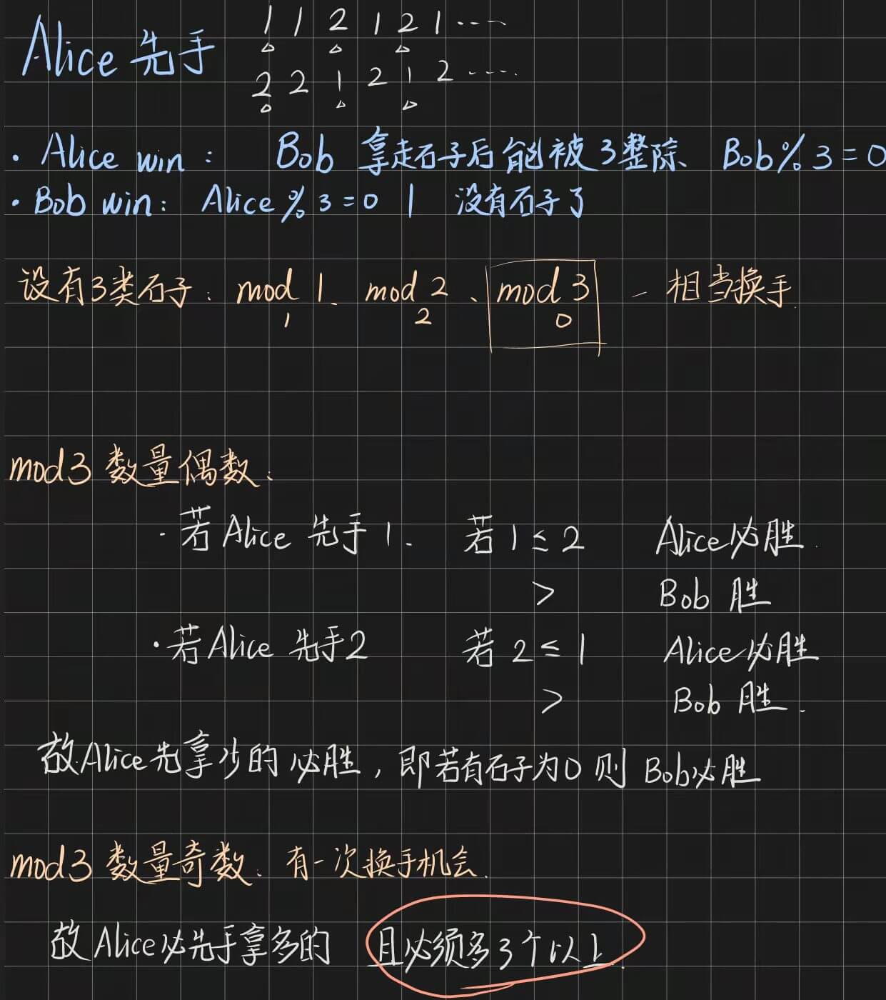

# leetcode 算法日记（第二弹）

2022 新的一年继续努力积极向上 hhhh~

## 模拟

### 击鼓传花

有`num`个小孩儿，编号从`1-num`，围成一圈依此报数，1、2、3... 数到 `count` 的小孩儿退出这个圈， 然后下一个小孩 重新报数 1、2、3...，问最后剩下的那个小孩儿的编号是多少?

---

**队列** `2022.2.15`

主要思路：将报过数的小孩，从队头拿出重新插入到队尾中。

```js
function foo(num, count) {
  let queue = new Array(num);
  for (let i = 0; i < num; i++) {
    queue[i] = i + 1;
  }
  while (queue.length > 1) {
    for (let i = 0; i < num - 1; i++) {
      queue.push(queue.shift());
    }
    queue.shift();
  }
  return queue[0];
}
```

### leetcode 382. 链表随机节点

给你一个单链表，随机选择链表的一个节点，并返回相应的节点值。每个节点被选中的概率一样 。

实现 `Solution` 类：

`Solution(ListNode head)` 使用整数数组初始化对象。
`int getRandom()` 从链表中随机选择一个节点并返回该节点的值。链表中所有节点被选中的概率相等。

**法一：模拟** `2022.1.16`

基本思路：直接遍历链表并存在数组中，再通过随机下标获取值

```js
/**
 * Definition for singly-linked list.
 * function ListNode(val, next) {
 *     this.val = (val===undefined ? 0 : val)
 *     this.next = (next===undefined ? null : next)
 * }
 */
var Solution = function (head) {
  this.head = head;
  this.arr = [];
  let t = this.head;
  while (t !== null) {
    this.arr.push(t.val);
    t = t.next;
  }
};
Solution.prototype.getRandom = function () {
  const n = this.arr.length;
  return this.arr[Math.floor(Math.random() * n)];
};
```

**法二：池塘抽样** `2022.1.16`

主要思路是：从前往后处理每一个数据，令每一个数据选出的概率是$\frac{1}{i}$,这样最终每一个数据选出的概率就变成了$\frac{1}{n}$

[算法思路证明](https://leetcode-cn.com/problems/linked-list-random-node/solution/gong-shui-san-xie-xu-shui-chi-chou-yang-1lp9d/)

```js
var Solution = function (head) {
  this.head = head;
};

Solution.prototype.getRandom = function () {
  let t = this.head;
  let i = 0;
  let ans = 0;
  while (t !== null && ++i >= 0) {
    if (Math.floor(Math.random() * i) === 0) ans = t.val;
    t = t.next;
  }
  return ans;
};
```

### leetcode 537. 复数乘法

复数 可以用字符串表示，遵循 `"实部+虚部i"` 的形式，并满足下述条件：

- 实部 是一个整数，取值范围是 `[-100, 100]`
- 虚部 也是一个整数，取值范围是 `[-100, 100]`
- i2 == -1
  给你两个字符串表示的复数 `num1` 和 `num2` ，请你遵循复数表示形式，返回表示它们乘积的字符串。

---

**简单模拟** `2022.2.25`

取出实部虚部的数组部分，进行数学操作，最后再将实部虚部部分拼起来即可。

### 539. 最小时间差

给定一个 24 小时制（小时:分钟 "HH:MM"）的时间列表，找出列表中任意两个时间的最小时间差并以分钟数表示。

**简单模拟** `2022.1.18`

主要思路是：将时间转化为分钟进行存储，从小到大排序后，考虑隔一天的情况，只需要将第一位也就是最小的分钟加一个 1440（即一天），存入数组中即可。然后就是简单遍历了。

```js
var findMinDifference = function (timePoints) {
  const n = timePoints.length;
  if (n > 1440) return 0;
  let nums = new Array(n + 1);
  let i = 0;
  for (let t of timePoints) {
    const time = t.split(":");
    nums[i] = time[0] * 60 + time[1] * 1; // 隐式转换
    i++;
  }
  nums.sort((a, b) => a - b);
  nums[n] = nums[0] + 1440;
  let ans = Infinity;
  for (let i = 1; i < nums.length; i++) {
    ans = Math.min(ans, nums[i] - nums[i - 1]);
  }
  return ans;
};
```

### leetcode. 717. 1 比特与 2 比特字符

有两种特殊字符：

- 第一种字符可以用一比特  `0` 表示
- 第二种字符可以用两比特`（10 或 11）`表示

给你一个以 `0` 结尾的二进制数组  `bits` ，如果最后一个字符必须是一个一比特字符，则返回 `true` 。

---

**遍历模拟** `2022.2.20`

从头开始遍历模拟即可

```js
var isOneBitCharacter = function (bits) {
  const n = bits.length;
  let i = 0;
  while (i < n - 1) {
    if (bits[i] == 0) i++;
    else i += 2;
  }
  return i == n - 1 ? true : false;
};
```

### leetcode. 838. 推多米诺

`n` 张多米诺骨牌排成一行，将每张多米诺骨牌垂直竖立。在开始时，同时把一些多米诺骨牌向左或向右推。

每过一秒，倒向左边的多米诺骨牌会推动其左侧相邻的多米诺骨牌。同样地，倒向右边的多米诺骨牌也会推动竖立在其右侧的相邻多米诺骨牌。

如果一张垂直竖立的多米诺骨牌的两侧同时有多米诺骨牌倒下时，由于受力平衡， **该骨牌仍然保持不变**。

就这个问题而言，我们会认为一张正在倒下的多米诺骨牌不会对其它正在倒下或已经倒下的多米诺骨牌施加额外的力。

给你一个字符串 `dominoes` 表示这一行多米诺骨牌的初始状态，其中：

- `dominoes[i] = 'L'`，表示第 i 张多米诺骨牌被推向左侧，
- `dominoes[i] = 'R'`，表示第 i 张多米诺骨牌被推向右侧，
- `dominoes[i] = '.'`，表示没有推动第 i 张多米诺骨牌。

返回表示最终状态的字符串。

---

**哨兵+分情况模拟** `2022.2.21`

我们可以分析出 4 种子情况：

- `L....R` 的时候，中间的骨牌不变
- `R....L` 的时候，中间的骨牌从左右两边开始变化，如果中间骨牌长度为奇数，则中间一个骨牌由于受力平衡而站立
- `R...R`和`L...L` 中间骨牌全部变化

为了防止首尾为`.`的情况，我们可以在前后加哨兵。

```js
// L...L 或 R...R
// L...R ： ...
// R...L ： RRR.LLL
var pushDominoes = function (dominoes) {
  // 加一个虚拟头尾部
  dominoes = "L" + dominoes + "R";
  const n = dominoes.length;
  let l = 0;
  let res = "";
  for (let r = 1; r < n; r++) {
    if (dominoes[r] == ".") continue;
    let len = r - l - 1;
    if (dominoes[l] == "L" && dominoes[r] == "L") {
      res += "L".repeat(len);
    } else if (dominoes[l] == "R" && dominoes[r] == "R") {
      res += "R".repeat(len);
    } else if (dominoes[l] == "L" && dominoes[r] == "R") {
      res += ".".repeat(len);
    } else {
      let half = Math.floor(len / 2);
      res += "R".repeat(half) + (len & 1 ? "." : "") + "L".repeat(half);
    }
    if (r != n - 1) res += dominoes[r]; // 不把尾部虚拟L加入进去
    l = r;
  }
  return res;
};
```

### leetcode 884. 两句话中的不常见单词

句子是一串由空格分隔的单词。每个 **单词** 仅由小写字母组成。

如果某个单词在其中一个句子中恰好出现一次，在另一个句子中却 **没有出现** ，那么这个单词就是 **不常见的** 。

给你两个 句子 s1 和 s2 ，返回所有 **不常用单词** 的列表。返回列表中单词可以按 任意顺序 组织。

---

**哈希表** `2022.1.30`

遍历两个句子，看看哪个单词只出现过一次

```js
var uncommonFromSentences = function (s1, s2) {
  const map = new Map();
  for (let s of s1.split(" ")) {
    if (map.has(s)) {
      let i = map.get(s);
      map.set(s, i + 1);
    } else map.set(s, 1);
  }
  for (let s of s2.split(" ")) {
    if (map.has(s)) {
      let i = map.get(s);
      map.set(s, i + 1);
    } else map.set(s, 1);
  }
  const ans = [];
  for (let i of map.keys()) {
    if (map.get(i) === 1) ans.push(i);
  }
  return ans;
};
```

### leetcode 917. 仅仅反转字母

给你一个字符串 `s` ，根据下述规则反转字符串：

- 所有非英文字母保留在原有位置。
- 所有英文字母（小写或大写）位置反转。
  返回反转后的 `s` 。

---

**简单模拟** `2022.2.23`

双指针，从左到右向中间遍历，左右指针同时指向字母的时候，调换位置即可。

### leetcode 1001. 网格照明

在大小为 n x n 的网格 grid 上，每个单元格都有一盏灯，最初灯都处于 关闭 状态。

给你一个由灯的位置组成的二维数组  lamps ，其中 `lamps[i] = [rowi, coli]` 表示 打开 位于 `grid[rowi][coli]` 的灯。即便同一盏灯可能在 lamps 中多次列出，不会影响这盏灯处于 打开 状态。

当一盏灯处于打开状态，它将会照亮 自身所在单元格 以及同一 行 、同一 列 和两条 对角线 上的 所有其他单元格 。

另给你一个二维数组 queries ，其中 `queries[j] = [rowj, colj]` 。对于第 j 个查询，如果单元格 `[rowj, colj]` 是被照亮的，则查询结果为 1 ，否则为 0 。在第 j 次查询之后 `[按照查询的顺序]` ，关闭 位于单元格 `grid[rowj][colj]` 上及相邻 8 个方向上（与单元格 `grid[rowi][coli]` 共享角或边）的任何灯。

返回一个整数数组 ans 作为答案， `ans[j]` 应等于第 j 次查询  `queries[j]`  的结果，1 表示照亮，0 表示未照亮。

---

**哈希表模拟** `2022.2.8`

简单复述下题意：打开的灯会照亮别的灯，操作如下：先打开一些灯，然后查询指定灯有没有被照亮，返回结果，查询后需要关闭该灯四周九宫格范围内**已经打开**的灯

为了节省时间，我们可以使用 4 个哈希表，分别记录行，列，正反对角线的亮灯的数目（数目更好，节省空间），以及打开灯的位置。

然后模拟查询以及关闭灯即可

```js
var gridIllumination = function (n, lamps, queries) {
  const DIR = [
    [1, 0],
    [-1, 0],
    [1, 1],
    [1, -1],
    [0, 1],
    [0, -1],
    [-1, 1],
    [-1, -1],
  ];
  let col = new Map();
  let row = new Map();
  let left = new Map(); // x+y 反向对角线
  let right = new Map(); // x-y 正向对角线
  let set = new Set(); // 放真正打开的灯
  for (let l of lamps) {
    let r = l[0];
    let c = l[1];
    let a = r + c;
    let b = c - r;
    if (set.has(r * n + c)) continue;
    put(col, c);
    put(row, r);
    put(left, a);
    put(right, b);
    set.add(r * n + c);
  }
  let ans = [];
  for (let q of queries) {
    let r = q[0];
    let c = q[1];
    let a = r + c;
    let b = c - r;
    if (col.has(c) || row.has(r) || left.has(a) || right.has(b)) ans.push(1);
    else ans.push(0);
    if (set.has(r * n + c)) {
      remove(col, c);
      remove(row, r);
      remove(left, a);
      remove(right, b);
      set.delete(r * n + c);
    }
    for (let dir of DIR) {
      let nx = c + dir[0];
      let ny = r + dir[1];
      let na = nx + ny;
      let nb = nx - ny;
      if (nx < 0 || ny < 0 || nx >= n || ny >= n) continue;
      if (set.has(ny * n + nx)) {
        remove(col, nx);
        remove(row, ny);
        remove(left, na);
        remove(right, nb);
        set.delete(ny * n + nx);
      }
    }
  }
  return ans;
};
function put(map, key) {
  if (map.has(key)) {
    let cur = map.get(key);
    map.set(key, cur + 1);
  } else {
    map.set(key, 1);
  }
}
function remove(map, key) {
  let cur = map.get(key);
  if (cur == 1) map.delete(key);
  else map.set(key, cur - 1);
}
```

### leetcode 1332. 删除回文子序列

给你一个字符串  `s`，它仅由字母  `'a'` 和 `'b'`  组成。每一次删除操作都可以从 `s` 中删除一个回文 **子序列**。

返回删除给定字符串中所有字符（字符串为空）的最小删除次数。

**双指针模拟** `2022.1.22`

因为这个字符串就只有 a、b 两个字母，因此最差也只需要删除 2 次。实际上就只需要判断 s 是不是一个回文串，是的话就直接删除，不是的话就返回 2。

```js
var removePalindromeSub = function (s) {
  const n = s.length;
  let i = 0;
  let j = n - 1;
  while (i < j) {
    if (s.charAt(i) !== s.charAt(j)) return 2;
    i++;
    j--;
  }
  return 1;
};
```

### leetcode 1342. 将数字变成 0 的操作次数

给你一个非负整数 num ，请你返回将它变成 0 所需要的步数。 如果当前数字是偶数，你需要把它除以 2 ；否则，减去 1 。

---

```js
var numberOfSteps = function (num) {
  let ans = 0;
  while (num > 0) {
    ans++;
    if ((num & 1) == 0) {
      num = num >> 1;
    } else {
      num -= 1;
    }
  }
  return ans;
};
```

### leetcode 1414. 和为 K 的最少斐波那契数字数目

给你数字 k ，请你返回和为 k 的斐波那契数字的最少数目，其中，每个斐波那契数字都可以被使用多次。

---

**递归** `2022.2.3`

```js
var findMinFibonacciNumbers = function (k) {
  if (k === 0) return 0;
  let a = 1;
  let b = 1;
  let c = 1;
  while (a + b <= k) {
    a = b;
    b = c;
    if (a + b > k) break;
    c = a + b;
  }
  return findMinFibonacciNumbers(k - c) + 1;
};
```

### leetcode 1447. 最简分数

给你一个整数 n ，请你返回所有 0 到 1 之间（不包括 0 和 1）满足分母小于等于 n 的 最简 分数 。分数可以以 任意 顺序返回。

---

**gcd--欧几里得算法** `2022.2.10`

今天来学习一下如何使用欧几里得算法来计算最大公约数

不断的用除数除以余数，当余数为 0 的时候，该次的除数则是答案

```js
var simplifiedFractions = function (n) {
  function gcd(a, b) {
    return b == 0 ? a : gcd(b, a % b);
  }
  let ans = [];
  for (let i = 2; i <= n; i++) {
    for (let j = 1; j < i; j++) {
      if (gcd(i, j) === 1) ans.push(j + "/" + i);
    }
  }
  return ans;
};
```

### leetcode 1688. 比赛中的配对次数

给你一个整数 n ，表示比赛中的队伍数。比赛遵循一种独特的赛制：

- 如果当前队伍数是 **偶数** ，那么每支队伍都会与另一支队伍配对。总共进行 `n / 2` 场比赛，且产生 `n / 2` 支队伍进入下一轮。
- 如果当前队伍数为 **奇数** ，那么将会随机轮空并晋级一支队伍，其余的队伍配对。总共进行 `(n - 1) / 2` 场比赛，且产生 `(n - 1) / 2 + 1` 支队伍进入下一轮。
  返回在比赛中进行的配对次数，直到决出获胜队伍为止。

**暴力** `2022.1.25`

```js
var numberOfMatches = function (n) {
  let ans = 0;
  while (n > 1) {
    ans += n & 1 ? (n - 1) / 2 : n / 2;
    n = n & 1 ? (n + 1) / 2 : n / 2;
  }
  return ans;
};
```

**脑筋急转弯**

最终决出获胜队伍，即有 n-1 个队伍需要配对，即直接 return n-1

> 但我不知道为啥暴力的时间还更少- -

### leetcode 1706. 球会落何处

用一个大小为 `m x n` 的二维网格 `grid` 表示一个箱子。你有 `n` 颗球。箱子的顶部和底部都是开着的。

箱子中的每个单元格都有一个对角线挡板，跨过单元格的两个角，可以将球导向左侧或者右侧。

将球导向右侧的挡板跨过左上角和右下角，在网格中用 `1` 表示。
将球导向左侧的挡板跨过右上角和左下角，在网格中用 `-1` 表示。
在箱子每一列的顶端各放一颗球。每颗球都可能卡在箱子里或从底部掉出来。如果球恰好卡在两块挡板之间的 "V" 形图案，或者被一块挡导向到箱子的任意一侧边上，就会卡住。

返回一个大小为 `n` 的数组 `answer` ，其中 `answer[i]` 是球放在顶部的第 `i` 列后从底部掉出来的那一列对应的下标，如果球卡在盒子里，则返回 `-1` 。

---

**简单模拟** `2022.2.24`

根据图来模拟即可。注意卡死的条件即可。

```js
var findBall = function (grid) {
  const m = grid.length;
  const n = grid[0].length;
  let ans = new Array(n);
  for (let i = 0; i < n; i++) ans[i] = getCol(grid, m, n, i);
  return ans;
};
//grid m 层数 n 总列数 st开始的列索引
function getCol(grid, m, n, st) {
  for (let i = 0; i < m; i++) {
    let cur = grid[i][st];
    if (cur == -1) {
      if (st == 0 || grid[i][st - 1] == 1) return -1;
      st--;
    }
    if (cur == 1) {
      if (st == n - 1 || grid[i][st + 1] == -1) return -1;
      st++;
    }
  }
  return st;
}
```

### leetcode 2006. 差的绝对值为 K 的数对数目

给你一个整数数组  nums  和一个整数  k ，请你返回数对  `(i, j) `的数目，满足  `i < j`  且  `|nums[i] - nums[j]| == k` 。

---

**简单模拟：哈希表** `2022.02.09`

先用哈希表记录数据出现次数，然后遍历数组，同时寻找相差 k 的较大较小数。

```js
var countKDifference = function (nums, k) {
  let map = new Map();
  for (let num of nums) {
    if (map.has(num)) {
      map.set(num, map.get(num) + 1);
    } else {
      map.set(num, 1);
    }
  }
  let ans = 0;
  for (let i of nums) {
    let xi = i - k;
    let yi = i + k;
    if (map.has(xi)) ans += map.get(xi);
    if (map.has(yi)) ans += map.get(yi);
  }
  return ans / 2;
};
```

### leetcode 2013. 检测正方形

给你一个在 X-Y 平面上的点构成的数据流。设计一个满足下述要求的算法：

- 添加一个在数据流中的新点到某个数据结构中。可以添加 **重复** 的点，并会视作不同的点进行处理。
- 给你一个查询点，请你从数据结构中选出三个点，使这三个点和查询点一同构成一个面积为正的轴对齐正方形 ，统计满足该要求的方案数目。

> 轴对齐正方形是一个正方形，除四条边长度相同外，还满足每条边都与 x-轴 或 y-轴 平行或垂直。

实现` DetectSquares` 类：

`DetectSquares()` 使用空数据结构初始化对象
`void add(int[] point)` 向数据结构添加一个新的点 `point = [x, y]`
`int count(int[] point)` 统计按上述方式与点 `point = [x, y]` 共同构造 轴对齐正方形 的方案数。

**哈希表** `2022.1.26`

使用一维优化的方式记录 point。

使用哈希表来记录每一个点的个数，再使用一个数组来记录每一个点的种类。

在查询方法中，遍历数组获取所有不同的点，判断是否正方形面积为 0（即重叠）或不为轴对齐，然后判断组成正方形的剩余两个点的数量并相乘

```js
const N = 100;
class DetectSquares {
  constructor() {
    this.cnt = new Map();
    this.st = new Array(5005);
    this.i = 0;
  }
  add(point) {
    if (!this.cnt.has(point[0] * N + point[1])) {
      this.st[this.i++] = point[0] * N + point[1];
    }
    const cur = this.cnt.get(point[0] * N + point[1]) || 0;
    this.cnt.set(point[0] * N + point[1], cur + 1);
  }
  count(point) {
    let ans = 0;
    for (let i = 0; i < this.i; i++) {
      let x = Math.floor(this.st[i] / N);
      let y = this.st[i] % N;
      if (
        x === point[0] ||
        y === point[1] ||
        Math.abs(x - point[0]) != Math.abs(y - point[1])
      )
        continue;
      if (this.cnt.has(point[0] * N + y) && this.cnt.has(x * N + point[1])) {
        ans +=
          this.cnt.get(point[0] * N + y) *
          this.cnt.get(x * N + point[1]) *
          this.cnt.get(this.st[i]);
      }
    }
    return ans;
  }
}
```

### leetcode 2029. 石子游戏 IX

Alice 和 Bob 再次设计了一款新的石子游戏。现有一行 `n` 个石子，每个石子都有一个关联的数字表示它的价值。给你一个整数数组 `stones` ，其中 `stones[i]` 是第 `i` 个石子的价值。

Alice 和 Bob 轮流进行自己的回合，Alice 先手。每一回合，玩家需要从 `stones`  中移除任一石子。

如果玩家移除石子后，导致 **所有已移除石子** 的价值   **总和** 可以被 3 整除，那么该玩家就 **输掉游戏** 。
如果不满足上一条，且移除后没有任何剩余的石子，那么 Bob 将会直接获胜（即便是在 Alice 的回合）。
假设两位玩家均采用   **最佳** 决策。如果 Alice 获胜，返回 `true` ；如果 Bob 获胜，返回 `false` 。

**博弈论** `2022.1.20`



主要是要理解为什么当第 3 类石子是奇数的时候，必须多的那类石子要多出 3 个以上。只有多出 3 个以上 Alice 才能胜利

```js
var stoneGameIX = function (stones) {
  const cnt = new Array(3).fill(0);
  for (let i = 0; i < stones.length; i++) {
    cnt[stones[i] % 3]++;
  }
  return cnt[0] % 2 === 0 ? cnt[1] && cnt[2] : Math.abs(cnt[1] - cnt[2]) >= 3;
};
```

### leetcode 2151. 基于陈述统计最多好人数

游戏中存在两种角色：

好人：该角色只说真话。
坏人：该角色可能说真话，也可能说假话。
给你一个下标从 0 开始的二维整数数组 statements ，大小为 `n x n` ，表示 n 个玩家对彼此角色的陈述。具体来说，`statements[i][j]` 可以是下述值之一：

- 0 表示 i 的陈述认为 j 是 坏人 。
- 1 表示 i 的陈述认为 j 是 好人 。
- 2 表示 i 没有对 j 作出陈述。
  另外，玩家不会对自己进行陈述。形式上，对所有  `0 <= i < n` ，都有 `statements[i][i] = 2` 。

根据这 n 个玩家的陈述，返回可以认为是 **好人** 的 **最大** 数目。

**二进制枚举和状态压缩**

这题的 n 最大只有 15，因此可以用暴力枚举的方法----二进制枚举。今天来学习一下[二进制枚举](https://blog.csdn.net/sugarbliss/article/details/81099340)

因此这题总枚举数是`1 << n`，（最多 15 个人，每个人都可以当坏人或者好人，即 2^15）

为了优化我们使用状态压缩的方法，即 i>>j 为第 i 种情况中是否为好人（1 则好人，0 则坏人），坏人说的话没有判断的价值

此时继续枚举 k，然后判断 i（好人）说的话跟 statements 的有没有冲突，有的话则说明 i 的这种情况有问题。

```js
var maximumGood = function (statements) {
  const n = statements.length;
  let ans = 0;
  for (let i = 0; i < 1 << n; i++) {
    let cur = 0;
    let flag = true;
    for (let j = 0; j < n && flag; j++) {
      if ((i >> j) & 1) {
        cur += 1;
        for (let k = 0; k < n && flag; k++) {
          if (statements[j][k] === 2) continue;
          if (statements[j][k] == 0 && ((i >> k) & 1) == 1) flag = false;
          if (statements[j][k] == 1 && ((i >> k) & 1) == 0) flag = false;
        }
      }
    }

    if (flag) ans = Math.max(cur, ans);
  }
  return ans;
};
```

## 单调栈

### leetcode 1856. 子数组最小乘积的最大值

给你一个正整数数组  `nums` ，请你返回  `nums`  任意   非空子数组   的最小乘积   的   最大值  。由于答案可能很大，请你返回答案对   `109 + 7`  取余   的结果。

**单调栈** `2022.1.17`

主要思路是利用单调栈找出以每一个数字作为最小值的时候，最大长度的区间，然后求答案。

注意这题一定要用 BigInt 不用 AC 不了

```js
/**
 * @param {number[]} nums
 * @return {number}
 */
var maxSumMinProduct = function (nums) {
  let queue = new Stack();
  let ans = BigInt(0);
  let sum = new Array(nums.length + 1).fill(0);
  for (let i = 1; i <= nums.length; i++) {
    sum[i] = sum[i - 1] + nums[i - 1];
  }
  for (let i = 0; i < nums.length; i++) {
    let cur = nums[i];
    while (!queue.isEmpty() && nums[queue.peek()[0]] > cur) {
      let maxList = queue.pop();
      let l = queue.isEmpty() ? 0 : queue.peek()[queue.peek().length - 1] + 1;
      let tep = BigInt(sum[i] - sum[l]) * BigInt(nums[maxList[0]]);
      if (tep > ans) ans = tep;
    }
    if (!queue.isEmpty() && nums[queue.peek()[0]] === nums[i])
      queue.peek().push(i);
    else queue.push([i]);
  }
  while (!queue.isEmpty()) {
    let maxList = queue.pop();
    let l = queue.isEmpty() ? 0 : queue.peek()[queue.peek().length - 1] + 1;
    let tep = BigInt(sum[nums.length] - sum[l]) * BigInt(nums[maxList[0]]);
    if (tep > ans) ans = tep;
  }
  return ans % 1000000007n;
};
class Stack {
  constructor() {
    this.items = [];
  }
  push(el) {
    this.items.push(el);
  }
  pop() {
    return this.items.pop();
  }
  peek() {
    if (this.items.length === 0) return null;
    return this.items[this.items.length - 1];
  }
  isEmpty() {
    return this.items.length === 0;
  }
  size() {
    return this.items.length;
  }
}
```

### leetcode 1996. 游戏中弱角色的数量

你正在参加一个多角色游戏，每个角色都有两个主要属性：**攻击** 和 **防御** 。给你一个二维整数数组 `properties` ，其中 `properties[i] = [attacki, defensei]` 表示游戏中第 i 个角色的属性。

如果存在一个其他角色的攻击和防御等级 都严格高于 该角色的攻击和防御等级，则认为该角色为 **弱角色** 。更正式地，如果认为角色 i 弱于 存在的另一个角色 j ，那么 `attackj > attacki` 且 `defensej > defensei` 。

返回 **弱角色** 的数量。

**法一：排序** `2022.1.28`

首先按照攻击力从大到小排序，在攻击力相同的每一段维护一个最大防御力，这样的话遍历到下一段的时候只要防御力没有上一段最大防御力高，则为弱角色

```js
var numberOfWeakCharacters = function (properties) {
  // 攻击
  properties.sort((a, b) => b[0] - a[0]);
  let ans = 0;
  let defenseMax = properties[0][1]; // 一段中最大值
  for (let i = 0; i < properties.length; ) {
    let j = i;
    let cur = defenseMax;
    // 处理攻击力相同段
    while (j < properties.length && properties[i][0] === properties[j][0]) {
      if (i !== 0 && properties[j][1] < defenseMax) {
        ans++;
      }
      cur = Math.max(cur, properties[j++][1]);
    }
    defenseMax = cur;
    i = j;
  }
  return ans;
};
```

**法二：单调栈**

对于找比自身大的值这种问题，单调栈是最好实现的了

这就需要维护一个递减的单调栈。这样的话我们可以先按照攻击力从小到大排序，如果攻击力相同的话则防御力从大到小排序。**这里是为了让攻击力相同时单调栈一直 push 值**

单调栈只需要维护防御力即可。

```js
var numberOfWeakCharacters = function (properties) {
  properties.sort((a, b) => {
    if (a[0] != b[0]) return a[0] - b[0];
    else return b[1] - a[1];
  });
  let ans = 0;
  let st = []; // defense递减的单调栈---找比自己大的
  for (let p of properties) {
    while (st.length > 0 && st[st.length - 1] < p[1]) {
      st.pop();
      ans++;
    }
    st.push(p[1]);
  }

  return ans;
};
```

## 优先队列（堆）

### leetcode 2034. 股票价格波动

给你一支股票价格的数据流。数据流中每一条记录包含一个 **时间戳**  和该时间点股票对应的 **价格** 。

不巧的是，由于股票市场内在的波动性，股票价格记录可能不是按时间顺序到来的。某些情况下，有的记录可能是错的。如果两个有相同时间戳的记录出现在数据流中，前一条记录视为错误记录，后出现的记录 **更正**  前一条错误的记录。

请你设计一个算法，实现：

更新股票在某一时间戳的股票价格，如果有之前同一时间戳的价格，这一操作将更正之前的错误价格。
找到当前记录里 **最新股票价格** 。最新股票价格定义为时间戳最晚的股票价格。
找到当前记录里股票的 **最高价格** 。
找到当前记录里股票的 **最低价格** 。
请你实现  `StockPrice`  类：

`StockPrice()`  初始化对象，当前无股票价格记录。
`void update(int timestamp, int price)`  在时间点 timestamp  更新股票价格为 price 。
`int current()`  返回股票 最新价格  。
`int maximum()`  返回股票 最高价格  。
`int minimum()`  返回股票 最低价格  。

**优先队列** `2022.1.23`

基本思路：设置一个哈希表（time：price），每次 update 都 set 一下。其次是返回最新价格，只需要每次 update 的时候维护一个最大时间戳即可

主要是最大最小价格，一开始我采用遍历哈希表的方法，TLE 了- -

那只能用优先队列了呀。用优先队列的话还要考虑一个问题，如何解决之前的错误价格呢？

其实也很容易，只需要加时间和价格同时推进优先队列中即可，取出的时候判断一下是否跟哈希表内的时间和价格一致，不一致则说明是错误价格，继续取出即可。

```js
class StockPrice {
  constructor() {
    this.stock = new Map();
    this.cur = 0;
    this.maxQueue = new PriorityQueue((a, b) => a[0] > b[0]);
    this.minQueue = new PriorityQueue((a, b) => a[0] < b[0]);
  }
  update(time, price) {
    this.cur = Math.max(this.cur, time);
    this.stock.set(time, price);
    // 直接offer

    this.maxQueue.offer([price, time]);
    this.minQueue.offer([price, time]);
  }
  current() {
    return this.stock.get(this.cur);
  }
  maximum() {
    while (1) {
      const cur = this.maxQueue.peek();
      if (this.stock.get(cur[1]) === cur[0]) {
        return cur[0];
      }
      this.maxQueue.poll();
    }
  }
  minimum() {
    while (1) {
      const cur = this.minQueue.peek();
      if (this.stock.get(cur[1]) === cur[0]) {
        return cur[0];
      }
      this.minQueue.poll();
    }
  }
}
class PriorityQueue {
  constructor(compare = (a, b) => a > b) {
    this.data = [];
    this.size = 0;
    this.compare = compare;
  }
  peek() {
    return this.size > 0 ? this.data[0] : null;
  }
  offer(value) {
    this.data.push(value);
    this._siftUp(this.size++);
  }
  poll() {
    this._swap(0, --this.size);
    this._siftDown(0);
    return this.data.pop();
  }
  _parent(index) {
    return (index - 1) >> 1;
  }
  _child(index) {
    return (index << 1) + 1;
  }
  _siftUp(index) {
    while (
      this._parent(index) >= 0 &&
      this.compare(this.data[index], this.data[this._parent(index)])
    ) {
      this._swap(index, this._parent(index));
      index = this._parent(index);
    }
  }

  _siftDown(index) {
    while (this._child(index) < this.size) {
      let child = this._child(index);
      if (
        child + 1 < this.size &&
        this.compare(this.data[child + 1], this.data[child])
      ) {
        child = child + 1;
      }
      if (this.compare(this.data[index], this.data[child])) {
        break;
      }
      this._swap(index, child);
      index = child;
    }
  }

  _swap(a, b) {
    [this.data[a], this.data[b]] = [this.data[b], this.data[a]];
  }
}
```

## 滑动窗口

### 219. 存在重复元素 II

给你一个整数数组`nums` 和一个整数  `k` ，判断数组中是否存在两个 不同的索引  `i`  和  `j` ，满足 `nums[i] == nums[j]` 且 `abs(i - j) <= k` 。如果存在，返回 true ；否则，返回 false 。

**2022.1.19**

```js
var containsNearbyDuplicate = function (nums, k) {
  const n = nums.length;
  let set = new Set();
  for (let i = 0; i < n; i++) {
    if (i > k) {
      set.delete(nums[i - k - 1]);
    }
    if (set.has(nums[i])) {
      return true;
    }
    set.add(nums[i]);
  }
  return false;
};
```

### leetcode 1984. 学生分数的最小差值

给你一个 **下标从 0 开始** 的整数数组 `nums` ，其中 `nums[i]` 表示第 `i` 名学生的分数。另给你一个整数 `k` 。

从数组中选出任意 `k` 名学生的分数，使这 `k` 个分数间 **最高分** 和 **最低分** 的 **差值** 达到 **最小化** 。

返回可能的 **最小差值** 。

---

**滑动窗口** `2022.2.11`

先排个序，再用滑动窗口记录最左以及最右值的差值，统计出遍历过程中该差值的最小值

``var minimumDifference = function(nums, k) { nums.sort((a,b)=>a-b) let ans=Infinity for(let i=k-1;i<nums.length;i++){ ans=Math.min(ans,nums[i]-nums[i-k+1]) } return ans };`js

````

## 动态规划

### leetcode 1220. 统计元音字母序列的数目

**dp** `2022.1.17`

类似这种题想到的就是 dp，重点是定义状态数组，根据题意，可以定义 dp[i][j]是长度为 i，j 是结尾为第 j 个字符的序列数。

```js
var countVowelPermutation = function (n) {
  //['a','e','i','o','u']  dp[i][j] i表示长度i j表示结尾是第j个字符
  let dp = new Array(n + 1).fill(0).map(() => new Array(5).fill(0));
  // 初始化
  for (let i = 0; i < 5; i++) {
    dp[1][i] = 1;
  }
  for (let i = 2; i <= n; i++) {
    dp[i][0] = (dp[i - 1][4] + dp[i - 1][1] + dp[i - 1][2]) % 1000000007; // a=e+i+u
    dp[i][1] = (dp[i - 1][0] + dp[i - 1][2]) % 1000000007; //e =a+i
    dp[i][2] = (dp[i - 1][1] + dp[i - 1][3]) % 1000000007; // i= e+o
    dp[i][3] = dp[i - 1][2] % 1000000007; // o=i
    dp[i][4] = (dp[i - 1][2] + dp[i - 1][3]) % 1000000007; // u=i+o
  }
  let ans = 0;
  for (let i = 0; i < 5; i++) {
    ans += dp[n][i] % 1000000007;
  }
  return ans % 1000000007;
};
````

## 动规 dp&bfs&dfs

### leetcode 688. 骑士在棋盘上的概率

在一个  `n x n`  的国际象棋棋盘上，一个骑士从单元格 `(row, column)`  开始，并尝试进行 `k` 次移动。行和列是 从 `0` 开始 的，所以左上单元格是 `(0,0)` ，右下单元格是 `(n - 1, n - 1)` 。

象棋骑士有 8 种可能的走法，如下图所示。每次移动在基本方向上是两个单元格，然后在正交方向上是一个单元格。

每次骑士要移动时，它都会随机从 8 种可能的移动中选择一种(即使棋子会离开棋盘)，然后移动到那里。

骑士继续移动，直到它走了 k 步或离开了棋盘。

返回 **骑士在棋盘停止移动后仍留在棋盘上的概率** 。

---

**dfs 记忆化搜索** `2022.2.18`

简单 dfs 即可。

关键在于出界以后概率为 0，剩余步数 k=0 的时候仍在棋盘内内概率为 1，在 dfs 遍历过程中，需要加上 8 种 子情况的概率乘以 1/8

```js
const DIR = [
  [2, 1],
  [1, 2],
  [-2, 1],
  [-1, 2],
  [-2, -1],
  [-1, -2],
  [1, -2],
  [2, -1],
];
var knightProbability = function (n, k, row, column) {
  let dp = new Array(n)
    .fill(0)
    .map(() => new Array(n).fill(0).map(() => new Array(k + 1).fill(-1)));
  for (let i = 0; i < n; i++) {
    for (let j = 0; j < n; j++) {
      dp[i][j][0] = 1;
    }
  }
  return move(n, dp, k, row, column);
};
function move(n, dp, k, x, y) {
  if (x < 0 || y < 0 || x >= n || y >= n) return 0;
  if (k === 0) return 1;
  if (dp[x][y][k] > -1) return dp[x][y][k];
  let ans = 0;
  for (let dir of DIR) {
    let nx = x + dir[0];
    let ny = y + dir[1];
    ans += move(n, dp, k - 1, nx, ny) / 8;
  }
  dp[x][y][k] = ans;
  return ans;
}
```

### leetcode 1020. 飞地的数量

给你一个大小为 `m x n` 的二进制矩阵 `grid` ，其中 0 表示一个海洋单元格、1 表示一个陆地单元格。

一次 移动 是指从一个陆地单元格走到另一个相邻（上、下、左、右）的陆地单元格或跨过 grid 的边界。

返回网格中 **无法** 在任意次数的移动中离开网格边界的陆地单元格的数量。

---

**多源 BFS** `2022.2.12`

只需要以四周边界的所有陆地作为起点，BFS 遍历到的陆地都变为 0，最后统计剩下 1 的个数即可

注意，这道题疯狂 TLE- -

```js
var numEnclaves = function (grid) {
  const DIR = [
    [0, 1],
    [0, -1],
    [1, 0],
    [-1, 0],
  ];
  let ans = 0;
  let id = 0;
  const m = grid.length;
  const n = grid[0].length;
  let queue = [];
  for (let i = 0; i < m; i++) {
    if (grid[i][0] == 1) {
      queue.push([i, 0]);
      grid[i][0] = 0;
    }
    if (grid[i][n - 1] == 1) {
      grid[i][n - 1] = 0;
      queue.push([i, n - 1]);
    }
  }
  for (let j = 0; j < n; j++) {
    if (grid[0][j] == 1) {
      queue.push([0, j]);
      grid[0][j] = 0;
    }
    if (grid[m - 1][j] == 1) {
      queue.push([m - 1, j]);
      grid[m - 1][j] = 0;
    }
  }
  while (id < queue.length) {
    let cur = queue[id++];
    for (let dir of DIR) {
      let ni = cur[0] + dir[0];
      let nj = cur[1] + dir[1];
      if (ni < 0 || nj < 0 || ni >= m || nj >= n) {
        continue;
      }
      if (grid[ni][nj] == 1) {
        grid[ni][nj] = 0;
        queue.push([ni, nj]);
      }
    }
  }
  for (let i = 0; i < m; i++) {
    for (let j = 0; j < n; j++) {
      if (grid[i][j] == 1) ans++;
    }
  }
  return ans;
};
```

### leetcode 1219. 黄金矿工

你要开发一座金矿，地质勘测学家已经探明了这座金矿中的资源分布，并用大小为  m \* n 的网格 grid 进行了标注。每个单元格中的整数就表示这一单元格中的黄金数量；如果该单元格是空的，那么就是 0。

为了使收益最大化，矿工需要按以下规则来开采黄金：

- 每当矿工进入一个单元，就会收集该单元格中的所有黄金。
- 矿工每次可以从当前位置向上下左右四个方向走。
- 每个单元格只能被开采（进入）一次。
- 不得开采（进入）黄金数目为 0 的单元格。
- 矿工可以从网格中 任意一个 有黄金的单元格出发或者是停止。

---

**dfs** `2022.2.5`

```js
const DIR = [
  [0, 1],
  [0, -1],
  [1, 0],
  [-1, 0],
];

var getMaximumGold = function (grid) {
  const m = grid.length;
  const n = grid[0].length;
  let visited = new Array(m).fill(0).map(() => new Array(n).fill(false));
  let ans = 0;
  for (let i = 0; i < m; i++) {
    for (let j = 0; j < n; j++) {
      if (grid[i][j]) {
        visited[i][j] = true;
        ans = Math.max(ans, dfs(grid, i, j));
        visited[i][j] = false;
      }
    }
  }
  return ans;

  function dfs(grid, i, j) {
    const m = grid.length;
    const n = grid[0].length;
    let ans = grid[i][j];
    for (let d of DIR) {
      let ni = i + d[0];
      let nj = j + d[1];
      if (ni < 0 || nj < 0 || ni >= m || nj >= n) continue;
      if (visited[ni][nj] || grid[ni][nj] === 0) continue;
      visited[ni][nj] = true;
      ans = Math.max(ans, grid[i][j] + dfs(grid, ni, nj));
      visited[ni][nj] = false;
    }
    return ans;
  }
};
```

### leetcode 1345. 跳跃游戏 IV

给你一个整数数组`arr` ，你一开始在数组的第一个元素处（下标为 0）。

每一步，你可以从下标  `i`  跳到下标：

`i + 1`  满足：`i + 1 < arr.length`
`i - 1`  满足：`i - 1 >= 0`
`j`  满足：`arr[i] == arr[j] 且 i != j`
请你返回到达数组最后一个元素的下标处所需的  **最少操作次数** 。

注意：任何时候你都不能跳到数组外面。

**BFS** `2022.1.21`

这道题很容易想到 bfs，因此需要考虑几乎所有情况后的最佳情况。

主要思路是：遍历一遍数组并将元素下标存入哈希表中，然后从 start 开始将其可以到达的 next push 进队列中。并且更新步数。

但是这道题困难就难在该死的测试用例：TLS!!!

因此我们要不断的优化：比如用一个 dp 数组存每一个下标的到达的步数。如果已经走过的话就不用再走了。

最重要的是**过河拆桥**：即走过该格子后将其在哈希表内删除掉！

```js
var minJumps = function (arr) {
  const n = arr.length;
  if (n === 1) return 0;
  let map = new Map();
  for (let i = 0; i < n; i++) {
    if (!map.has(arr[i])) map.set(arr[i], [i]);
    else map.get(arr[i]).unshift(i);
  }
  let dp = new Array(n).fill(Infinity); // 存每个位置最小步数
  dp[0] = 0;
  let queue = [0]; // BFS
  while (queue.length > 0) {
    const i = queue.shift();
    const idxs = map.get(arr[i]);
    let step = dp[i];
    if (idxs) {
      for (let idx of idxs) {
        if (idx === n - 1) return step + 1;
        if (dp[idx] === Infinity) {
          queue.push(idx);
          dp[idx] = step + 1;
        }
      }
    }

    map.delete(arr[i]);
    if (i - 1 >= 0 && dp[i - 1] === Infinity) {
      queue.push(i - 1);
      dp[i - 1] = step + 1;
    }
    if (i + 1 < n && dp[i + 1] === Infinity) {
      if (i + 1 === n - 1) return step + 1;
      if (dp[i + 1] === Infinity) {
        queue.push(i + 1);
        dp[i + 1] = step + 1;
      }
    }
  }
  return dp[n - 1];
};
```

### leetcode 1765. 地图中的最高点

给你一个大小为  `m x n`  的整数矩阵  `isWater` ，它代表了一个由 **陆地**  和 **水域**  单元格组成的地图。

如果  `isWater[i][j] == 0` ，格子  (i, j)  是一个 陆地   格子。
如果  `isWater[i][j] == 1` ，格子  (i, j)  是一个 水域   格子。
你需要按照如下规则给每个单元格安排高度：

每个格子的高度都必须是非负的。
如果一个格子是是 **水域** ，那么它的高度必须为 **0** 。
任意相邻的格子高度差 **至多**  为 1 。当两个格子在正东、南、西、北方向上相互紧挨着，就称它们为相邻的格子。（也就是说它们有一条公共边）
找到一种安排高度的方案，使得矩阵中的最高高度值最大。

请你返回一个大小为  `m x n`  的整数矩阵 `height` ，其中 `height[i][j]`  是格子 (i, j)  的高度。如果有多种解法，请返回任意一个。

**BFS** `2022.1.29`

这很容易想到，从每一处的水域开始出发，采用广度优先搜索来将高度递增即可。

**这里需要注意的是，js 的 push 和 shift 方法很鸡肋会导致超时，这里我使用了一个辅助数组来代替队列操作**

```js
const DIR = [
  [0, 1],
  [1, 0],
  [-1, 0],
  [0, -1],
];
var highestPeak = function (isWater) {
  // 从水源触发 bfs
  const getIdx = (i, j) => i * n + j;
  const parseIdx = (idx) => [Math.floor(idx / n), idx % n];
  const m = isWater.length;
  const n = isWater[0].length;
  let height = new Array(m).fill(0).map(() => new Array(n));
  let queue = [];
  for (let i = 0; i < m; i++) {
    for (let j = 0; j < n; j++) {
      if (isWater[i][j] == 1) {
        height[i][j] = 0;
        queue.push(getIdx(i, j));
      } else {
        height[i][j] = -1;
      }
    }
  }
  while (queue.length > 0) {
    let newQueue = [];
    for (let idx of queue) {
      const curIdx = parseIdx(idx);
      const i = curIdx[0];
      const j = curIdx[1];
      const h = height[i][j];
      for (let d of DIR) {
        const ni = i + d[0];
        const nj = j + d[1];
        if (ni < 0 || nj < 0 || ni >= m || nj >= n) continue;
        if (height[ni][nj] != -1) continue;
        // if(height[ni][nj]===h+1) continue
        // if(isWater[ni][nj]) continue
        height[ni][nj] = h + 1;
        newQueue.push(getIdx(ni, nj));
      }
    }
    queue = newQueue;
  }
  return height;
};
```

### leetcode 1971. 寻找图中是否存在路径

有一个具有 `n`个顶点的 **双向** 图，其中每个顶点标记从 0 到 n - 1（包含 0 和 n - 1）。图中的边用一个二维整数数组 `edges` 表示，其中 `edges[i] = [ui, vi]` 表示顶点 ui 和顶点 vi 之间的双向边。 每个顶点对由最多一条边连接，并且没有顶点存在与自身相连的边。

请你确定是否存在从顶点 start 开始，到顶点 end 结束的 有效路径 。

给你数组 edges 和整数 n、start 和 end，如果从 start 到 end 存在 有效路径 ，则返回 true，否则返回 false 。

**dfs** `2022.1.27`

首先哈希表将双向边都记录下来。

两个剪枝：过河拆桥以及走过的路不再走

```js
var validPath = function (n, edges, source, destination) {
  const graph = new Map();
  const set = new Set();
  // 0->1,2
  for (let i of edges) {
    const h = i[0];
    const t = i[1];
    if (graph.has(h)) graph.get(h).push(t);
    else graph.set(h, [t]);
    if (graph.has(t)) graph.get(t).push(h);
    else graph.set(t, [h]);
  }
  return dfs(source);
  //
  function dfs(start) {
    if (start === destination) return true;
    if (!graph.has(start)) return false;
    const nxt = graph.get(start);
    graph.delete(start);
    for (let i of nxt) {
      // [1,2]
      if (set.has(i)) continue;
      set.add(i);
      if (dfs(i)) return true;
    }
    return false;
  }
};
```

## 贪心算法

### leetcode 969. 煎饼排序

给你一个整数数组 `arr` ，请使用 煎饼翻转 完成对数组的排序。

一次煎饼翻转的执行过程如下：

- 选择一个整数 `k` ，`1 <= k <= arr.length`
- 反转子数组 `arr[0...k-1]`（下标从 0 开始）

例如，`arr = [3,2,1,4]` ，选择 `k = 3` 进行一次煎饼翻转，反转子数组 `[3,2,1]` ，得到 `arr = [1,2,3,4]` 。

以数组形式返回能使 `arr` 有序的煎饼翻转操作所对应的 `k` 值序列。任何将数组排序且翻转次数在  `10 * arr.length` 范围内的有效答案都将被判断为正确。

---

**贪心** `2022.2.19`

一开始看的时候，不太明白怎么做。但其实我们只需要从单个数字开始入手：

如果 i 想要去正确的位置 k，则需要首先将其反转到索引 0，即然后再反转到索引 k。

由于煎饼排序只会影响前缀的数字，因此我们可以从大到小开始，将大的数字先排好序即可。

```js
var pancakeSort = function (arr) {
  const N = arr.length;
  let idxs = new Array(N + 10);
  let ans = [];
  for (let i = 0; i < N; i++) {
    idxs[arr[i]] = i;
  }
  // 寻找正确位置的数字
  for (let i = N; i >= 1; i--) {
    let idx = idxs[i];
    if (idx === i - 1) continue;
    if (idx !== 0) {
      ans.push(idx + 1);
      reverse(0, idx, arr, idxs);
    }
    ans.push(i);
    reverse(0, i - 1, arr, idxs);
  }
  return ans;
};
function reverse(i, j, arr, idxs) {
  while (i < j) {
    //
    idxs[arr[i]] = j;
    idxs[arr[j]] = i;
    let t = arr[j];
    arr[j--] = arr[i];
    arr[i++] = t;
  }
}
```

### leetcode 1405. 最长快乐字符串

如果字符串中不含有任何 `'aaa'`，`'bbb'` 或 `'ccc'` 这样的字符串作为子串，那么该字符串就是一个「快乐字符串」。

给你三个整数 a，b ，c，请你返回 任意一个 满足下列全部条件的字符串 s：

s 是一个尽可能长的快乐字符串。
s 中最多有**a 个字母 'a'、b  个字母 'b'、c 个字母 'c'** 。
s 中**只**含有 'a'、'b' 、'c' 三种字母。
如果不存在这样的字符串 s ，请返回一个空字符串 ""。

---

**贪心：堆排序** `2022.2.7`

看到这道题，首先想到的就是要让快乐字符串最长，就得必须保证 a、b、c 的个数都趋于相同，即优先用最多的字符

因此可以利用最大堆，每次让个数最多的字符拼接上去，然后再连续个数到 2 个之后拼接次多者。

```js
/**
 * @param {number} a
 * @param {number} b
 * @param {number} c
 * @return {string}
 */
var longestDiverseString = function (a, b, c) {
  // 主要思路：每次取最长的先构造，超过2个则插入别的字母
  let queue = new PriorityQueue((a, b) => a[1] > b[1]);
  if (a > 0) queue.offer([0, a]);
  if (b > 0) queue.offer([1, b]);
  if (c > 0) queue.offer([2, c]);
  let ans = "";
  while (queue.size > 0) {
    let cur = queue.poll();
    let n = ans.length;
    if (
      n >= 2 &&
      ans.charAt(n - 2).charCodeAt() - "a".charCodeAt() == cur[0] &&
      ans.charAt(n - 1).charCodeAt() - "a".charCodeAt() == cur[0]
    ) {
      if (queue.size == 0) break;
      let next = queue.poll();
      ans += String.fromCharCode(next[0] + "a".charCodeAt());
      if (next[1] - 1 > 0) queue.offer([next[0], next[1] - 1]);
      queue.offer([cur[0], cur[1]]);
    } else {
      ans += String.fromCharCode(cur[0] + "a".charCodeAt());
      if (cur[1] - 1 > 0) queue.offer([cur[0], cur[1] - 1]);
    }
  }
  return ans;
};
class PriorityQueue {
  constructor(compare = (a, b) => a > b) {
    this.data = [];
    this.size = 0;
    this.compare = compare;
  }
  peek() {
    return this.size > 0 ? this.data[0] : null;
  }
  offer(value) {
    this.data.push(value);
    this._siftUp(this.size++);
  }
  poll() {
    this._swap(0, --this.size);
    this._siftDown(0);
    return this.data.pop();
  }
  _parent(index) {
    return (index - 1) >> 1;
  }
  _child(index) {
    return (index << 1) + 1;
  }
  _siftUp(index) {
    while (
      this._parent(index) >= 0 &&
      this.compare(this.data[index], this.data[this._parent(index)])
    ) {
      this._swap(index, this._parent(index));
      index = this._parent(index);
    }
  }
  _siftDown(index) {
    while (this._child(index) < this.size) {
      let child = this._child(index);
      if (
        child + 1 < this.size &&
        this.compare(this.data[child + 1], this.data[child])
      ) {
        child = child + 1;
      }
      if (this.compare(this.data[index], this.data[child])) {
        break;
      }
      this._swap(index, child);
      index = child;
    }
  }
  _swap(a, b) {
    [this.data[a], this.data[b]] = [this.data[b], this.data[a]];
  }
}
```

## 二分算法

### leetcode 540. 有序数组中的单一元素

给你一个仅由整数组成的有序数组，其中每个元素都会出现两次，唯有一个数只会出现一次。

请你找出并返回只出现一次的那个数。

你设计的解决方案必须满足 `O(log n)` 时间复杂度和 `O(1)` 空间复杂度。

---

**二分** `2022.2.14`

看到这个 O(log n) 时间复杂度需求，肯定想到的就是二分。但二分的话，需要找到左右两边的临界点。

我们可以发现，在唯一数的左边，每种元素都是奇数索引为第二个数，偶数索引为第一个数，而在唯一数的右边，这个规则则反了。因此可以利用这点来找到临界点

```js
var singleNonDuplicate = function (nums) {
  const n = nums.length;
  let l = 0;
  let r = n - 1;
  while (l < r) {
    mid = Math.floor((l + r) / 2);
    if (
      (mid % 2 === 0 && nums[mid + 1] == nums[mid]) ||
      (mid % 2 === 1 && nums[mid + 1] != nums[mid])
    ) {
      l = mid + 1;
    } else {
      r = mid;
    }
  }
  return nums[l];
};
```

## 周赛题

### leetcode 1994. 好子集的数目

给你一个整数数组  `nums` 。如果  `nums`  的一个子集中，所有元素的乘积可以表示为一个或多个 互不相同的质数 的乘积，那么我们称它为   好子集  。

比方说，如果  `nums = [1, 2, 3, 4] ：`
`[2, 3] ，[1, 2, 3] 和 [1, 3]`  是 好   子集，乘积分别为  `6 = 2*3` ，`6 = 2*3`  和  `3 = 3` 。
`[1, 4]` 和  `[4]`  不是 **好**  子集，因为乘积分别为  `4 = 2*2` 和  `4 = 2*2` 。
请你返回 `nums`  中不同的   好   子集的数目对  `109 + 7`  取余   的结果。

nums  中的子集是通过删除 nums  中一些（可能一个都不删除，也可能全部都删除）元素后剩余元素组成的数组。如果两个子集删除的下标不同，那么它们被视为不同的子集。

---

**状态压缩+dp** `2022.2.22`

从数据大小入手，因为 nums[i]<=30,因此在此范围内的质数就只有 10 个，因此可以使用二进制压缩来遍历所有情况，共 2^10 种情况。

使用计数算法，将所有出现的数字的个数统计出来。

从 2-30 入手，遍历所有质数，统计该数是否能够由不同的质数相乘而得到。这里注意：**好子集表示所有元素的乘积可以表示为一个或多个互不相同的质数 的乘积，那么单个元素也一样可以表示为不同质数之积**

记录下此时情况 cur。

状态转义方程略。。

遍历所有情况的时候，必须从大到小遍历，因为由状态转移方程我们可以知道，较小的二进制数依靠较大的二进制数，这样才能保证新状态依赖旧状态。

```js
const MOD = 1e9 + 7;
var numberOfGoodSubsets = function (nums) {
  let p = [2, 3, 5, 7, 11, 13, 17, 19, 23, 29];
  let cnt = new Array(31).fill(0);
  for (let i of nums) {
    cnt[i]++;
  }
  let mask = 1 << 10;
  let dp = new Array(mask).fill(0);
  dp[0] = 1;
  // 先不考虑1
  for (let i = 2; i <= 30; i++) {
    if (cnt[i] == 0) continue;
    let cur = 0;
    let t = i;
    let ok = true;
    for (let j = 0; j < 10; j++) {
      let pp = p[j];
      let count = 0;
      while (t % pp == 0) {
        cur |= 1 << j;
        t /= pp;
        count++;
      }
      if (count > 1) {
        // 相同质数
        ok = false;
        break;
      }
    }
    if (!ok) continue;
    for (let prev = mask - 1; prev >= 0; prev--) {
      if ((prev & cur) != 0) continue;
      dp[prev | cur] = (dp[prev | cur] + dp[prev] * cnt[i]) % MOD;
    }
  }
  let ans = 0;
  for (let i = 1; i < mask; i++) ans = (ans + dp[i]) % MOD;
  for (let i = 0; i < cnt[1]; i++) ans = (ans * 2) % MOD;
  return ans;
};
```

### leetcode 6003. 移除所有载有违禁货物车厢所需的最少时间

给你一个下标从 0 开始的二进制字符串 s ，表示一个列车车厢序列。`s[i] = '0'` 表示第 i 节车厢 不 含违禁货物，而 `s[i] = '1'` 表示第 i 节车厢含违禁货物。

作为列车长，你需要清理掉所有载有违禁货物的车厢。你可以不限次数执行下述三种操作中的任意一个：

- 从列车 **左** 端移除一节车厢（即移除 `s[0]`），用去 1 单位时间。
- 从列车 **右** 端移除一节车厢（即移除 `s[s.length - 1]`），用去 1 单位时间。
- 从列车车厢序列的 **任意位置** 移除一节车厢，用去 2 单位时间。
  返回移除所有载有违禁货物车厢所需要的 **最少** 单位时间数。

注意，空的列车车厢序列视为没有车厢含违禁货物。

---

**前后缀动态规划** `2022.2.6`

这道题可以先从左边或者右边入手，以左边为例子，对于`s[i]==0`来说，`dpl[i]=dpl[i-1]`代价维持不变；对于`s[i] == 1`来说，则有两种情况，即`min ( i+1 , dpl[i-1] + 2 )`

右边也一样，最后再统计即可

```js
var minimumTime = function (s) {
  const n = s.length;
  let dpl = new Array(n + 1).fill(0);
  let dpr = new Array(n + 1).fill(0);
  dpl[0] = s.charAt(0) == 1 ? 1 : 0;
  for (let i = n - 1; i >= 0; i--) {
    if (s.charAt(i) == 1) {
      dpr[i] = Math.min(dpr[i + 1] + 2, n - i);
    } else {
      dpr[i] = dpr[i + 1];
    }
  }
  for (let i = 1; i <= n; i++) {
    if (s.charAt(i) == 1) {
      dpl[i] = Math.min(dpl[i - 1] + 2, i + 1);
    } else {
      dpl[i] = dpl[i - 1];
    }
  }
  let ans = Infinity;
  for (let i = 0; i < n; i++) {
    ans = Math.min(ans, dpl[i] + dpr[i + 1]);
  }
  return ans;
};
```
