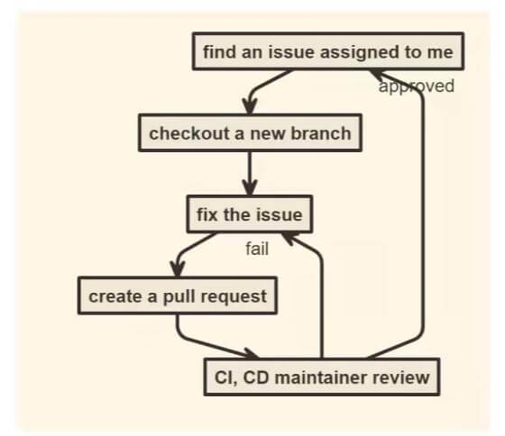
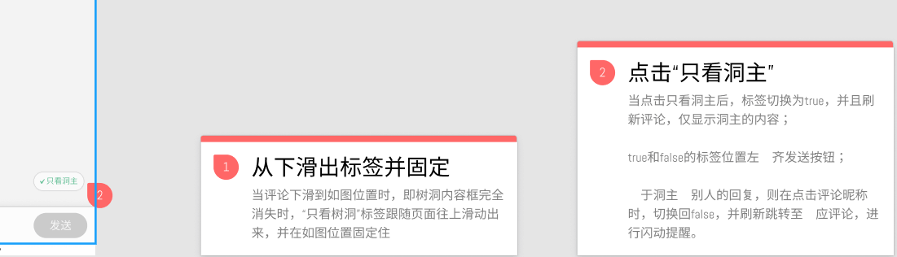

# hustHole 项目开发日记

---

> hustHole 是一个面对我校社区的一个匿名社区，一个社交论坛。

21 年 5 月份，我第一次参与开发 hustHole 的 H5 端 中去。参与开发项目之前，首先先熟悉一下项目开发的流程，也就是如何利用 github 进行团队协作开发。如下图：



(因为我是 maintainer，所以我不需要 fork？)首先把项目从仓库中 clone 下来，然后 checkout 新分支，在本地进行好开发后，提交并 push，最后在 github 上 pull request 请求合并，且让项目负责人可以看得到。

我接到的第一个 issue 是对后端的 api 进行封装，用的库当然就是最热门的 axios 啦。那么在这里，我接触到几个知识盲区：

- #### Typescript 的使用。

?> 因为之前一直没有接触 Ts，那么在项目中去使用 Ts，比单纯用 Js 有好处的多。首先就是 Ts 是一门强类型的语言，他可以约束函数、变量以及函数返回值的类型。我们可以事先约束好变量的类型，当以后运行报错时，就可以根据提示很快就找到错误的地方。

- #### 单元测试

> 单元测试的目标是隔离程序模块并证明这些单个模块是正确的。单元测试能确保在开发过程的早期就能发现问题，是为了让程序“死得更早”。我们应该从开发的早期就为所有函数和方法编写单元测试，可读性强的单元测试可以使程序员方便地检查代码片断是否依然正常工作。良好设计的单元测试案例覆盖程序单元分支和循环条件的所有路径。采用这种自底向上的测试路径，先测试程序模块再测试模块的集合，一旦变更导致错误发生，借助于单元测试可以快速定位并修复错误。

把后端 API 封装好后，我需要做的就是想一个方案来适配移动端设备。因为项目用的是**Vuetify**组件库，所以可以根据`this.$vuetify.breakpoint.mobile`来判断设备。当然，我事先重新对`this.$vuetify.breakpoint.mobileBreakpoint`做了调整。

在开发中，可能因为插件的问题，所以在上传 git 的时候自动将*assets*中的`.sass`文件编译成了`.css`文件。但是在 Vue-Cli 脚手架中是会自动编译的，不需要自己再生成`.css`文件。

## 5.27

---

今天完成了登陆和注册的组件封装。利用学长自己封装的组件**MO2dialog**,我只需要读懂一些属性就 OK 啦。yysy，学长封装的组件感觉很神奇，我看了会源码，不过还是有点地方不懂。

注册 API 需要前端传入加密后的密码，学长说先不做，让后端多封装一个不需要加密的 API。

这天跟学长腾讯会议，主要聊了 Promise 异步，IO 操作，一些 ts 方面问题，（学长懂的东西好多，我感觉自己学的挺少的）以及最最令我开心的，解决了我困扰已久的问题：**Eslint**插件的使用。

在我学 Vue 的时候我就下载了 Eslint 插件，但是一直无法起作用。后来我去网上搜教程，配置了一下，发现有的时候能有用，有的时候又失效了，这里我贴上我的配置代码：

```js
{
    "workbench.colorTheme": "Community Material Theme Darker High Contrast",
    "workbench.iconTheme": "eq-material-theme-icons-darker",
    "[html]": {
        "editor.defaultFormatter": "esbenp.prettier-vscode"
    },
    "explorer.confirmDragAndDrop": false,
    "editor.fontSize": 20,
    /* "editor.codeActionsOnSave": {
        "source.fixAll": true
    }, */
    "stylelint.enable": true,
    "eslint.options": { // 这个配置可以去掉，vscode 会自动找到根目录下的eslint配置文件， 如果配置了，名字必须对上，不然eslint检测不生效
        "configFile": ".eslintrc.js",
        "extensions": [".vue"]
    },
    "eslint.validate": ["html", "vue", "javascript", "jsx", "typescript"],
    // "eslint.autoFixOnSave": true,
    "emmet.syntaxProfiles": {
        "vue-html": "html",
        "vue": "html",
        "typescript": "html"
    },
    "editor.wordWrapColumn": 220,
    "editor.codeActionsOnSave": {
        "source.fixAll.eslint": true
    },
    "easysass.formats": [
        {
            "format": "expanded",
            "extension": ".css"
        },
        {
            "format": "compressed",
            "extension": ".min.css"
        }
    ],
    "files.autoSave": "afterDelay",
    "php.validate.executablePath": "",
    "explorer.confirmDelete": false,
    "[javascript]": {
        "editor.defaultFormatter": "esbenp.prettier-vscode"
    },
    "gitlens.defaultDateFormat": null,
    "gitlens.defaultDateShortFormat": null,
    "gitlens.advanced.externalDirectoryDiffTool": "",
    "git.path": "D://Git//bin//git.exe",
    "git.autofetch": true,
    "eslint.runtime": "",
    "eslint.codeAction.showDocumentation": {
        "enable": true
    },
    "[vue]": {

        "gitlens.codeLens.scopes": [
            "document"
        ],
        "editor.defaultFormatter": "octref.vetur"
    },
    "[typescript]": {
        "editor.defaultFormatter": "vscode.typescript-language-features"
    },
    "editor.formatOnPaste": true,
    "editor.formatOnSave": true,
    "editor.formatOnType": true,
}
```

后来学长发现，我右下角中 ESLINT 显示一直是个三角形而不是 √，才给我找出了原因所在：我一直都是在 VScode 中的工作区中打开一个大文件夹，然后里面放着各种项目 balabala，但是学长说只有将项目放在工作区首位，**Vetur**和**ESLINT**才可以正常工作。还有，学长说可以在 VScode 设置中搜索*format*，然后把一切的什么`false`弄成`true`,弄了这些之后，我的 ESlint 自动格式化功能终于能正常工作啦。~~~&#x1F308;&#x1F308;

## 5.28

---

今天我根据学长的话，自己提了新 issue：做树洞详情页。我首先想到的就是用动态路由，根据每条树洞的具体 id 来实现。然后再随意加一点 UI 组件，很快的页面整体就完成了。但是在 typescript 方面有一些小问题，类型的问题，还有后端返回数据跟我规定的 type 冲突的问题。我自己摸索了一下发现还是无法搞定，决定等学长有空再请教请教。

## 5.29

---

学长估计出去玩了(手动狗头&#x1F349;)，我就补了补数据结构(学了 js 就感觉只会 js 了)。自己摸索了一下 github：

- 首页的美化
- commit 的时候可以传入 emoji 表情
- issue 中的右侧各种功能？

## 5.30

---

ts 的小问题：复合类型赋值报错

解决方法：

- 关于复合类型的赋值：可以利用断言 `as` 来规定类型。
- 注意一下请求后端返回的数据格式。

然后还有利用 `vue2timeago` 组件来代替了我自己写的一个返回时间差的函数。不得不说别人的组件真香！

## 5.31

---

今天用`live share`同步跟学长一起写代码，看到了学长平时写代码的秘诀，比如 `Ctal`寻找变量位置，以及学到了一些组件间通信的思路和路由守卫的一些知识。

- 把 login 组件封装成了通用模块
- 发现了后端返回 cookie 的一些 bug；
- `http-only`协议是为了防止 XSS 攻击，不让前端访问。然后 Cookie 一般不由客户端来进行操作设置。
- 还有 app-bar 需要再处理一下

## 6.1

---

今天早上，fix 了 login 和 register，现在它们是挂载在 App 上的通用模块啦。
然后还通过路由判断，也成功把 app-bar 封装好啦。现在这个标题栏可以在主页以及详情页中来换切换样式了。

## 6.2

---

今天添加了树洞详情页的手机适配，然后改造了一下添加评论的 dialog，然后学长教了怎么用`sanitize`插件，防止 XSS 攻击，和用`tiptap`来实现更多功能如 placeholder。然后又一起稍微调整了一下样式。

待调整好之后，糊糊涂涂地看着学长部署项目上线了。但是树洞测试版好像没有开放 cors 跨域，所以还在与后端交流 ing。

## 6.3

---

早上完成了随机头像以及触底懒加载功能。现在每一个树洞都有一个随机的主题啦，每个人都可以获取到对应主题的头像。

下午研究了一下学长写的触底组件。我大概总结一下：

- 首先监听页面滚动事件，判断高度差小于 10px(大概)，即为触底
- 然后触发触底事件：
  - 先做个判断，判断数据是否已经全部请求完毕以及现在的 loading 状态是否关闭
  - 然后将 loading 状态打开，执行 ajax 请求数据
  - 请求成功后，更新 datalist，并且判断数据是否全部拿到了，关闭 loading

然后下午发现了 2 个 BUG：

- 添加评论后，应该清空 datalist 以及 page，重新获取数据
- 在进入树洞的时候，有的时候会未获取 hole_id 就请求数据导致数据为空：
  - 原因：因为浏览器会自动记录滚动条位置，所以刷新页面之后触发请求而跳过了第一次的数据请求。
  - 解决方法：设定 firstloading，表示是否是第一次请求数据。

## 6.4

---

今天早上做了树洞详情页中的点赞、切换排序、收藏功能。然后由于后端浏览器安全策略的问题，给评论点赞的功能暂时做不了，搁置一波。

晚上弄好了底部导航栏的样式，明天可以加入发树洞功能啦。

## 6.5

---

今天解决了关于 ts 困扰已久的两个问题：

- 当在`.vue`文件，为变量附上类型时，有时候会以下错误：
  `Type annotations can only be used in TypeScript files.Vetur(8010)`

?> 解决方法：**在`<script>`中加上`lang="ts"`**

- 当在`.vue`文件，引用\$refs 有时候会以下错误：
  `Property 'editor' does not exist on type 'Vue'.Vetur(2339)`

?> 解决方法：**附上`$refs: { [key: string]: any; };`**

然后完成了添加评论的功能以及解析 HTML 的功能。现在树洞基本上支持`markdown`格式的输入与输出啦。

## 6.6

---

今天没有做项目，趁着活动白嫖了一台阿里云服务器，然后按照网上步骤搭建了一个真正别人可以访问的网站啦。我打算等到假期把这个网站做成的我个人博客，现在博客的样式不太行，到时候还得重制一下。

## 6.7

---

早上想了一下，把底部导航栏移到了 App 组件里，然后加入了路由跳转的样式 & 重制了一下顶部栏的逻辑，现在它的内容随着`$route.name`而变化啦。

下午想完善一下首页的功能样式，于是加入了首页点赞、评论数、收藏、举报的功能 & 加入了首页的顶部搜索栏样式。
现在大概的样子已经做的差不多了感觉~~

## 6.8

---

今天后端这边修改了鉴权模式，现在是用 token 来进行鉴权操作了。但是改了之后感觉前端这边出了点问题，修复 ing。。

- 获取评论列表中，`is_thumbup`这里有点问题，当传入了 Authorization 的时候，返回 number 类型？

## 6.9

---

早上将所有 API 都加上了 headers，然后完善了一下点赞、收藏数的实时刷新功能————在调用 API 后不再请求新数据，直接在前端的数组中改数据

晚上终于能和学长一起讨论解决问题了：

- 关于**firstloading**：正确的逻辑应该是先在 `created` 中加载数据，然后改变 firstloading 为 `false`，在 firstloading 为 `false` 的情况下，触底才会触发 autoloading 效果。这样就避免了在未加载第一次数据的时候就加载后面数据的情况

- 发现后端返回数据类型不对的 bug（`is_thumbup`）

- 做了项目以后的一些想法：比如路由改变后，数据加载前的骨架效果。以及按钮触发后动态 class 改变。

bug 改好了，心里也就舒畅了许多 1=&#x1F308;1=&#x1F308;

## 6.10

---

- 今天配合后端解决了后端的一些 BUG，例如`is_thumbup`的类型问题和`reply_id`为 0 的时候的 BUG 问题。
- 修复了前端的 auth 逻辑，应该把默认请求头部放在`main.js`中，之前放在 login 组件中的时候，一刷新页面 auth 请求头部就无了
- 添加了首页切换排序以及搜索树洞的功能。
  > 思想：搜索树洞加载新数据后，要重新修改`ReachedBottom`函数，这里要把它写成函数变量形式，然后还要注意`this`的指向问题。我们需要把 this 指向 Vue 实例，所以在赋值函数的时候，需要将其写成**箭头函数**的形式。

## 6.11

---

- 今天完成了通知页面的大概的样式。但我是根据 figma 上的设计稿来做的，好像有一些功能后端还没有 API，待开发中。

## 6.12

---

- 完善了一下 Home 主页以及给 Editor 添加了字数统计以及各种小功能。感觉现在这个项目已经把大致框架都做得差不多了，就剩下慢慢的完善缝缝补补了。

- 今晚添加了骨架 loading 以及路由跳转的过渡效果。

- 之后的多余的时间，我想用来去学习一些计算机基础：比如计算机网络，HTTP 等、以及数据结构基础等等

## 6.14

- 今天配合后端的改动，修改了一下点赞的 api
- 添加了回复评论的功能。

## 7.18

今天跟后端小哥哥部署了一下测试版 h5 树洞。遇到几个坑：

- bulid 打包后，vue.config 反向代理的设置失效，我们需要在 nginx 的配置文件中重新配置代理信息。
- build 打包后，index.html 打不开，是因为资源路径有问题：在 vue.config 中把`publicPath`的路径改为相对路径。不然的话就找不到正确的路径了，因为服务器跟本地的路径是不一样的。

## 7.19

今天把登录和注册的模态框给整合在了一起。这个事情是上个月甚至更少之前学长提过一下，不过因为原来的话登录和注册的模态框都是直接套用学长的组件，所以要整合的话意味着要自己重新写一个组件，所以一直没做。昨天终于使用 vuetify 的 tabs 组件以及自带的验证机制实现了。不过以后还是要学一下 vuelidate，感觉自己看文档有点看不懂。
记录一个坑：

- Ts+Vue 写页面的时候，一定要加上 **component**，不管你有没有用，不然的话 vuetify 会出 BUG 不显示组件内容。

## 7.22

今天解决了 ts+Vue 引用 vuelidate 的一个巨坑：

- 在我按照官网的步骤去引入 vuelidate 的时候，发现了一个难以解决的报错：**`$v is undefined`**.这就很让我烦恼了。因为官网上的安装教程我是一步一步按着操作的：

```
npm i vuelidate -S
import Vue from 'vue'
import Vuelidate from 'vuelidate'
Vue.use(Vuelidate)
```

在我辗转于百度谷歌等搜索答案的过程中，我终于发现了，在 Ts 构建项目的时候，我们需要引入 RegisterHooks，这就是一个声明钩子的函数，我们需要将 validations 声明好，因此在 main.ts 中，需要以下代码：

```js
import { Component } from "vue-property-decorator";
Component.registerHooks(["validations"]);
```

## 7.24-7.27

这段时间在对着设计稿做 UI 的调整。遇到了一些问题：

- 引用地址的问题：有的页面用相对路径引用 assets 文件是没问题的，但有的页面却得用绝对路径。

因此我查了查资料，发现原来 assets 里的文件编译过程中会被 webpack 处理理解为模块依赖，只支持相对路径的形式。assets 放可能会变动的文件；
static 里的文件不会被 webpack 解析，会直接被复制到最终的打包(默认是 dist/static)下，必须使用绝对路径引用这些文件。static 放不会变动的文件。这是通过在 config.js 文件中的 build.assetsPublicPath 和 build.assetsSubDirectory 连接来设置的。任何放在 static/ 中文件需要以绝对路径的形式引用：`/static/[filename]`。如果更改 assetSubDirectory 的值为 assets，那么路径需改为 `/assets/[filename]`。

## 7.29

今天调整 UI 的一些小细节，发现了一个问题，就是每次路由切换的时候都要重新加载一次。因此我在`<router-view>`外面包了一层`<keep-alive>`，它可以缓存其中的组件。然后在动态路由页面的时候，它们之间的缓存会相互影响。因为我了解过 Vue 的 diff 算法的大概原理，这里需要一个 key 属性来避免该问题。因此我给`<router-view>`加上了 key 属性：`<router-view :key="$route.fullPath">`

## 8.4

遇到一个问题：img 中图片加载不出来报错 403Forbidden，但是直接将 url 在浏览器中打开却可以成功显示。

> 解决方法：加上该句 `<meta name="referrer" content="no-referrer" />`

- http 请求体的 header 中有一个 referrer 字段，用来表示发起 http 请求的源地址信息，这个 referrer 信息是可以省略但是不可修改的，就是说你只能设置是否带上这个 referrer 信息，不能定制 referrer 里面的值。

- 服务器端在拿到这个 referrer 值后就可以进行相关的处理，比如图片资源，可以通过 referrer 值判断请求是否来自本站，若不是则返回 403 或者重定向返回其他信息，从而实现图片的防盗链。上面出现 403 就是因为，请求的是别人服务器上的资源，但把自己的 referrer 信息带过去了，被对方服务器拦截返回了 403。

- 在前端可以通过 meta 来设置 referrer policy(来源策略)，具体可以设置哪些值以及对应的结果参考这里。所以针对上面的 403 情况的解决方法，就是把 referrer 设置成 no-referrer，这样发送请求不会带上 referrer 信息，对方服务器也就无法拦截了。

## 8.9

发现登录后逻辑写错了。来记录一下：

- 对于需要登录后权限才能进去的路由，设置路由守卫，判断是否有 token，有则放行，没有则跳转至登录路由。
- 登录后，必须利用 axios 的请求拦截器，让每一次发送请求的时候能带上 Authorization 头。我之前是直接用`axios.defaults.headers`来设置的，这导致的问题就是用户登录后再请求的时候不会带上 Authorization 头，因为在登录之前默认请求头是 NULL。

## 8.13



今天终于把新功能做好了,之前一直卡着做不出来，记录一些坑：

- 首先是标签，我利用滑动事件，用`v-show`判断如果触底则显示，外面套一层`transition`过渡标签。
- 点击功能：我是先把所有的 datalist 数据 copy 一份，然后点击的时候将原数组进行过滤，再显示出来。然后再次点击的时候，切换模式，再将 copy 出来的一份重新赋值给 datalist。
- 最后是点击闪动的功能。说实话我之前一直不知道怎么做，因为我觉得在 Vue 中操作 dom 是不是有点。。。
  后来还是用 dom 操作了，给对应回复评论的索引的 dom 添加类名即可。

## ~~9.1

陆陆续续完成暑期迭代的新功能，如

- 一些 UI 、文字的修改
- 删除功能的浮窗优化
- 显示热评...

之前的只看洞主的新功能，过滤数据应该由后端重新编写 API。

## 9.12

- 最近发现了一个很大的问题。我给`router-view`加了一层`transition`，但是在路由切换转场的过程中，会出现有一些 dom 组件发生抖动的现象。这导致看起来十分的卡顿和不自然。我一开始认为这个可能是别的问题(总之是我解决不了的问题)，后来搜索了一下资料才发现这个是由于前后路由过渡的时候产生了占位所导致的。**解决方法**也很简单，直接给`.leave`和`.enter`加上一个`display:none`即可解决。

- 但是解决了第一个问题，又有新问题跳出来了。由于页面中有`fixed`的 dom 节点，他在路由过渡的时候还是会抖动，经过调试发现，是由于过渡的时候会将前一个路由页面包裹了一层用于过渡的 div，因此可以在其下面修改对应 dom 的位置属性。当然这个十分麻烦，只能针对特定元素。

- 但是还是又有新的问题出来了。由于我给`router-view`加了一层`keepalive`缓存，在手机端测试的时候，用户左滑屏幕，会由于缓存立刻显示上一页面，然后再执行过渡动画，这就导致上一个页面在视觉上出现了 2 次。这个问题我觉得无能为力呀~~

最后，还是决定直接把过渡动画删了，这样路由切换卡顿问题就迎刃而解了。

> ps:本来是想还原小程序中`navigator`的自带的过渡动画，但是发现还是做不到那么完美呀。

# ~9.17

最近学长配置了 pwa，我也学习了一下，记录了下来，详情到[点这里可以进去](../frontend/pwa.md)

# ~9.30

最近做了许多功能，记录一下：

- `pwa-install`插件：可以配合 PWA 配置下载弹窗。还学习到了一些 js 判断用户是否从桌面上打开：

```js
if (
  !this.installComponent.getInstalledStatus() ||
  !navigator["standalone"] ||
  !window.matchMedia("(display-mode:standalone)").matches
)
  this.install();
```

- `vue-pull-refresh`插件的配置使用

- 加入事件总线用于非父子组件间通信

```js
import EventBus from "vue-bus-ts";

Vue.use(EventBus);
const bus = new EventBus.Bus();
const vm = new Vue({
  router,
  vuetify,
  store,
  bus,
  render: (h) => h(App),
}).$mount("#app");
/* 使用的时候 */
this.$bus.$emit(...)
this.$bus.$on(...)
```

- 对一些复用代码的组件封装，以及冗余代码的删除。

- 对于树洞帖子，若数据更新了，如果之前已经打开过的话，会由于`keep-alive`的缓存效果而不刷新。于是我利用它的`exclude`属性来使得对于特点组件不缓存。

```js
<keep-alive exclude="AddProduct">
  <router-view />
</keep-alive>;

/*
 ** 对于这里的名字，是组件的name属性，对于类组件写法如下：
 */
//错误写法
@Component()
export default class AddProduct extends Vue {
  //这个时候在dev开发环境或者测试环境都是没问题的，只有线上环境打包时候会把name忽略
}

//正确写法
@Component({
  name: "AddProduct",
})
export default class AddProduct extends Vue {}
```

> 注意，如果传入的是类组件的名字，只会在开发环境下生效，因为生产环境中类组件的名字会清除掉。
