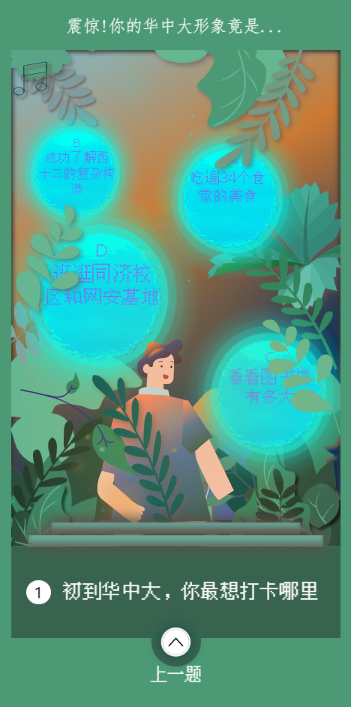

[https://github.com/1360151219/h5-question](https://github.com/1360151219/h5-question)

## 8.29

今天是 8.29 号。历时近 2 周的问答类 h5 项目开发差不多已经结束可以交付了，我就随便记录一下开发日常。

首先要感谢一下设计，设计的画稿十分好看，令我有点难以入手~~~~这里贴张图可以感受一下。

这个项目主要是 css 的设计，主要都是运用 position、animation 来实现各种动态效果.

然后背后的算法是每一个选项都对应着 2 个属性，当用户答完所有问题时，选出对应最高的两个属性，生成对应的海报。海报的生成：一开始是由我将图片拼接好在一起，然后利用 `dom to image` 插件来生成一个图片并下载。但在手机端上下载的功能失效。分享功能也无法实现。毕竟是 h5 网页。(我太菜了~)

> 下载是利用`<a>`标签的`download`属性实现的

于是现在是直接把海报的图片贴上去，用户可以长按保存。。

还有关于音乐的模仿，`audio`标签的`autoplay`属性在 PC 端浏览器是被禁止的，无法自动播放，但手机端上是没有限制。

对于 Svg 格式的优化，可以用`svgo`插件来进行压缩。

其次，我还做了一个首页加载动画，在`index.html`文件中自定义一个 dom 动画，在 App 中 Mounted 中再移除该 dom 节点。但是后续页面的资源加载我就没想到怎么优化了...

## 9.13

记录一下最近的情况吧。

- 首先是由于图片大多数是 svg 格式，会导致用户加载速度非常慢，于是我们压缩并将其转化为 jpg、png 格式，然后今天发现好像 webp 格式的内存更加小，现在还在等图片弄好 ing。
- 项目中引入了一个 otf 字体文件，竟达到了 23MB，加载速度慢的飞起。
- 然后是解决了结果算法问题。因为之前的算法是每一个问题对应几个结果，然后分数是++的，所以会导致最后出现多个分数相同的结果，这样就不好判断了。现在是给每道题新增不同的权重，这样可以避免最后出现分数相同的结果了。 -然后就是给选项加了一个防抖功能，防止用户多次触发导致页面切换过快、视觉上有毛病。

## 埋点

- 对于刷新页面和浏览器关闭，Vue 的 beforeDestory 和 destoryed 是不生效的，而且被 keepalive 缓存的组件也没有这个效果。
