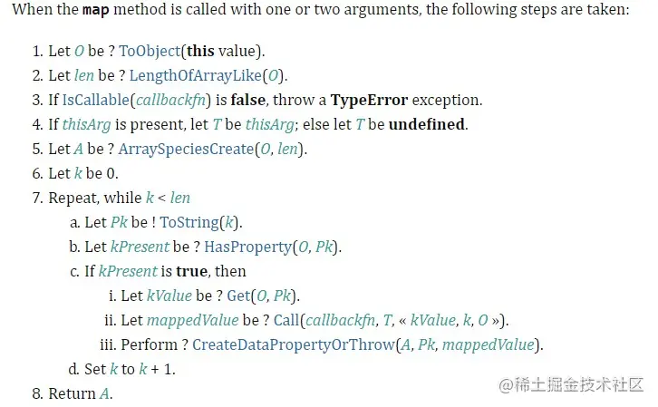

# Array 高阶函数全揭秘

什么是高阶函数：

> 一个函数可以将另一个函数作为参数传入或者是返回值为一个函数，称为高阶函数

今天我们来了解一下 Array 中的高阶函数的实现原理吧。

## Map

根据 ECMA262 草案，map 的实现规范如下：



- 首先判断异常情况：this 是否是数组，以及传入的 cb 是不是一个函数
- 将数组转化为一个对象
- 索引从 0 开始，通过 Object `in` 方法（针对稀疏数组），来对对象中的键值进行操作，并将结果存入新数组中
- 最后返回新数组

```js
function _map(fn, thisArg) {
  // 处理数组类型异常
  if (this === undefined || this === null)
    throw new TypeError("Cannot read property 'map' of null or undefined");
  // 处理回调类型错误
  if (Object.prototype.toString.call(fn) !== "[object Function]")
    throw new TypeError(fn + " is not a function");
  // 将数组转化为O  k=0 T
  let O = Object(this);
  let T = thisArg;
  let len = this.length >>> 0; // 将所有类型转化为数字
  // 遍历O
  let A = new Array(len);
  for (let k = 0; k < len; k++) {
    // k in O 即稀疏数组
    if (k in O) {
      let kValue = O[k];
      let res = fn.call(T, kValue, k, O);
      A[k] = res;
    }
  }
  return A;
}
```

## Reduce

reduce 的实现原理如下：

> 有些地方与 Map 一样我就不写进去了，如异常检测等

- 接收两个参数：回调函数，累计器的初始值

这里要注意一个地方就是，如果没有传入累计器初始值要怎么做？如果传入了又要怎么做？

- 若没有传入累计器初始值，则从左到右选择**第一个**数组中的元素作为累计器初始值。（同样要注意稀疏数组）

- 若传入了累计器初始值，则跳过上边那一步

- 然后遍历数组，执行回调函数。（这里回调函数参数是这样的： `cb(acc,cur,array)`）

```js
function _reduce(fn, init) {
  // 处理数组类型异常
  if (this === undefined || this === null)
    throw new TypeError("Cannot read property 'reduce' of null or undefined");
  // 处理回调类型错误
  if (Object.prototype.toString.call(fn) !== "[object Function]")
    throw new TypeError(fn + " is not a function");
  let O = Object(this);
  let len = this.length >>> 0;
  let acc;
  let k = 0;
  if (init) acc = init;
  // 找到第一个数字，考虑稀疏数组
  if (acc == undefined) {
    for (; k < len; k++) {
      if (k in O) {
        acc = O[k];
        k++;
        break;
      }
    }
  }
  // 这里要判断acc有没有值，没有值就是错误
  if (acc == undefined && len === k)
    throw new TypeError("Each element of the array is empty");
  for (; k < len; k++) {
    if (k in O) {
      // 核心
      acc = fn.call(undefined, acc, O[k], k, O);
    }
  }
  return acc;
}
```

## Push

- 判断合并后长度是否超出 Number 类型最大值：2\*\*53 - 1

- 对数组转化成的对象 O 进行键值对赋值操作来扩容

- 返回值是合并后**数组总长度**

```js
function _push(...args) {
  let O = Object(this);
  let len = this.length >>> 0;
  let argsLen = args.length >>> 0;
  if (len + argsLen > 2 ** 53 - 1)
    throw new TypeError(
      "The number of array is over the max value restricted!"
    );
  for (let i = 0; i < argsLen; i++) {
    O[len + i] = args[i];
  }
  O.length = len + argsLen;
  return O.length;
}
```

## Pop

- 获取数组长度并减一

- 删除目前长度对应键值的对象属性

- 返回删除元素的值

```js
function _pop() {
  let O = Object(this);
  let len = this.length >>> 0;
  if (len === 0) {
    O.length = 0;
    return;
  }
  len--;
  let res = O[len];
  delete O[len];
  O.length = len;
  return res;
}
```

## filter

- 对回调函数返回 true 的键值添加到新数组中

```js
function _filter(fn, thisArg) {
  // 处理数组类型异常
  if (this === undefined || this === null)
    throw new TypeError("Cannot read property 'filter' of null or undefined");
  // 处理回调类型错误
  if (Object.prototype.toString.call(fn) !== "[object Function]")
    throw new TypeError(fn + " is not a function");
  let O = Object(this);
  let T = thisArg;
  let len = this.length >>> 0;
  let res = [];
  let resLen = 0;
  for (let k = 0; k < len; k++) {
    // k in O 即稀疏数组
    if (k in O) {
      let kValue = O[k];
      if (fn.call(T, kValue, k, O)) res[resLen++] = kValue;
    }
  }
  return res;
}
```

## splice

主要的思路如下：

- 判断添加元素以及删除元素的大小关系，并且根据情况对 start 后续元素进行前移或者后移

- 移动后插入元素，更新长度

- 返回**删除元素构成**的数组

除此之外，还需要对 start 和 deleteCount 进行特殊处理：

- 如果 start 是负数，则 start 是从末尾开始向左寻找

- 如果 start 大于 len，则 start 直接等于 len

- deteleCount 如果不存在，则默认将 start 后续元素全部删除

- 若 deleteCount<0，则默认为 0；若大于最大可删除长度即 len-start，则等于最大可删除长度

我们不妨在考虑深一点，对于密封对象和冻结对象的考虑，我们还需要做一些异常处理。

```js
function _splice(start, deleteCount, ...addArgs) {
  let O = Object(this);
  let len = O.length >>> 0;
  // 处理特殊情况
  if (start < 0) {
    start = start + len > 0 ? start + len : 0;
  }
  if (start >= len) start = len;
  // 默认删除后面全部
  if (deleteCount == undefined || deleteCount == null)
    deleteCount = len - start;
  if (deleteCount < 0) deleteCount = 0;
  if (deleteCount > len - start) deleteCount = len - start;
  // 判断是否是密封对象或者是冻结对象 （密封对象：只能修改不能添加或删除属性 冻结对象：不能动它）
  if (Object.isSealed(O) && deleteCount !== addLen)
    throw new TypeError("the object is a sealed object!");
  else if (Object.isFrozen(O) && (deleteCount > 0 || addLen > 0))
    throw new TypeError("the object is a frozen object!");
  // 先删除元素，并且拷贝在数组中
  let deleteRes = [];
  let deleteLen = 0;
  for (let i = start; i < start + deleteCount; i++) {
    if (i in O) {
      let iValue = O[i];
      deleteRes[deleteLen++] = iValue;
    }
  }
  // 判断添加元素长度，根据情况对后续元素进行前移后移操作
  // let resLen = len - deleteCount + addLen
  let addLen = addArgs.length >>> 0;
  if (addLen > deleteCount) {
    // 后移：这里注意要从后往前遍历，防止后面元素被覆盖
    for (let i = len - 1; i >= start + deleteCount; i--) {
      let from = i;
      let to = i + (addLen - deleteCount);
      if (from in O) {
        O[to] = O[from];
      } else {
        delete O[to];
      }
    }
  } else if (addLen < deleteCount) {
    // 前移
    for (let i = start + deleteCount; i < len; i++) {
      let from = i;
      let to = i - (deleteCount - addLen);
      if (from in O) {
        O[to] = O[from];
      } else delete O[to];
    }
    // 因为是前移 所以删除冗余元素
    for (let i = len - 1; i >= len - deleteCount + addLen; i--) {
      delete O[i];
    }
  }
  // 插入新元素
  for (let i = 0; i < addLen; i++) {
    O[i + start] = addArgs[i];
  }
  O.length = len - deleteCount + addLen;
  // 最后返回删除元素组成的数组
  return deleteRes;
}
```

## Sort

我们来聊一下 V8 中的 sort 方法吧。在 V8 中对 sort 方法其实是做了一系列优化和边界的处理的。

我们根据 V8 原理思路来一步一步实现一个 与其性能一样的 sort 方法吧。

设排序的元素个数为 n：

- n <= 10 的时候，采用插入排序

- n > 10 的时候，采用三路快速排序
  - 10 < n <= 1000，采用中位数作为哨兵元素
  - n > 1000，每隔 200~215 个元素挑一个元素放在新数组中，排序后找到中间位置的数作为哨兵。

为什么要这么做呢？

为什么元素个数少的时候要采用插入排序？当 n 足够小的时候，快排的效率反而优势小于插入排序。

为什么要这样去选择哨兵元素？快排的性能高低取决于递归的深度，也就是哨兵左右两边元素个数不能差的太大。若差的太大则递归层数会越来越高。

### 插入排序

下面是将交换次数优化到 n 的排序方法。

```js
function insertSort(arr, start = 0, end) {
  end = end || arr.length;
  for (let i = start; i < end; i++) {
    let j = i;
    let temp = arr[i];
    while (arr[j - 1] > temp && j - 1 >= start) {
      arr[j] = arr[j - 1];
      j--;
    }
    arr[j] = temp;
  }
  return arr;
}
```

### 寻找哨兵元素

我们先实现一下 sort 的骨架吧。

```js
function _sort(arr, comparefn) {
  if(Object.prototype.toString.call(comparefn)!==[object Function]){
    comparefn=function(x,y){
      if(x===y) return 0
      x=x.toString
      y=y.toString
      if(x==y) return 0
      else return x<y?-1:1
    }
  }
  const insertSort=function(){
    //...
  }
  const getMidIndex=(arr,start,end)=>{

  }
  const quickSort=(arr,start,end)=>{
    let midIndex=0
    while(1){
      if(to-start<=10){
        insertSort(arr,start,end)
        return
      }
      if(to-start>1000){
        midIndex=getMidIndex(arr,start,end)
      }else{
        midIndex=start+((end-start)>>1)
      }
      // quickSort...
    }
  }
}
```

先看一下求哨兵位置的代码：

```js
function getMidIndex(arr, start, end) {
  let temps = [];
  // 递增量，这里任何数与上15都会比其小
  let increment = 200 + ((end - start) & 15);
  let j = 0;
  start++;
  end--;
  for (let i = start; i < end; i += increment) {
    temps[j] = [i, arr[i]];
    j++;
  }
  temps.sort((a, b) => a[1] - b[1]);
  return temps[j >> 1][0];
}
```

### 快排代码

我们来看一下 V8 的快排源码吧：

```js
function QuickSort(a, from, to) {
  // to:a.length
  var third_index = 0;
  while (true) {
    // Insertion sort is faster for short arrays.
    if (to - from <= 10) {
      InsertionSort(a, from, to);
      return;
    }
    if (to - from > 1000) {
      third_index = GetThirdIndex(a, from, to);
    } else {
      third_index = from + ((to - from) >> 1);
    }
    // Find a pivot as the median of first, last and middle element.
    var v0 = a[from];
    var v1 = a[to - 1];
    var v2 = a[third_index];

    var c01 = comparefn(v0, v1);
    if (c01 > 0) {
      // v1 < v0, so swap them.
      var tmp = v0;
      v0 = v1;
      v1 = tmp;
    } // v0 <= v1.
    var c02 = comparefn(v0, v2);
    if (c02 >= 0) {
      // v2 <= v0 <= v1.
      var tmp = v0;
      v0 = v2;
      v2 = v1;
      v1 = tmp;
    } else {
      // v0 <= v1 && v0 < v2
      var c12 = comparefn(v1, v2);
      if (c12 > 0) {
        // v0 <= v2 < v1
        var tmp = v1;
        v1 = v2;
        v2 = tmp;
      }
    }

    // v0 <= v1 <= v2
    a[from] = v0;
    a[to - 1] = v2;

    var pivot = v1;

    var low_end = from + 1; // Upper bound of elements lower than pivot. **record pivot_index
    var high_start = to - 1; // Lower bound of elements greater than pivot. **record search_index
    // **put pivot to from+1
    a[third_index] = a[low_end];
    a[low_end] = pivot;

    // From low_end to i are elements equal to pivot.
    // From i to high_start are elements that haven't been compared yet.

    partition: for (var i = low_end + 1; i < high_start; i++) {
      // cur element
      var element = a[i];
      var order = comparefn(element, pivot);
      if (order < 0) {
        // cur < pivot , swap
        a[i] = a[low_end];
        a[low_end] = element;
        low_end++;
      } else if (order > 0) {
        // cur > pivot
        do {
          // from end ,search a element(high_start) lower than pivot
          high_start--;
          if (high_start == i) break partition;
          var top_elem = a[high_start];
          order = comparefn(top_elem, pivot);
        } while (order > 0);
        // swap high_start and i
        a[i] = a[high_start];
        a[high_start] = element;
        // order: i, pivot
        if (order < 0) {
          element = a[i];
          a[i] = a[low_end];
          a[low_end] = element;
          low_end++;
        }
      }
    }

    if (to - high_start < low_end - from) {
      QuickSort(a, high_start, to);
      to = low_end;
    } else {
      QuickSort(a, from, low_end);
      from = high_start;
    }
  }
}
```

我们以数组`[10, 9, 8, 7, 6, 5, 4, 3, 2, 1, 0]`为例子分析执行过程：

1. from：0 ；to：11

2. 此时 10 < to - from < 1000，则第三个基准元素为`(0 + 11) >> 1`，也就是 5

3. 比较 `a[0]`、`a[10]`、`a[5]`的值，这三个值作一个顺序排序，此时数组变成：`[0, 9, 8, 7, 6, 5, 4, 3, 2, 1, 10]`

4. 将基准值与第(from+1)个元素开始互换，此时数组变成：`[0, 5, 8, 7, 6, 9, 4, 3, 2, 1, 10]`。此时基准值前面的元素必然是小于基准值的（由第三步）。接下来要做的就是将**5 后面所有小于 5 的值的放在它前面**。

5. 循环从第三个元素`a[i]` 8 开始，它大于 5，即 order>0，于是执行 do while 循环，其目的在于倒序查找一个小于基准值的元素。然后跟`a[i]`交换位置。

数组变成了`[0, 5, 1, 7, 6, 9, 4, 3, 2, 8, 10]`，`high_start`的值是为了记录当前倒叙查找到了哪里。然后`a[i]`与基准值交换，`low_end++`，其值是为了记录当前基准值的位置。

此时数组变成了`[0, 1, 5, 7, 6, 9, 4, 3, 2, 8, 10]`

6. 依次循环**步骤 5**

7. 当`i==high_start`的时候，意味正序倒序查找结束，此时数组为`[0, 1, 2, 3, 4, 5, 9, 6, 7, 8, 10]`,然后分别对两个子集进行递归

8. 这里还有一个优化。判断`to - high_start < low_end - from`的结果，如果是 true 的话，就说明前面的元素是小区间了，因此此时基准值偏向右边，因此对后面的元素（大区间）进行排序。然后左边的小区间继续由 while 进行循环。此时因为 to 变成了基准值下标，因此`to - from < 10`，所以会对它进行插入排序。

> 参考连接：


