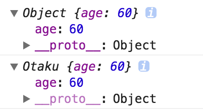

> 以下大多数内容最初灵感启发来自于[冴羽博客](https://github.com/mqyqingfeng/Blog)

`new`关键字的作用我们用一句话来概括：

> new 运算符创建一个用户定义的对象类型的实例或具有构造函数的内置对象类型之一

因为我不能去创建一个关键字来模拟，所以我用一个函数`objectFactory(constructor,....)`来模拟`new`。

### 第一版

`new`创建的新实例继承了构造函数中的各种属性。因此模拟代码如下：

```js
function objectFactory() {
  let obj = new Object();
  Constructor = [].shift.call(arguments); //Array.from(arguments).shift()
  obj.__proto__ = Constructor.prototype; // 继承原型链
  Constructor.apply(obj, arguments); // 将参数传给构造函数
  return obj;
}
```

我们可以来进行一个测试：

```js
function Otaku(name, age) {
  this.name = name;
  this.age = age;
  this.habit = "Games";
}

Otaku.prototype.strength = 60;

Otaku.prototype.sayYourName = function () {
  console.log("I am " + this.name);
};
let person = objectFactory(Otaku, "Kevin", 18);
console.log(person.name); // Kevin
console.log(person.habit); // Games
console.log(person.age); //18
console.log(person.strength); // 60

person.sayYourName(); // I am Kevin
```

### 第二版：返回值实现

当有返回值的时候，我们的构造函数的行为就有点不一样了：

```js
function Otaku(name, age) {
  this.strength = 60;
  this.age = age;
  return {
    name: name,
    habit: "Games",
  };
}

var person = new Otaku("Kevin", "18");

console.log(person.name); // Kevin
console.log(person.habit); // Games
console.log(person.strength); // undefined
console.log(person.age); // undefined
```

可见实例仅仅可以访问构造函数返回的对象。注意是对象。如果返回的是基本类型值呢？

```js
function Otaku(name, age) {
  this.strength = 60;
  this.age = age;
  this.name = name;
  this.habit = "game";
  return this.habit;
}

var person = new Otaku("Kevin", "18");

console.log(person.name); // Kevin
console.log(person.habit); // game
console.log(person.strength); // 60
console.log(person.age); // 18
```

可见结果相反，返回值被忽视了。因此我们需要在模拟函数中加入一个判断返回值是否为对象的代码。

```js
function objectFactory() {
  let obj = new Object();
  Constructor = [].shift.call(arguments); //Array.from(arguments).shift()
  obj.__proto__ = Constructor.prototype; // 继承原型链
  let res = Constructor.apply(obj, arguments); // 将参数传给构造函数
  return res typeof 'object' ? res || obj : obj
}
```

> 这里如果用的是`let obj=Object.create(null)`的话，则后面通过 prototype 添加的方法则无法使用。



查看由两种方式生成的 person 对象，第一个是由 `Object.create`生成的，第二个是 new Object 生成的

第一种是实的，我推测是`Object.create`将`__proto__`当成一个属性。

我们在[JS 之深入原型链](http://www.strk2.cn/views/frontend/JSPrototype.html#%E5%8E%9F%E5%9E%8B%E9%93%BE)中提到过，`__proto__`实际上是在`Object.prototype`中，而 Object.create(null) 生成的对象的原型链是 null，即没有这个属性。

> `Object.create(prototype)` 这里传入的是一个原型对象，返回的对象的`__proto__`为传入的原型。我认为这里是因为原型传入的是 NULL 所以才会产生这样的问题。
