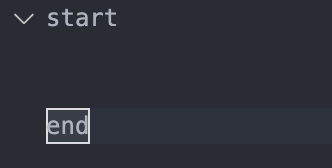
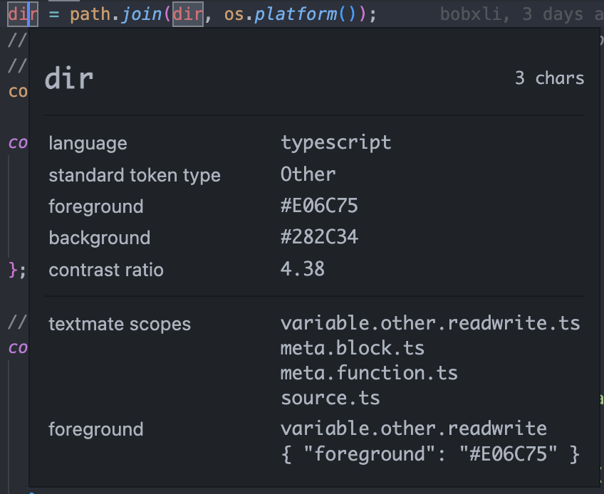

最近有在研究一些vscode代码高亮的功能，并收集了一些资料以及做了一份总结说明。

[textMate](https://macromates.com/manual/en/language_grammars)

[掘金范老师](https://juejin.cn/post/6969149578599727111#heading-6)

## Language Configuration Guide

举个例子 `language-configuration.json`
```json
{
// 注释Toggle
  "comments": {
    "lineComment": "//",
    "blockComment": ["/*", "*/"]
  },
  
 // 括号匹配，用于实现相匹配括号的高亮效果
  "brackets": [
    ["{", "}"],
    ["[", "]"],
    ["(", ")"]
  ],
  
  // 自动补全括号
  // notIn 表示在某些代码范围内不生效。比如在字符串之中单引号无法自动补全
  "autoClosingPairs": [
  // 简写 ["{", "}"],
    { "open": "{", "close": "}" },
    { "open": "[", "close": "]" },
    { "open": "(", "close": ")" },
    { "open": "'", "close": "'", "notIn": ["string", "comment"] },
    { "open": "\"", "close": "\"", "notIn": ["string"] },
    { "open": "`", "close": "`", "notIn": ["string", "comment"] },
    { "open": "/**", "close": " */", "notIn": ["string"] }
  ],
  
  // vscode默认只有在当前光标后面有空格的时候才会自动补全pairs
  // 如 {xxxxx 在输入 { 的时候并不会自动补全
  // autoCloseBefore 可以覆盖这个设置，即当前光标后有设置的符号也可以自动补全
  "autoCloseBefore": ";:.,=}])>` \n\t",
  
  // 当你选中一段文本的时候，输入设置好的一个surroundingPairs, 
  // 自动将选中的文本用匹配的pairs给包裹起来Autosurrounding
  "surroundingPairs": [
    ["{", "}"],
    ["[", "]"],
    ["(", ")"],
    ["'", "'"],
    ["\"", "\""],
    ["`", "`"]
  ],
  
  // 将对应的标志之间的代码折叠起来
  "folding": {
      "markers": {
        "start": "^\\s*start\\b",
        "end": "^\\s*end\\b",
    }
  },
  
  // 定义单词边界
  "wordPattern": "(-?\\d*\\.\\d\\w*)|([^\\`\\~\\!\\@\\#\\%\\^\\&\\*\\(\\)\\-\\=\\+\\[\\{\\]\\}\\\\\\|\\;\\:\\'\\\"\\,\\.\\<\\>\\/\\?\\s]+)",
  
  // 定义当前行、下一行的自动缩进规则
  // 如果不定义的话，会根据brackets的规则来，遇到开括号的下一行自动进一个indent
  "indentationRules": {
    "increaseIndentPattern": "^((?!\\/\\/).)*(\\{[^}\"'`]*|\\([^)\"'`]*|\\[[^\\]\"'`]*)$",
    "decreaseIndentPattern": "^((?!.*?\\/\\*).*\\*/)?\\s*[\\}\\]].*$"
  }
}
```

### Folder

vscode默认是以相同的缩进来匹配可折叠的范围的。当然你也可以通过自定义start和end来控制这个策略。如上配置，如下所示



## Syntaxes Guide

语法高亮在vsc主要有两个组件：
- **Tokenization**: 将代码段分成token
- **Theming**: 将对应的token进行着色

### Scope Inspector

这是一个vsc内置的工具，可以让你对语法和语义token进行debug。打开方式只需要运行`Developer: Inspect Editor Tokens and Scopes`这个命令。



### Tokenization

将代码分词并且赋予对应的class。vsc的分词引擎用的是[Language Grammars - TextMate 1.x Manual](https://macromates.com/manual/en/language_grammars)
vsc还允许插件通过  `Semantic Token Provider`的形式去进行提供自定义分词
高亮功能实际上是对基于TextMate-based的语法高亮上的实现，语义高亮在语法高亮之上。
> [VS Code uses TextMate grammars as the syntax tokenization engine](https://code.visualstudio.com/api/language-extensions/syntax-highlight-guide#theming)

- **TextMate tokens and scopes**

Tokens是同一程序元素的一部分的一个或多个字符。
每一个token都有自己的作用域。如上图就是`variable.other.readwrite.ts`
注意，为了让你的语言得到最大程度上的支持，应该尽可能使用**TextMate中已有的scopes**
作用域嵌套让每一个token与多个作用域相关连，其中最上层的scope最为具体。当主题以一个作用域为目标时，所有带有该父作用域的标记都将被着色，除非主题还为它们各自的作用域提供更具体的着色。

- **开始配置基本的语法高亮**

```json
// package.json
{
  "contributes": {
    "languages": [
      {
        // 语言id    
        "id": "abc",
        // 语言后缀
        "extensions": [".abc"]
      }
    ],
    "grammars": [
      {
        "language": "abc",
        // 语法顶级作用域
        "scopeName": "source.abc",
        "path": "./syntaxes/abc.tmGrammar.json"
      }
    ]
  }
}
```

- **path 对应的语法文件**

一个语法文件会包含一个顶级作用域，主要分为两大部分：（该语法文件中可以通过`{included:#id}`去引用repository定义好的元素）
1. patterns列举了该程序的顶层元素
2. repository定义了该程序中的每一种元素

举个例子🌰：
```json
{
  "scopeName": "source.abc",
  "patterns": [{ "include": "#expression" }],
  "repository": {
    "expression": {
      "patterns": [{ "include": "#letter" }, { "include": "#paren-expression" }]
    },
    "letter": {
      "match": "a|b|c",
      "name": "keyword.letter"
    },
    // ***
    "paren-expression": {
      "begin": "\\(",
      "end": "\\)",
      "beginCaptures": {
        "0": { "name": "punctuation.paren.open" }
      },
      "endCaptures": {
        "0": { "name": "punctuation.paren.close" }
      },
      "name": "expression.group",
      "patterns": [{ "include": "#expression" }]
    }
  }
}
```

则最终效果如下：
```ts
a               keyword.letter, source.abc
(               punctuation.paren.open, expression.group, source.abc
    b           keyword.letter, expression.group, source.abc
)               punctuation.paren.close, expression.group, source.abc
x               source.abc
(               punctuation.paren.open, expression.group, source.abc
    (           punctuation.paren.open, expression.group, expression.group, source.abc
        c       keyword.letter, expression.group, expression.group, source.abc
        xyz     expression.group, expression.group, source.abc
    )           punctuation.paren.close, expression.group, expression.group, source.abc
)               punctuation.paren.close, expression.group, source.abc
(               punctuation.paren.open, expression.group, source.abc
a               keyword.letter, expression.group, source.abc
```

## 基于scope的自定义样式

了解了这么多，下面就来直接上例子吧～

```json
// package.json
"configurationDefaults": {
      "editor.semanticTokenColorCustomizations": {
        "enabled": true,
        "rules": {
        // 匹配特定语言
          "parameter:pivot-lang": "#ff0000"
        }
      },
      "editor.tokenColorCustomizations": {
        "textMateRules": [
          {
            "scope": "keyword.control.pivot-lang",
            "settings": {
              "foreground": "#FF0000",
              "fontStyle": "bold"
            }
          }
        ]
      }
    }
```