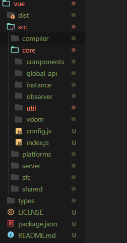

# 前言

最近金三银四，看了好多 Vue 相关面试题目，但是却总觉得不够理解，印象不是特别深刻。嘛，背题不如自己啃源码来的舒服，在这里打个 flag 吧，从今天开始阅读一下源码，持续更新~~！

这篇博客我想从`new Vue`开始入手，层层深入，利于理解。

# new Vue 到底做了什么

首先找到 Vue 源码目录。



我们很容易的就找到 Vue 的构造函数啦。

> 这里需要说明一点，在 vue 的内部，`_` 符号开头定义的变量是供内部私有使用的，而 `$` 符号定义的变量是供用户使用的

```js
import { initMixin } from "./init";
import { stateMixin } from "./state";
import { renderMixin } from "./render";
import { eventsMixin } from "./events";
import { lifecycleMixin } from "./lifecycle";
import { warn } from "../util/index";

function Vue(options) {
  if (process.env.NODE_ENV !== "production" && !(this instanceof Vue)) {
    warn("Vue is a constructor and should be called with the `new` keyword");
  }
  this._init(options); // 一切的开始
}

initMixin(Vue); // 主要是定义_Init
stateMixin(Vue); // 定义数据相关方法 $set $delete
eventsMixin(Vue); // 定义事件总线方法
lifecycleMixin(Vue); // 定义了_update $forceUpdate 更新方法
renderMixin(Vue); // 渲染方法

export default Vue;
```

首先这里是引入了 5 个函数，我们分别先来简单看看吧。

- `initMixin`

这里主要是定义了`_init`函数。其作用主要是为了初始化一系列参数并且进行挂载。

```js
export function initMixin(Vue: Class<Component>) {
  Vue.prototype._init = function (options?: Object) {
    // ... to continue
  };
}
```

- `stateMixin`

定义数据相关的`$set`、`$delete` ...方法。

```js
export function stateMixin(Vue: Class<Component>) {
  // ...
  Object.defineProperty(Vue.prototype, "$data", dataDef);
  Object.defineProperty(Vue.prototype, "$props", propsDef);

  Vue.prototype.$set = set;
  Vue.prototype.$delete = del;

  Vue.prototype.$watch = function (
    expOrFn: string | Function,
    cb: any,
    options?: Object
  ): Function {
    //...
  };
}
```

- `eventInit`

主要用于定义 Vue 事件类的方法和属性。

```js
export function eventsMixin(Vue: Class<Component>) {
  const hookRE = /^hook:/;
  Vue.prototype.$on = function (
    event: string | Array<string>,
    fn: Function
  ): Component {
    //...
  };

  Vue.prototype.$once = function (event: string, fn: Function): Component {
    //...
  };
  Vue.prototype.$off = function (
    event?: string | Array<string>,
    fn?: Function
  ): Component {
    //...
  };
  Vue.prototype.$emit = function (event: string): Component {
    //...
  };
}
```

- `lifecycleMixin`

定义了 `_update` 和 `$destory` 、`$forceUpdate` 等方法。

- `renderMixin`

定义了渲染相关方法：`_render` 、 `$nextTick`

```js
export function renderMixin(Vue: Class<Component>) {
  // install runtime convenience helpers
  installRenderHelpers(Vue.prototype);

  Vue.prototype.$nextTick = function (fn: Function) {
    return nextTick(fn, this);
  };

  Vue.prototype._render = function (): VNode {
    //...
  };
}
```

在这之后，Vue 会进行一系列的 Global API 的挂载定义

我们可以看到，其实 Vue 的整体架构是这样的：首先最底层的是一个 ES5 的构造函数 Vue，其次是在其之上的各个文件定义的各种方法`_update`、`_init`等，再绑定到其原型上。再上面就是全局 API，然后就是编译器等...

那么接下来，我们来继续了解一下，从 `_init`方法开始吧。

# \_init：在 beforeCreate 前 Vue 都干了啥

```js
let uid = 0; // 每一个Vue实例都有一个唯一标识
Vue.prototype._init = function (options?: Object) {
  const vm: Component = this;
  // a uid
  vm._uid = uid++;
  // a flag to avoid this being observed
  vm._isVue = true;
  //...
  // merge options
  if (options && options._isComponent) {
    // optimize internal component instantiation
    // since dynamic options merging is pretty slow, and none of the
    // internal component options needs special treatment.
    initInternalComponent(vm, options);
  } else {
    vm.$options = mergeOptions(
      resolveConstructorOptions(vm.constructor),
      options || {},
      vm
    );
  }
  // expose real self
  vm._self = vm;
  initLifecycle(vm);
  initEvents(vm);
  initRender(vm);
  callHook(vm, "beforeCreate");
  initInjections(vm); // resolve injections before data/props
  initState(vm);
  initProvide(vm); // resolve provide after data/props
  callHook(vm, "created");

  if (vm.$options.el) {
    vm.$mount(vm.$options.el);
  }
};
```

- 首先是每一个 Vue 子类都会有一个唯一标识 `_uid`。

- **合并 options**

> （这里还没仔细看，先留个坑）

这里其实是分为两种情况的：

1. 初始化 new Vue

这里主要是将用户的自定义 options，和之前定义的 Vue 原型方法，以及全局 API 和 Mixin 中的参数做一个合并，合并为 `$options`

2. 如果是组件初始化

则除了合并以上属性，还需要将父组件的 `props`、`events`等等都要合并起来。

- 三个主要初始化方法

1. `initLifecycle`：主要是确认父子关系和某些实例属性

```js
export function initLifecycle (vm: Component) {
  const options = vm.$options

  // 这里找到第一个非抽象父组件作为自己的父组件parent
  let parent = options.parent
  if (parent && !options.abstract) {
    while (parent.$options.abstract && parent.$parent) {
        parent = parent.$parent
      }
    parent.$children.push(vm)
  }

  vm.$parent = parent
    vm.$root = parent ? parent.$root : vm

  vm.$children = []
    vm.$refs = {}

  vm.\_watcher = null
  vm.\_inactive = null
  vm.\_directInactive = false
  vm.\_isMounted = false
  vm.\_isDestroyed = false
  vm.\_isBeingDestroyed = false
}
```

2. `initEvents`：获取父组件监听的事件名数组 `listeners` ，并且存在组件实例的事件中心 `_events` 中.

```js
export function initEvents(vm: Component) {
  vm._events = Object.create(null); // 事件中心
  vm._hasHookEvent = false;
  // init parent attached events
  const listeners = vm.$options._parentListeners; // 监听的事件名
  if (listeners) {
    updateComponentListeners(vm, listeners);
  }
}
```

> 注意，这里获取处理的是自定义事件。原生事件的话会在模板编译阶段中通过 `addEventListener`来注册事件。

内部执行的 `updateComponentListeners` 主要是执行 `updateListeners` 方法。

```js
export function updateComponentListeners(
  vm: Component,
  listeners: Object,
  oldListeners: ?Object
) {
  target = vm;
  // 这里没有仔细看 挖个坑吧 ~
  updateListeners(
    listeners,
    oldListeners || {},
    add,
    remove,
    createOnceHandler,
    vm
  );
  target = undefined;
}
```

这个方法有两个执行时机，首先是现在的**初始化阶段**，还一个就是**最后 patch 时的原生事件**也会用到。

它的作用是比较新旧事件的列表来确定事件的添加和移除以及事件修饰符的处理。

目前 new Vue 的时候，首先使用`$on` 往 `vm.events` 事件中心下创建一个自定义事件名的数组集合项，数组内的每一项都是对应事件名的回调函数。

触发的时候使用`$emit`，就是获取对应事件名的回调函数数组集合，然后遍历执行啦。

> 从这里我们也可以看出来，父组件并不是在监听事件，只是将事件名和回调函数作为参数传给子组件，子组件在父组件作用域下获取并保存。在 `$Emit` 使用的时候再将回调函数取出来执行。这里派发事件其实是在子组件上做的。

3. `initRender`: 主要是挂载将`render`函数转化为 VNode 的方法

```js
export function initRender(vm: Component) {
  vm._vnode = null; // the root of the child tree
  vm._staticTrees = null; // v-once cached trees
  const options = vm.$options;
  const parentVnode = (vm.$vnode = options._parentVnode); // the placeholder node in parent tree
  const renderContext = parentVnode && parentVnode.context;
  vm.$slots = resolveSlots(options._renderChildren, renderContext);
  vm.$scopedSlots = emptyObject;
  // 转化编译器执行的，如template
  vm._c = (a, b, c, d) => createElement(vm, a, b, c, d, false);
  // 用户手写的。 render(h)=> h('span', this.msg);
  vm.$createElement = (a, b, c, d) => createElement(vm, a, b, c, d, true);

  //...
  /* istanbul ignore else */
  // 定义了 $attrs $listeners
}
```

4. `callHook(vm, 'beforeCreate')`

到此为止，`beforeCreate` 前的初始化工作就完成啦。

**值得注意的是**，这里`data`属性还没被挂载上来，因为不可能访问`data`。那么在`beforeCreate`阶段可以干什么呢？

像插件内部 `install` 方法通过 `Vue.use`安装的时候，一般就在此时进行。
