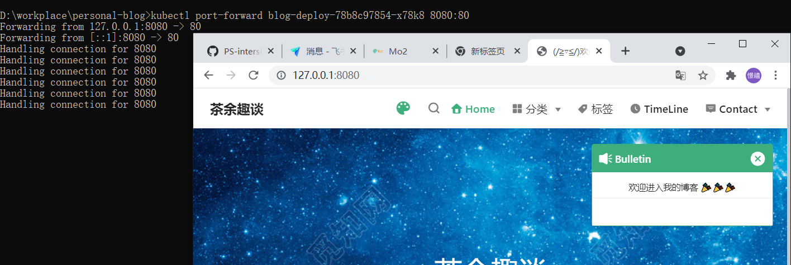
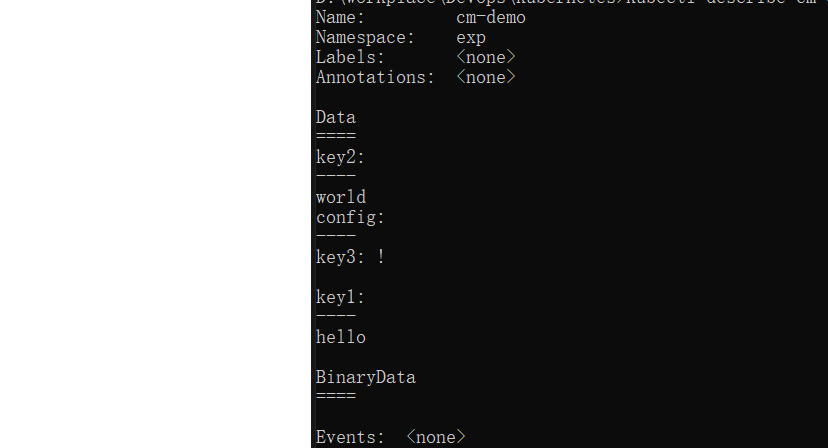
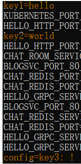

自从自己买了一台阿里云服务器后，我只会用 finalshell、宝塔可视化面板来对服务器进行基本操作，我觉得这太逊啦~~看了学长的运维成果，我也挺感兴趣的，于是自己也去学习 docker，这里记录一下遇到的坑。

### 9.18

这里一开始我数据卷挂载一个 html 到 tomcat 上，可是服务器访问的时候怎么都不会显示这个 html 文件，而是现在默认的。我查了一下，是因为 tomcat 默认是访问目录是 ROOT。

另外一个问题就是，我把 html 放在了 webapps 文件夹下的一个 exam 文件夹里，我需要在 url 拼接上路径才能访问对。如`strk2.cn:8082/exam`

注意，在服务器上开放端口后，也要去阿里云控制台开放安全组噢

### 9.19

今天在学习如何部署 nginx 集群。集群就是访问一台服务器，可以把流量分发给多台服务器

关键在于 2 个点:

```js
http {
   // ......
   //集群配置：这里比如我要分发给2台服务器
	upstream nginxcluster{
		server 47.106.198.203:8082;
		server 47.106.198.203:8083;
	}

}
```

```js
server {
   //...
    location / {
    	   root html;
    	   index index.html index.htm;
        proxy_pass http://nginxcluster; //这里注意和上面定义的stream要一样
    }
}
```

然后在部署的时候遇到一些小问题，可以通过`docker logs 容器名`来找到错误问题。

### ~9.22

这几天学习了一些 Dockerfile 的命令：`FROM`、`ENV`、`RUN`、`COPY`等...
以及通过 docker build -t [NAME] . 来构建一个镜像。

> [注]：这里一定要加一个点，表示是以当前目录下的 Dockerfile 文件来构建。

### 9.25

今天我做了自动部署流程。遇到了不少的困难，记录一下。

- 首先是 git actions 的使用，可以通过 secrets 定义密钥变量，然后在`.github\workflows\xx.yml`文件中使用。
- Cannot connect to the Docker daemon at unix:///var/run/docker.sock. Is the docker daemon running?报错。这个东西我暂时看不懂，应该是网络方面的错误吧。
  解决方法：
  只需要重启一下 daemon 即可。

```yml
systemctl daemon-reload
sudo service docker restart
sudo service docker status
```

- 然后就是连接阿里云镜像仓库的各种报错信息。这里一定要结合仓库上面的一些例子来编写 yml。
- 然后就是连接私有服务器的各种报错。这里我也不多说了，按照错误提示来 debug 就好了。

yml 文件的编写我打算以后再慢慢的研究，总而言之终于把这个 CI 给弄好了。

### 9.26

今天想尝试将博客的 ci 自动化流程弄好，但是还是失败了，准确来说是只弄了一半吧。

- 首先是 yml 文件以及 Dockerfile 中的根目录环境是不一样的
- 现在我只能在本地先 build，然后再通过 Dockerfile COPY，我尝试在 Dockerfile 中写入 build，然后发现 npm install 就得等 15min？这也太慢了吧，而且还有各种报错信息，都是路径的问题。哎，给我弄吐了，先这样吧以后再完善。总而言之现在我的博客也不需要 finalshell 来连接服务器然后手动上传了。这也算是进步一丢丢吧。

### 9.27

我宣布，本博客的 CI 自动化部署流程终于弄好了。今天又有点不甘心于是继续尝试，我看了一下我们团队 email 微服务以前的 Dockerfile 文件，发现采用了 2 个 FROM，于是我也学着写了一下。

```yml
FROM node:alpine as builder
WORKDIR /var/www/blog/
COPY . /var/www/blog/
RUN npm install --registry=https://registry.npm.taobao.org

RUN npm run build

FROM nginx:alpine as server

COPY --from=builder nginx.conf /etc/nginx/nginx.conf
```

然后居然报错：`nginx.conf not found!`

我上百度也搜了一下，但是找不到问题所在。然后继续看学长之前写的 Dockerfile，发现最后一句的 COPY 的源文件目录会不会应该是在 node 环境中的目录呢？于是我改成了:`COPY --from=builder /var/www/blog/nginx.conf /etc/nginx/nginx.conf`

果然 CI 流程成功运行了。我开心的打开博客一看，居然报 Nginx server error 500

于是我打开 docker 想进入容器，发现报错:`OCI runtime exec failed: exec failed: container_linux.go:344: starting container process caused "exec: \"/bin/bash\": stat /bin/bash: no such file or directory": unknown`。 咱也看不懂啊，百度一查，将进入容器的命令改为 sh 即可，进入之后，发现熟悉的 nginx 环境没有了，我突然就想到了是我刚刚构建 nginx 的时候只复制了`nginx.conf`,并没有复制 html 文件。于是灵感大发重新改了配置：

```yml
FROM node:latest as builder
COPY . .
RUN npm config set -g registry https://registry.npm.taobao.org
RUN npm install

RUN npm run build

FROM nginx:alpine as server

COPY --from=builder nginx.conf /etc/nginx/nginx.conf
COPY --from=builder public /var/www/blog/
WORKDIR /var/www/blog/
```

终终终终于成功啦....我的博客终于也可以自动化部署了。而且是应用了 docker 技术，而不是手动上传文件。。

### 10.5

这几天看了一些 k8s 的概念和知识点语法(等有时间写一个小笔记吧)。今晚成功试着将我的一个博客镜像部署在了集群里。通过这个可以访问部署的项目：`kubectl port-forward 你的pod名 ⽬标本地端⼝:微服务端⼝`



**高可用**:同时还绑定了一个 HPA 到这个 Deployment 中：
`kubectl autoscale deployment blog-deploy --min=1 --max=3 --cpu-percent=5`

感觉差不多了，明天继续学习......

记录一下：github actions 对公开后的镜像仓库不生效？ 我也不知道为什么。

### 10.8

今天把这几天学到的内容都自己上手了一遍：

- 创建`secret`资源对象并绑定在我的`deployment`上
- 将什么`readinessProbe`、`livenessProbe`、`rollingUpdate`策略都写进了我的 deployment 上
- 注意 svc 的`targetPort`最好填容器内`containerPort`的`name`而不是具体的 port。这样可以将拥有相同 labels 的 pods 都绑定在一个 svc 上。

现在可以做到在 github action CI 的时候自动拉取镜像 连接集群 滚动更新了。总算是有一丢成就感了...

### K8S 学习记录

今天上课，于是想回顾一下自己学 k8s 的一些知识吧。

首先 k8s 是一个生产级别的容器编排，整体架构由`master`集群控制节点和若干个`node`集群工作节点构成。

#### k8s 资源对象

所有的 k8s 资源对象都可以使用`yaml`文件来创建。由于我没有自己搭建 k8s 集群，所以有一些对象只能自己写写 yaml 文件练习一下了。

**Job/Cronjob**
批处理任务，`Cronjob`则多了一个定时。

```yaml
apiVersions: batch/v1
kind: CronJob
metadata:
  name: job-demo
spec:
  successfulJobsHistoryLimit: 10
  failedJobsHistoryLimit: 10
  schedule: "*/1 * * * *"
  jobTemplate:
    spec:
      template:
        metadata:
          name: job-demo
        spec:
          restartPolicy: Never # 重启策略：Never/Onfailure
          containers:
            - name: counter
              image: busybox
              command:
                - "/bin/sh"
                - "-c"
                - "for i in 9 8 7 6 5 4 3 2 1;do echo $i;done"
```

**Service**

k8s 中有 3 种 IP：

- Node IP: Node 节点的 IP 地址
- Pod IP： Pod 的 IP 地址
- Cluster IP： Service 的 IP。(这是一个虚拟 IP，仅仅作用于 Kubernetes 的 Service 对象)

例如，假定我们有一组 Pod 服务，它们对外暴露了 8080 端口，同时都被打上了 app=myapp 这样的标签，那么我们就可以像下面这样来定义一个 Service 对象：

```yaml
apiVersion: v1
kind: Service
metadata:
  name: myService
spec:
  selector:
    app: myapp
  ports:
    - name: myService
      protocal: TCP
      port: 80
      targetPort: 8080 # 注意，这里填pod的ports name 更好。
```

> 这里 Service 的服务类型默认为`ClusterIP`，只能够在集群内部访问；还能为`nodePort`,通过每个 node 节点和静态 port 对外暴露服务。

**ConfigMap**：用于保存一些配置信息的资源对象。

```yaml
apiVersion: v1
kind: ConfigMap
metadata:
  name: cm-demo
data:
  key1: hello
  key2: world
  config: |
    key3: !
```



除此之外可以使用命令行的方式来创建：

- 文件或者文件夹：`kubectl create configmap cm-demo --from-file=test.txt`
- 键值对：`kubectl create configmap --from-literal=key=value`

那么创建好了该如何去访问呢？

- 通过环境变量的形式：

```yaml
apiVersion: v1
kind: Pod
metadata:
  name: testcm1-pod
spec:
  containers:
    - name: testcm1
      image: busybox
      command: ["/bin/sh", "-c", "env"]
      resources:
        requests:
          cpu: 10m
          memory: 10Mi
        limits:
          cpu: 10m
          memory: 10Mi
      env:
        - name: Hello
          valueFrom:
            configMapKeyRef:
              name: cm-demo
              key: key1
        - name: world
          valueFrom:
            configMapKeyRef:
              name: cm-demo
              key: key2
      envFrom:
        - configMapRef:
            name: cm-demo
```

我们通过输出它的 logs 来看一下：


- 通过挂载数据卷的形式（可以热更新）

```yaml
apiVersion: v1
kind: Pod
metadata:
  name: testcm-pod
spec:
  volumes:
    - name: config-volume
      configMap:
        name: cm-demo1
        items:
          - key: mysql.conf
            path: path/to/msyql.conf
  containers:
    - name: testcm
      image: busybox
      command: ["/bin/sh", "-c", "cat /etc/config/path/to/msyql.conf"]
      volumeMounts:
        - name: config-volume
          mountPath: /etc/config
```

**Secret**：用于存储加密的信息
`Secret` 有三种类型：`Opaque`、`Dockerconfigjson`、`service-account-token`。

- _Opaque_

采用`base64`加密编码。跟`ConfigMap`的使用形式差不多。

- _Dockerconfigjson_

用于存储私有 docker registry 的认证信息。这里拿本博客做例子。

声明：
`kubectl create secret docker-registry blog-registry --docker-server=<仓库地址> --docker-username=<用户名> --docker-password=<密码> --docker-email=<>`

> email 并不是必须的，其他信息是必填的。

引用：

```yaml
imagePullSecrets:
  - name: blog-registry
```

- _service-account-token_
  在创建 ServiceAccount 的时候，自动绑定。

**DaemonSet**

守护进程。用于在每一个节点部署一个 pod。当有新节点加入集群的时候，pod 会被调度到该节点上运行；若节点从集群中移除，pod 也会被移除。如用于监控每个节点信息的 pod。
